# match-bench — Platform Architecture

> Fair, repeatable, **un-gameable** benchmarking for high-frequency-trading algorithms.
>
> A contestant uploads a trading algorithm; the platform builds it, runs it in a
> locked-down pod, fires the *same* deterministic market workload at every
> contestant, measures latency **in the Linux kernel — outside the contestant's
> process**, replays every fill through a reference order book to score
> correctness, and publishes a live leaderboard.

This document describes how the platform is built. Every non-obvious claim is
cited to a `path:line` in the repository so the text can be checked against the
code it describes.

---

## How to read this document

The document is organized as a set of self-contained pages. Each can be read on
its own, but the recommended order for a newcomer is top to bottom.

| # | Page | Read this to understand… |
|---|------|--------------------------|
| 1 | [The thesis & system overview](#the-thesis--system-overview) | *Why* the platform exists and the one idea everything serves |
| 2 | [Map of the system](#map-of-the-system) | The components, planes, and how data moves between them |
| 3 | [Kafka topology, partitioning & horizontal scaling](#kafka-topology-partitioning--horizontal-scaling) | How services line up on the bus and how the platform scales out |
| 4 | [The benchmark run lifecycle](#the-benchmark-run-lifecycle) | The end-to-end sequence of one run, click → score |
| 5 | **Service reference** (one section each) | The internals of every microservice |
| 6 | [Benchmarking, bottleneck hunt & scope for improvement](#benchmarking-bottleneck-hunt--scope-for-improvement) | The numbers we measured, how we found and killed each bottleneck, and what's left |
| 7 | [Deployment, isolation & observability](#deployment-isolation--observability) | How it's deployed on Kubernetes/EKS and how fairness is enforced |
| 8 | [Scope for improvement (consolidated)](#scope-for-improvement) | Every open gap across the platform, ordered by impact |
| 9 | [Where this is going](#where-this-is-going) | The target multi-contestant architecture and the accepted validator redesign |
| 10 | [Appendix: glossary](#appendix-a--glossary) | Terminology used throughout this document |

**Service reference index**

- [Submission API](#submission-api-go) — the HTTP front door
- [Build Pipeline & Sandbox Orchestrator](#build-pipeline--sandbox-orchestrator-go) — turn a zip into a running, isolated pod
- [Bot-Fleet Controller](#bot-fleet-controller-go) — the orchestration brain of a run
- [Bot-Fleet Load Generator](#bot-fleet-load-generator-rust) — the open-loop order cannon
- [eBPF Latency Capture](#ebpf-latency-capture-rust) — kernel-stamped, un-gameable timing
- [Telemetry Ingester & Rollup](#telemetry-ingester--rollup-rust) — sent/acked → HDR histograms
- [Correctness Validator](#correctness-validator-go) — the reference order-book oracle
- [Score Computer & Leaderboard API](#score-computer--leaderboard-api-go) — ranking & live feed
- [Platform Foundations](#platform-foundations-auth-shared-libraries--schemas) — auth, shared libs, the schema contract

---

## The thesis & system overview

### The one idea: you cannot trust the thing you are measuring

A latency benchmark for trading code has a fatal temptation built in: if you ask
the contestant's program *"how fast were you?"*, a contestant who wants to win
simply lies — or, more subtly, measures from a point that flatters them
(after the syscall returns, before the response is serialized, using a clock they
control). Any number the contestant's process produces is, by construction,
**gameable**.

match-bench is built around removing the contestant from the measurement loop
entirely:

1. **Determinism in →** every contestant receives the *same* logical order stream
   for a given seed and workload mix, paced **open-loop** (the generator does not
   wait for the contestant to keep up, so a slow contestant cannot slow the
   clock — it just misses its deadlines, which is the thing we want to measure).
2. **Kernel measurement ⟷** request and response timestamps are taken by an
   **eBPF/XDP program in the kernel**, at the network boundary of the contestant's
   pod, using kernel time. The contestant's code never touches the clock, the
   counter, or the packets being timed.
3. **Reference-model scoring out →** every fill the contestant emits is replayed
   through a correct price-time-priority order book. A score is only accepted if
   the contestant's behavior matches what a correct engine would have done.

Everything else in this document — the split-producer Kafka design, the
co-partitioned telemetry streams, the HDR histograms, the hardened pods, the
distributed ingester — exists to make those three properties hold **at scale and
under load** without ever letting the measurement instrument perturb the thing it
measures.

### The shape of the system

The platform is a **multi-tenant, asynchronous, Kafka-triggered** pipeline of
small services written in **Go** (control plane / APIs) and **Rust** (the
performance-critical data plane: load generation, kernel capture, telemetry
aggregation). Services never call each other synchronously for the hot path —
they communicate through a small set of **Kafka topics with an explicitly shared
schema**, which is what lets each stage scale independently.

Work is physically separated into three **planes** that never share machines:

- **Measurement / control plane** — APIs, controllers, Kafka, databases,
  telemetry, scoring, observability. The brains and the bus.
- **Sandbox plane** — the untrusted contestant pod and its dedicated, privileged
  eBPF capture pod. One contestant per node, hardened and network-isolated.
- **Load-generation plane** — the bot-fleet workers that fire the deterministic
  order stream. Scaled out node-by-node; tainted so nothing else lands there.

Keeping these on separate, tainted Kubernetes node pools is not an operational
nicety — it is part of the fairness guarantee. The measurement instrument must
never steal CPU from the cores it is measuring, and the load generator must never
contend with the contestant for the NIC.

A run is not single-protocol: a benchmark session offers the contestant **FIX,
REST, and WebSocket traffic simultaneously**. The controller fans a
`ProtocolAll` request out into per-protocol bot-fleet tasks, each pinned to one
of the contestant's listeners via a per-task target index
(`schemas/rust/src/lib.rs:96,113,161`; details in the
[bot-fleet-controller](#bot-fleet-controller-go) section). Listener ports are
platform constants — FIX on 9898, HTTP+WS shared on 8080 — validated at upload
time by the submission-api, so the eBPF capture always knows exactly which ports
to watch.

### Languages & responsibilities at a glance

| Layer | Language | Services |
|-------|----------|----------|
| HTTP / control plane | Go | submission-api, build-worker, sandbox-orchestrator, bot-fleet-controller, correctness-validator, score-computer, leaderboard-api, auth-api |
| Data plane (hot path) | Rust | bot-fleet (load gen), ebpf-latency (kernel capture), telemetry-ingester (HDR aggregation) |
| Web | TypeScript / Next.js | frontend |
| Shared contracts | Go + Rust (mirrored) | schemas/ (Kafka topics + event structs), libs/ (auth, logging, metrics) |

### Repository layout (the parts that matter)

```text
services/          the 12 microservices (Go + Rust)
schemas/           the shared Kafka topic + event contract, mirrored in Go and Rust
libs/              shared Go/Rust libs: JWKS auth, Loki logging, Prometheus metrics
ops/kafka/         create-topics.sh — the authoritative topic/partition declaration
k8s/               Kubernetes manifests, grouped by plane (data/platform/sandbox/build/benchmark/observability)
infra/terraform/   the EKS cluster topology (node pools, taints, instance types)
e2e/               full end-to-end suite (every service on) + the reference contestant
bench/             the ~2M orders/s platform self-benchmark tier
deploy-bench/      load-generator capacity sweeps: drain-sink ceiling runs (1→2 nodes)
                   plus local task-count / pacing-fidelity sweeps (task-sweep-*.tsv)
deploy-local/      local k3s bring-up + HDR plots
```

---

## Map of the system

The diagram below is the high-level data flow. Solid arrows are Kafka topics
(the asynchronous spine); dashed arrows are direct reads/writes to stores or
HTTP/SSE. It is derived from the topic declarations in `ops/kafka/create-topics.sh`
and the producer/consumer wiring in each service — see
[Kafka topology](#kafka-topology-partitioning--horizontal-scaling) for the exact
partition-level contract.

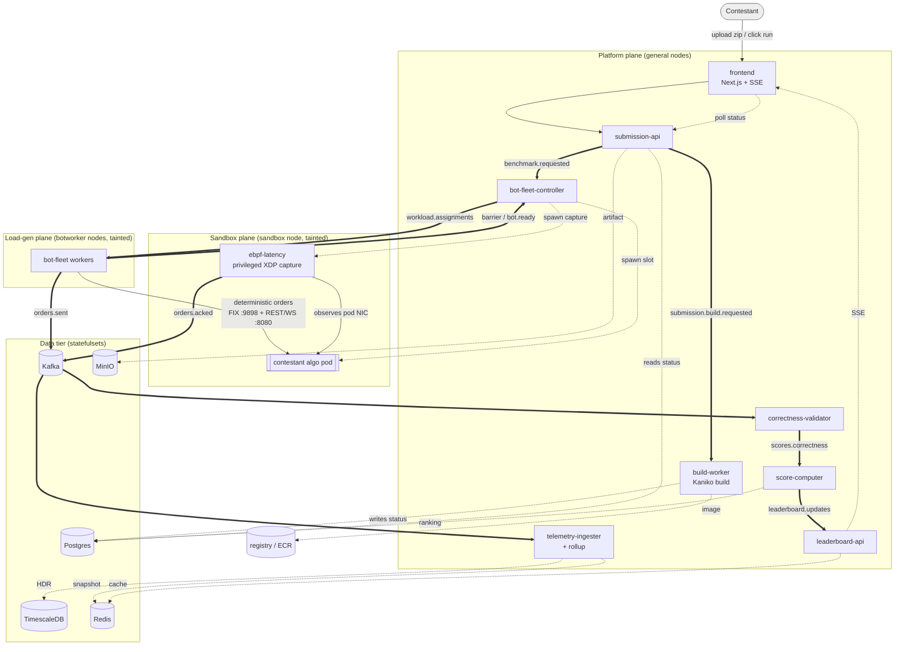

### Kafka topics at a glance

These are the twelve topics, exactly as declared in
`ops/kafka/create-topics.sh:35-46` (production sizing: replication-factor 3,
`min.insync.replicas=2`, `max.message.bytes=1 MiB`). The high-fan-out data-plane
topics get **24 partitions**; the control-plane topics get **3**. The full
producer/consumer/partition-key contract is in
[the Kafka section](#kafka-topology-partitioning--horizontal-scaling).

| Topic | Partitions | Retention | Role |
|-------|-----------:|-----------|------|
| `submission.build.requested` | 3 | 7 d | a new upload needs building |
| `submission.status.updated` | 3 | 7 d | build lifecycle: uploaded→building→…→ready/failed |
| `benchmark.requested` | 3 | 7 d | a run was triggered (one event per scenario session) |
| `benchmark.status.updated` | 3 | 1 d | run state machine: deploying→…→running→completed |
| `workload.assignments` | **24** | 1 d | one `WorkloadSpec` shard per bot-fleet worker; each spec carries `targets: Vec<TargetSpec{protocol,port}>` plus a per-task `target_idx` (`schemas/rust/src/lib.rs:96,113,161`) |
| `barrier` | 3 | 1 d | the synchronized "go" epoch for a session |
| `bot.ready` | 3 | 1 d | per-worker fan-in before the barrier fires |
| `workload.failed` | 3 | 7 d | a worker could not start its assignment |
| `orders.sent` | **24** | 1 d | every order the load-gen emitted (msgpack, keyed by order_id) |
| `orders.acked` | **24** | 1 d | every response the kernel captured (msgpack, keyed by order_id) |
| `scores.correctness` | 3 | 30 d | per-session correctness verdict |
| `leaderboard.updates` | 3 | 7 d | a contestant's rank/metrics changed |

The three 24-partition topics are the heart of the scaling story, but they use
**two different partition keys**. `orders.sent` and `orders.acked` are both
partitioned by `FNV1a(order_id) % 24`, so the *same* order deterministically
lands on the *same* partition in both streams — the **co-partitioning** that lets
the telemetry ingester and the validator each own a slice of partitions and match
sent↔acked locally, with no cross-replica shuffle (the precondition for scaling
them horizontally). `workload.assignments` is instead partitioned by
`worker_index % 24`, which pins one `WorkloadSpec` to one partition to one worker
pod (so the KEDA-scaled load-gen fleet fans out cleanly). Both schemes are
detailed in the next section.
## Kafka Topology, Partitioning & Horizontal Scaling

Kafka is the spine of match-bench. Every control transition and every byte of
telemetry crosses it, and the platform's horizontal-scaling story is almost
entirely a Kafka-partitioning story. This section is the single place that
describes how all eleven services line up on the bus and how the data plane
scales out while the control plane stays singleton.

There are exactly **12 topics**, declared in three places that must agree:
`ops/kafka/create-topics.sh` (the canonical local/dev script),
`k8s/data/kafka/topic-init-job.yaml` (the in-cluster Job), and the typed
constants `schemas/go/topics/topics.go` + `schemas/rust/src/lib.rs`. Two of
those declarations disagree on one config value — flagged below.

### 1. The 12 topics

Partition counts and configs are from `ops/kafka/create-topics.sh:36-48`
(the `create_topic <name> <partitions> <retention_ms>` calls) with the shared
config block at `create-topics.sh:12-15` (`--replication-factor 3`,
`min.insync.replicas=2`, `max.message.bytes=1048576`). Producers/consumers and
their partition keys come from each service's source, cited per row.

| # | Topic | Parts | RF | Retention | Producer(s) | Consumer group(s) | Partition key (exact) | Why that key |
|---|-------|------:|---:|-----------|-------------|-------------------|-----------------------|--------------|
| 1 | `submission.build.requested` | 3 | 3 | 7d (`604800000`) | submission-api (`internal/publisher/kafka.go:82`, `&kafka.Hash{}`) | build-worker `build-worker` (`cmd/worker/main.go:52`); spawner `build-worker-spawner` (`cmd/spawner/main.go:52`) | `Hash(submission_id)` — key set at `publisher/kafka.go:135` | All build events for one submission stay ordered on one partition. |
| 2 | `submission.status.updated` | 3 | 3 | 7d | build-worker (`internal/publisher/kafka.go:46`, `&kafka.LeastBytes{}`) | **none in code** (see note below) | `LeastBytes` (no key affinity — pure load spread) | Status events are independent fan-out; even spread beats ordering here. |
| 3 | `benchmark.requested` | 3 | 3 | 7d | submission-api (`internal/publisher/kafka.go:92`, `&kafka.Hash{}`) | bot-fleet-controller `bot-fleet-controller` (`main.go:42`, consumer `internal/controller/consumer.go:37`) | `Hash(benchmark key)` (`publisher/kafka.go:169`) | One session's run-request lands deterministically; controller is the sole consumer. |
| 4 | `benchmark.status.updated` | 3 | 3 | 7d | bot-fleet-controller (`internal/controller/producer.go:58`, `&kafka.Hash{}`, key=`session_id`) | submission-api `submission-api-benchmark-status` (`main.go:117`); correctness-validator `correctness-validator` (`main.go:56`, consumer `:313`); score-computer `score-computer` (`internal/config/config.go:39`, consumer `internal/trigger/consumer.go:42`) | `Hash(session_id)` | Per-session lifecycle ordering; three independent consumer groups each see the full stream and fan out. |
| 5 | `workload.assignments` | **24** | 3 | 1d (`86400000`) | bot-fleet-controller (`internal/controller/producer.go:54`, **custom `workerIndexBalancer`**) | bot-fleet `bot-fleet` (`src/config.rs:43`; KEDA-scaled) | **explicit partition = `worker_index % numPartitions`** (`producer.go:81`); key=`session_id:worker_index` | Each bot-fleet worker pod owns exactly one partition, so one WorkloadSpec → one pod, never split or doubled (see §4). |
| 6 | `barrier` | 3 | 3 | 1d | bot-fleet-controller (`internal/controller/producer.go:55`, `&kafka.Hash{}`, key=`session_id`) | bot-fleet (broadcast read; matched by `session_id` in `src/kafka.rs:307` `wait_for_barrier`) | `Hash(session_id)` | All workers wait on the same barrier event for a session; ordering per session is enough. |
| 7 | `bot.ready` | 3 | 3 | 1d | bot-fleet (`src/worker.rs:249` `publish_json`, key=`session_id:worker_id`) | bot-fleet-controller `bot-fleet-controller-ready` (`main.go:43`, consumer `internal/controller/consumer.go:45`) | `Hash(session_id:worker_id)` | Fan-in: controller counts ready signals per session to fire the barrier. |
| 8 | `workload.failed` | 3 | 3 | 7d | bot-fleet (`src/config.rs:47`) | bot-fleet-controller (failure path) | `Hash` (default) | Low-volume control signal; spread is fine. |
| 9 | `orders.sent` | **24** | 3 | 1d† | bot-fleet (`src/telemetry.rs:298`, **explicit partition**) | telemetry-ingester `telemetry-ingester` (`src/ingester.rs:30`, subscribe); correctness-validator (per-partition direct readers, **no group**, `internal/source/stream.go:255`) | **`partition_for(order_id)` = FNV-1a 64-bit mod N** (`schemas/rust/src/lib.rs:26`) | The co-partition linchpin (§3): same `order_id` → same partition as `orders.acked`. |
| 10 | `orders.acked` | **24** | 3 | 1d† | ebpf-latency (`src/main.rs:288,351`, **explicit partition**) | telemetry-ingester `telemetry-ingester` (same group as #9); correctness-validator (per-partition direct readers, `stream.go`) | **`partition_for(order_id)`** (same FNV-1a) | Identical hash to `orders.sent` so sent⇄acked match without cross-replica shuffle. |
| 11 | `scores.correctness` | 3 | 3 | 30d (`2592000000`) | correctness-validator (`internal/publisher/kafka.go:32`, `&kafka.LeastBytes{}`) | score-computer `score-computer-correctness` (`internal/config/config.go:40`, consumer `internal/trigger/consumer.go:85`) | `LeastBytes` (key=`session_id` at publish) | One score per session; score-computer aggregates per run-group. |
| 12 | `leaderboard.updates` | 3 | 3 | 7d | score-computer (`internal/publisher/kafka.go:30`) | leaderboard-api `leaderboard-api-sse` (`internal/config/config.go:46`, consumer `internal/consumer/consumer.go:40`) | key=`run_group_id` (default `Hash`) | Per-run-group rank updates pushed to the SSE/leaderboard fan-out. |

> † **Retention of `orders.sent`/`orders.acked`.** The in-cluster topic-init Job
> (`k8s/data/kafka/topic-init-job.yaml:55-56`) sets `21600000` (6 h); the
> create-topics script and the bot-fleet self-create path set `86400000` (24 h).
> All paths agree on **24 partitions, RF=3**; the in-cluster firehose retention is
> the shorter 6 h, deliberately, because these are the high-volume topics and disk
> is the bottleneck (see §5). Topics are created `--if-not-exists`, so the Job's
> 6 h wins in-cluster.

> **Note — `submission.status.updated` is a produce-only audit stream.** The only
> reference in the codebase is build-worker *producing* it
> (`internal/publisher/kafka.go:46`); no service subscribes today. Build status
> reaches the frontend directly: build-worker writes each transition into the
> `submissions` Postgres table, and the frontend polls `GET /submissions/{id}` on
> submission-api (which reads that table). The topic exists for a future push/SSE
> status consumer.

> **Wire-format note — `workload.assignments` payload grew (Shape A per-task
> protocol targets).** A `WorkloadSpec` no longer carries a single
> protocol/port pair; it now also carries `targets: Vec<TargetSpec{protocol,
> port}>` and each task carries a `target_idx` index into that table
> (`schemas/rust/src/lib.rs:96,113,161`; Go mirror in
> `schemas/go/topics/topics.go`). The controller fans a `ProtocolAll` run out to
> FIX+REST+WS with round-robin `target_idx` and unique task ids
> (`services/bot-fleet-controller/internal/controller/runner.go`), and the
> worker resolves connect + render through `spec.targets[task.target_idx]`,
> falling back to the legacy single protocol/port when `targets` is empty
> (`services/bot-fleet/src/worker.rs`). The `targets` and `target_idx` fields
> are `#[serde(default)]`, so old specs still deserialize. Partitioning is
> unaffected: it is still one spec per partition by `worker_index`. Rationale in
> `docs/tps-improvement-plan.md:319-384`.

### 2. End-to-end event flow

The whole platform is one long Kafka chain. Control topics are JSON; the two
firehose topics (`orders.sent`/`orders.acked`) are **MessagePack batches**
(`OrderSentBatch`/`OrderAckedBatch`, `schemas/rust/src/lib.rs`).

1. **Upload → build.** submission-api writes `submission.build.requested`
   (key=`submission_id`). build-worker (group `build-worker`) consumes, builds
   the artifact, and emits `submission.status.updated` (`uploaded → building →
   … → ready`).
2. **Run request.** When a contestant starts a run, submission-api writes
   `benchmark.requested` (key=session). bot-fleet-controller (group
   `bot-fleet-controller`) consumes it.
3. **Fan-out workload.** The controller shards the scenario's task list into N
   `WorkloadSpec`s — each carrying the per-task protocol `targets` table
   described above — and writes them to `workload.assignments`, **one spec per
   partition** via `worker_index` (`producer.go`), after validating
   `worker_count ≤ partition_count` (`producer.go:90`).
4. **Workers spin up.** KEDA scales bot-fleet to ≥ N pods (lag trigger). Each
   pod (group `bot-fleet`) gets one partition → one spec, connects each task to
   the contestant pod on the protocol/port its `target_idx` selects, and
   publishes `bot.ready` (key=`session:worker`).
5. **Barrier.** The controller (group `bot-fleet-controller-ready`) fans in
   `bot.ready`; once all workers for a session report ready it publishes
   `barrier` with a target epoch. All workers, blocked in `wait_for_barrier`,
   release simultaneously.
6. **Firehose.** Workers fire orders at the contestant algorithm and stream
   `orders.sent` batches (one timestamped event per order). In parallel, the
   ebpf-latency capture pod (one per session slot) sniffs the algorithm's TCP
   acks via XDP, parses `ClOrdID`, and emits `orders.acked` batches.
7. **Aggregate.** telemetry-ingester (group `telemetry-ingester`, N replicas
   over 24 partitions) builds HDR latency histograms per (session, wave) and
   writes per-shard partials; the `telemetry-rollup` worker merges them into
   `metrics` for live dashboards/Redis.
8. **Score.** When the controller publishes terminal `benchmark.status.updated`,
   correctness-validator (group `correctness-validator`) replays both firehose
   topics for that session, matches sent⇄acked, and emits one
   `scores.correctness` event.
9. **Rank.** score-computer (group `score-computer-correctness`) consumes the
   score, computes peak TPS / p99 / spike-recovery from TimescaleDB, ranks the
   run-group, and writes `leaderboard.updates`.
10. **Display.** leaderboard-api (group `leaderboard-api-sse`) consumes
    `leaderboard.updates` and pushes them to the frontend over SSE.

```mermaid
flowchart LR
  SUB[submission-api] -->|submission.build.requested<br/>k=submission_id| BW[build-worker]
  BW -->|submission.status.updated| SUB
  SUB -->|benchmark.requested<br/>k=session| CTL[bot-fleet-controller]
  CTL -->|workload.assignments 24p<br/>part=worker_index%N| BF[bot-fleet workers x N]
  BF -->|bot.ready<br/>k=session:worker| CTL
  CTL -->|barrier<br/>k=session| BF
  BF -->|orders.sent 24p<br/>part=FNV1a&#40;order_id&#41;| ING[telemetry-ingester x N]
  EBPF[ebpf-latency capture] -->|orders.acked 24p<br/>part=FNV1a&#40;order_id&#41;| ING
  BF -. same partitions .-> VAL[correctness-validator]
  EBPF -. same partitions .-> VAL
  CTL -->|benchmark.status.updated| VAL
  VAL -->|scores.correctness<br/>k=session| SC[score-computer]
  SC -->|leaderboard.updates<br/>k=run_group| LB[leaderboard-api SSE]
  ING -->|metrics_partial → rollup| TS[(TimescaleDB)]
```

### 3. The co-partition design — the linchpin of horizontal scale

`orders.sent`, `orders.acked` (and `workload.assignments`) are **24
partitions**, and the latency telemetry pair is keyed by the **order id**, not by
session or worker. Both producers compute the destination partition with the
same function and then enqueue to that **explicit** partition (bypassing the
broker's default key-hash), so the wire is deterministic regardless of which
producer or client library is in play:

```rust
// schemas/rust/src/lib.rs:26 — FNV-1a 64-bit, mod partition count.
// Load-bearing: bot-fleet (orders.sent) and ebpf-latency (orders.acked) BOTH
// call this, so a given order_id lands on the SAME partition in both streams.
pub fn partition_for(order_id: &str, num_partitions: i32) -> i32 {
    if num_partitions <= 1 { return 0; }
    let mut hash: u64 = 0xcbf29ce484222325;          // FNV offset basis
    for byte in order_id.as_bytes() {
        hash ^= u64::from(*byte);
        hash = hash.wrapping_mul(0x100000001b3);     // FNV prime
    }
    (hash % num_partitions as u64) as i32
}
```

- **Producers select the partition, not the broker.** bot-fleet calls
  `partition_for(&event.order_id, num_partitions)` per event and buffers into a
  per-partition batcher (`src/telemetry.rs:298`), then `enqueue_to_partition`
  (`src/kafka.rs:274`) with `.partition(partition)`. ebpf-latency does the same
  in `batch_by_partition` → `enqueue_to_partition` (`src/main.rs:288,351`).
- **No Go FNV "twin" file** — the schema lives only in the Rust crate, because
  both order producers (bot-fleet, ebpf-latency) are Rust. The Go side that
  *reads* the firehose (correctness-validator) never needs to recompute the
  partition: it just reads every partition directly. The repo's Go partition
  code is a *different* scheme — `worker_index % N` for `workload.assignments`
  (`bot-fleet-controller/internal/controller/producer.go:81`), not order-id FNV.
- **Live partition-count discovery.** Both producers fetch the real partition
  count from broker metadata at startup and feed it into `partition_for`
  (bot-fleet `kafka.rs:229` `topic_partition_count`; ebpf-latency `main.rs:142`).
  So bumping the firehose from 24 → 96 partitions (bench tier, §4) keeps the two
  streams co-partitioned with **no code change** — both sides just hash mod 96.

**Why this is the linchpin.** Because the same `order_id` is guaranteed to sit
on the same partition number in *both* streams, a consumer that owns partition
*k* of `orders.sent` and partition *k* of `orders.acked` has, locally, every
fact it needs to match a sent event to its ack — zero cross-replica shuffle.
That is what lets the two heavy consumers scale out trivially:

- **telemetry-ingester** subscribes to both topics in one consumer group
  (`src/ingester.rs:30`); Kafka's group protocol hands each replica a disjoint
  subset of the 24 partitions, and because the streams are co-partitioned each
  replica's sent⇄acked join is entirely local (`agg.observe_sent` /
  `observe_acked` in the same `Aggregator`).
- **correctness-validator** discovers the partition list and launches one reader
  per `(topic, partition)` (`internal/source/stream.go:107`), k-way merges by
  event time, and matches sent⇄acked in a single pass — again, partition-local.

Without co-partitioning, a sent event on partition 3 and its ack on partition 17
would land on different replicas, forcing a network shuffle/repartition stage to
join them. The FNV co-partition trick removes that entire class of work and is
the reason the data plane is embarrassingly parallel.

### 4. Per-tier horizontal scaling

The platform splits cleanly into a **singleton control plane** (one replica
each, coordination state) and a **scale-out data plane** (partition-sharded,
stateless-per-partition).

**Load generation — bot-fleet (KEDA on Kafka lag).**
- Scaled by a KEDA `ScaledObject` (`k8s/benchmark/bot-fleet/scaledobject.yaml`):
  trigger `type: kafka`, `topic: workload.assignments`, `consumerGroup:
  bot-fleet`, `lagThreshold: "1"`, `minReplicaCount: 2`, `maxReplicaCount: 50`,
  `pollingInterval: 5`. Any unconsumed workload spec (lag ≥ 1) provokes a
  scale-up.
- **Unit of scale = one `workload.assignments` partition = one worker pod.** The
  controller assigns spec→partition by `worker_index % N` and refuses to publish
  if `worker_count > partition_count` (`producer.go:90`: "two specs would share a
  partition (serial execution, missed barrier)"). So the 24-partition
  `workload.assignments` topic caps a single session at **24 concurrent worker
  pods**; raising concurrency means repartitioning that topic.
- Static `replicas: 5` in `bot-fleet/deployment.yaml:14` is just the floor KEDA
  manages around.

**Telemetry ingester — N replicas over 24 partitions + 2-stage rollup.**
- Stateless per partition; `replicas: 2` baseline
  (`k8s/benchmark/telemetry-ingester/deployment.yaml:14`), group
  `telemetry-ingester`. Adding replicas redistributes partitions automatically.
- **Stage 1:** each replica builds per-(session, wave) HDR histograms and writes
  *partial* rows tagged with a `shard` id into `metrics_partial`
  (`src/store.rs:80` `INSERT_SQL`). **Stage 2:** a separate single-replica
  `telemetry-rollup` Deployment (`deployment.yaml:84`,
  `command: ["/usr/local/bin/telemetry-rollup"]`, `ROLLUP_INTERVAL_MS=1000`)
  natively merges the per-shard HDR blobs (`src/rollup.rs:63` `merge_one` →
  lossless `Histogram::add`) into the final `metrics` table. HDR's additive
  mergeability is what makes the two-stage design correct: percentiles computed
  from the merged histogram equal those of a single global histogram.
- **Bottleneck:** stage 1 scales with partitions, but the rollup is a singleton.
  The per-replica shard id is set correctly for scale-out: `INGESTER_SHARD` comes
  from `fieldRef: fieldPath: metadata.name` (`deployment.yaml:57-60`), which the
  Kubernetes downward API resolves to the **pod's** name — unique per replica
  (`telemetry-ingester-<replicaset-hash>-<suffix>`), not the Deployment name. The
  code reads `INGESTER_SHARD`, then falls back to `HOSTNAME` (also the pod name),
  then `ingester-0` (`config.rs:39-43`). So each replica stamps a distinct `shard`
  and the rollup's per-shard merge stays correct as the ingester scales out.

**Correctness validator — partition-sharded, session-scoped.**
- `replicas: 1` (`k8s/benchmark/correctness-validator/deployment.yaml:14`) plus
  `VALIDATOR_CONCURRENCY` for in-process per-session parallelism. It does **not**
  use a consumer group on the firehose; it opens direct readers across all
  partitions of both topics for one session (`stream.go`), bounded by
  `drainPartitionConcurrency` (`drain.go:161`). It *is* group-based only on its
  trigger topic `benchmark.status.updated` (group `correctness-validator`). The
  natural scale unit is **the session**: many validators could each own a subset
  of sessions, since the per-session firehose replay is self-contained.

**Kafka itself.**
- **Prod tier:** StatefulSet `replicas: 3` (`k8s/data/kafka/statefulset.yaml:15`),
  KRaft mode (`KAFKA_PROCESS_ROLES=broker,controller`, 3-voter quorum
  `:64`), one broker per node (anti-affinity comment `:30`), **RF=3**,
  `min.insync.replicas=2`, offsets/txn-state RF=3 (`:80-87`). The firehose pair
  is 24 partitions, sized so 24 ingester replicas can each own one.
- **Bench tier (transient):** `bench/kafka-bench.sh` replaces the StatefulSet
  with `KBROKERS=2` (bump to 3) on a dedicated `kafka` node pool, **`DATA_RF=1`**
  (no replication — correct for throwaway bench data; internal offsets/txn topics
  get RF=2 when ≥2 brokers, `kafka-bench.sh:14`), and rewrites the firehose to
  **96 partitions** (`sed 's/orders.sent 24/orders.sent 96/' … --replication-factor 1`,
  `:78`). It then `set env ORDERS_PARTITIONS=96` on the bot-fleet and
  sandbox-orchestrator deployments (the orchestrator forwards it to the
  ebpf-latency capture pods, `internal/k8s/slot.go:63`) and **scales
  telemetry-ingester to 8** (`:88`). 96 partitions / RF=1 / 8 ingesters is the
  ~2M-orders/s target geometry; on prod the same topics are 24/RF=3.

**Singletons (control plane, deliberately not sharded):**
`bot-fleet-controller` (replicas 1 — holds per-session barrier/fan-in state),
`sandbox-orchestrator` (replicas 1 — owns cpuset slot allocation, no Kafka
producer; only passes brokers to capture pods), `score-computer` (replicas 1),
`telemetry-rollup` (replicas 1), `build-worker spawner` (replicas 1).
Scale-out APIs: `submission-api` and `leaderboard-api` at `replicas: 2` (each
leaderboard pod is its own SSE consumer group member). `ebpf-latency` is neither
Deployment nor group-consumer — it is a **per-session-slot Job**
(`k8s/benchmark/ebpf-latency/job-template.yaml`, `kind: Job`,
`name: capture-<SLOT_ID>`), so it scales with the number of concurrent contestant
slots, one capture process per algorithm under test, produce-only to
`orders.acked`.

### 5. Durability & message-size constraints

- **`min.insync.replicas=2` with RF=3 (prod):** a produce with `acks=all`
  commits only when ≥2 of 3 replicas have it, so a single broker loss never
  loses an acknowledged control message and the cluster keeps accepting writes.
  The control/telemetry producers use `acks=all`/`acks=1` respectively but
  **`enable.idempotence=false`** (bot-fleet `src/kafka.rs:115`) — a deliberate
  choice: idempotence needs the transaction coordinator (`__transaction_state`),
  which a cold single-broker/RF=1 cluster may stall on. The pipeline is
  at-least-once and both heavy consumers dedup by `order_id`, so exactly-once is
  unnecessary.
- **RF=1 (bench)** drops replication entirely (`kafka-bench.sh:13`). On the bench
  tier `min.insync.replicas=2` is effectively relaxed because the bench
  StatefulSet template is regenerated; bench data is transient, so a broker loss
  just aborts the run rather than corrupting scored results.
- **`max.message.bytes=1048576` (1 MiB)** caps a single Kafka record. This
  directly shapes firehose batching: bot-fleet/ebpf-latency cap each MessagePack
  batch at `MAX_EVENTS_PER_BATCH = 1000` events
  (`bot-fleet/src/config.rs:51`, asserted equal at `config.rs:206-212`) so an
  encoded `OrderSentBatch`/`OrderAckedBatch` stays comfortably under 1 MiB. The
  telemetry producer further sets `batch.size=4194304` (4 MiB **produce**-request
  ceiling, `src/kafka.rs:146`) and `linger.ms=20` + `lz4` so many 1000-event app
  batches coalesce into one large compressed produce request — fewer broker
  round-trips/fsyncs per order. The 1 MiB record limit is therefore the hard
  ceiling on per-message event count; throughput is recovered by request-level
  batching and compression, not by larger messages.

### 6. Limitations / scope for improvement

- **Firehose partition count caps per-session worker fan-out at 24** (prod) /
  96 (bench), enforced by `validateWorkerCapacity` (`producer.go:90`). Raising
  concurrency is a topic-repartition operation, not a config flag.
- **Two diverging retention values** for `orders.sent`/`orders.acked` (6h Job vs
  24h script/self-create) — whichever creator runs first wins because of
  `--if-not-exists`, so the effective retention depends on bring-up order.
- **telemetry-rollup and bot-fleet-controller are hard singletons.** The rollup
  is a throughput chokepoint at very high partition counts; the controller holds
  all per-session barrier state in memory, so its failure mid-run loses in-flight
  fan-in (no documented HA path in code).
- **correctness-validator does its own partition discovery + offset math**
  (`stream.go`/`drain.go`) instead of a consumer group, so it cannot lean on
  Kafka's rebalancing to spread sessions across replicas; multi-validator
  sharding would need an explicit session-assignment layer.
## The benchmark run lifecycle

This page traces a single submission from upload to leaderboard, naming the
exact topics, keys, consumer groups, and HTTP calls at each hop. Everything here
is a synthesis of the per-service sections that follow; read this first for the
shape, then dive into a service section for the internals. Two facts make the
whole flow legible:

- **The control plane is JSON over Kafka; the hot order path is MessagePack.**
  Orchestration messages (`benchmark.requested`, `workload.assignments`,
  `barrier`, status updates, scores) are low-volume JSON. The two firehose topics
  (`orders.sent`, `orders.acked`) are MessagePack batches.
- **Every service is triggered, never called, on the hot path.** A stage reacts
  to a Kafka event (or, in two places, a direct HTTP call: submission-api↔client
  and controller→sandbox-orchestrator) and emits the next event. There is no
  synchronous request chain through the data plane.

One schema fact matters at several hops below, so it is worth stating once. A
`WorkloadSpec` no longer names a single protocol and port. It carries
`targets: Vec<TargetSpec{protocol, port}>` and each task carries a `target_idx`
into that vector (`schemas/rust/src/lib.rs:96`, `:113`, `:161`; Go mirror in
`schemas/go/topics/topics.go`). The contestant slot exposes two listener ports,
which are platform constants: **9898 for FIX** and **8080 shared by REST and
WS**. A single run therefore drives all three protocols against one contestant
concurrently, with each bot-fleet task bound to exactly one protocol target.
The rationale for this shape (called Shape A in the plan) is in
`docs/tps-improvement-plan.md:319-384`.

### The two phases

A submission goes through **build** (once per uploaded artifact) and then, on
each "run" click, a **benchmark**, which fans out into one *session* per scenario
(`constant`, `spike`, `ramp`) grouped under one *run-group*.

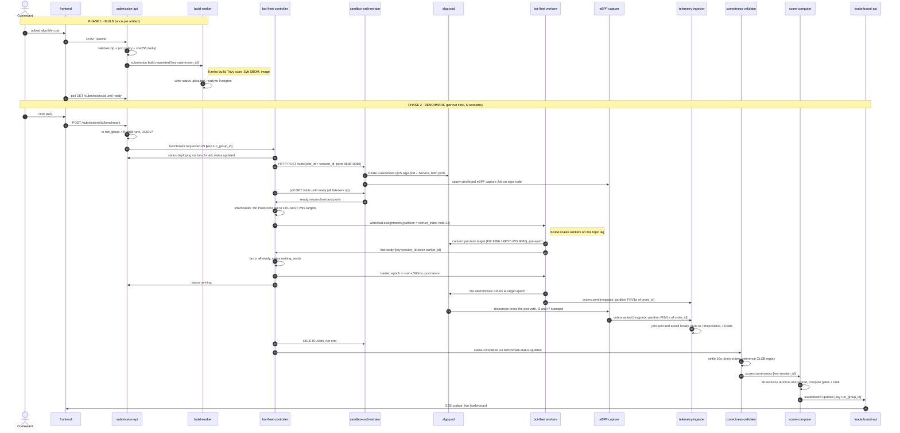

### Step-by-step (the contract at each hop)

**Build phase**

1. **Upload.** `POST /submit` → submission-api validates the zip
   (`benchmark.yaml` + `src/` + one build manifest, declared build-target must
   exist), computes the artifact sha256 and content-dedups, streams it to MinIO
   (`iicpc-submissions/{id}/artifact.zip`), inserts a `submissions` row at
   `status=uploaded`, and produces **`submission.build.requested`** keyed by
   `submission_id`. Port declarations in the manifest are validated against the
   platform constants (9898 FIX, 8080 HTTP+WS); a manifest that declares any
   other port is rejected at upload time
   (`services/submission-api/internal/validator/zip.go`,
   `internal/errors/errors.go`). Ports used to be contestant-chosen anywhere in
   `[1024, 65535]`, which made the bot-fleet's connect targets a per-submission
   variable; fixing them lets every downstream component treat the port→protocol
   mapping as a constant. Scenario population and action mixes are also
   env-configured rather than hardcoded
   (`services/submission-api/internal/scenarios/builder.go`).
2. **Build.** build-worker (group `build-worker-spawner`) consumes it and runs an
   ephemeral-Job pipeline: precheck (download + zip-slip guard) → generate a
   hardened Dockerfile → **Kaniko** build → **Trivy** scan + **Syft** SBOM (in
   parallel) → promote (a Harbor staging→prod crane copy; a no-op on single-
   registry ECR) → write the final `image_ref`. Each transition is written
   **directly to the `submissions` table** (monotonic rank guard, `failed` is
   terminal) and *also* emitted on `submission.status.updated` (an audit stream
   with no consumer today). The frontend polls `GET /submissions/{id}` and sees
   `uploaded → building → scanned → sbom_ready → ready`.

**Benchmark phase**

3. **Run trigger.** `POST /submissions/{id}/benchmark` gates on
   `status=ready` + a non-empty `image_ref`, enforces "one active run-group per
   submission" via a partial unique index, then in one transaction inserts a
   `run_group` plus **one child `run()` per scenario** (constant/spike/ramp),
   each with a fresh UUIDv7 `session_id`, and produces **`benchmark.requested`**
   per session, keyed by `run_group_id`.
4. **Deploy the sandbox.** bot-fleet-controller (group `bot-fleet-controller`)
   consumes one `benchmark.requested`, sets `status=deploying`, and makes a
   **synchronous HTTP `POST /slots`** to sandbox-orchestrator with
   `slot_id = session_id` and the slot's port list (`ports: [9898, 8080]`). The
   orchestrator creates a Guaranteed-QoS, integer-cpuset algo pod plus a stable
   Service with one `ContainerPort`/`ServicePort` pair per listed port, and
   lazily spawns the **privileged eBPF capture Job pinned to the algo pod's
   node**. Readiness gates on **all** declared listeners accepting connections,
   not just the first (`services/sandbox-orchestrator/internal/k8s/slot.go`,
   `internal/handler/slot.go`; covered by `internal/k8s/multiport_test.go`). The
   controller polls `GET /slots/{id}` until `ready`, then reads the algo's host
   and ports. The e2e reference engine matches this contract: it binds both
   listeners, FIX on 9898 and shape-multiplexed REST/WS on 8080
   (`e2e/contestant-matching-engine/src/main.rs`).
5. **Shard & assign.** The controller computes
   `worker_count = ceil(total_tasks / MAX_TASKS_PER_WORKER)`, round-robin shards
   the scenario's task list, and publishes one `WorkloadSpec` per worker to
   **`workload.assignments`** at the *explicit* partition `worker_index % 24` (a
   custom balancer, not key-hash) — the 1-spec→1-partition→1-pod contract. It
   refuses the run if `worker_count > 24`. Each spec carries the full `targets`
   vector; for a `ProtocolAll` scenario the controller fans the task list out
   across the FIX, REST, and WS targets with round-robin `target_idx` assignment
   and unique `task_id`s, so one third of the offered load lands on each
   protocol (`services/bot-fleet-controller/internal/controller/runner.go`).
6. **Workers ready.** KEDA scales bot-fleet on `workload.assignments` lag; each
   pod (group `bot-fleet`, roundrobin assignor) takes one partition = one spec.
   Each task resolves its connect endpoint and wire format from
   `spec.targets[task.target_idx]` (with a legacy single-protocol fallback for
   old specs, `services/bot-fleet/src/worker.rs`), opens its connection
   (**pre-warmed before the barrier** so connect cost never pollutes the
   measurement), and the worker publishes **`bot.ready`** keyed
   `session_id:worker_id`.
7. **Barrier.** The controller (group `bot-fleet-controller-ready`) fans in
   `bot.ready` until all workers report (or the 30 s `ReadyDeadline`), then
   computes a **fresh** go-time `epoch = now + 500ms` *after* fan-in and publishes
   **`barrier`** keyed by `session_id`. All workers, blocked in
   `wait_for_barrier`, release simultaneously at that epoch.
8. **Fire (the firehose).** Each task runs three concurrent loops per
   connection: the catch-up **pacer** (write), the **ClOrdID matcher** (read),
   and the **expiry watchdog**, which pops timed-out orders from a monotonic
   per-task deadline queue rather than scanning the whole pending map
   (`services/bot-fleet/src/worker.rs:576-592`, `:1065-1088`). Order bytes for
   the task's single protocol come from a per-task template built once at task
   start and patched per order (`fix::TemplateCache`,
   `services/bot-fleet/src/fix.rs:744`; created at
   `services/bot-fleet/src/worker.rs:746-749`). Every offered order streams to
   **`orders.sent`** (MessagePack, partition `FNV1a(order_id) % 24`). The eBPF
   capture stamps `t3` (XDP ingress) and `t7` (tc egress) on the algo pod's veth
   and emits **`orders.acked`** (MessagePack, *same* `FNV1a(order_id)`
   partition).
9. **Aggregate (live).** telemetry-ingester (group `telemetry-ingester`, N
   replicas across the 24 partitions) sees both legs of every order it owns
   (co-partitioning), joins them locally, builds per-`(session, wave)` HDR
   histograms, and writes per-shard partials; the singleton `telemetry-rollup`
   merges the shards (native HDR add) into the canonical `metrics` table +
   Redis hot hash for the live dashboard.
10. **Teardown.** After `scenario.DurationNs + gap` the controller deletes the
    slot and emits a terminal **`benchmark.status.updated`**. submission-api
    (group `submission-api-benchmark-status`) consumes it to advance the run /
    run-group status in Postgres.
11. **Score correctness.** correctness-validator (group `correctness-validator`)
    is triggered by the `completed` status: after a 10 s settle it drains the
    session's `orders.sent` + `orders.acked` (UUIDv7-bounded offsets, one reader
    per partition, k-way merged by time), replays the sent stream through a
    reference price-time-priority order book, diffs the contestant's fills, and
    produces **`scores.correctness`** keyed by `session_id`.
12. **Rank.** score-computer (groups `score-computer` + `score-computer-
    correctness`) tracks per-session progress in SQL; once *all* sessions of a
    run-group are terminal and scored it computes the gated metrics
    (peak-sustained-TPS behind median-p99/error gates, spike-recovery, total
    correctness, DQ), claims the score with `INSERT … ON CONFLICT DO NOTHING`
    (the exactly-once latch), ranks the whole table, and produces
    **`leaderboard.updates`** keyed by `run_group_id`.
13. **Display.** leaderboard-api (a **per-pod** consumer group so every replica
    sees every update) pushes the update to connected SSE clients; the frontend's
    `useLeaderboard` merges it into the live table. Run detail is polled over REST
    until all sessions are terminal.

### Idempotency & failure handling across the chain

Because every hop is at-least-once Kafka, each stage is built to tolerate
redelivery:

- **submission-api:** sha256 dedup + a partial-unique-index "one active run-group
  per submission"; a losing race re-resolves to the winner.
- **controller:** terminal-status precheck + duplicate-session guard; on crash,
  `RecoverInFlightRuns` fails out any non-terminal `runs` before consumers start
  (it is a singleton holding run state in memory).
- **validator:** a Postgres `ON CONFLICT` claim makes concurrent workers safe; a
  validation timeout writes a *recoverable* `timed_out` placeholder that a later
  redelivery re-runs.
- **score-computer:** `SaveScore … ON CONFLICT DO NOTHING` guarantees exactly one
  `leaderboard.updates` per run-group even under redelivery or multiple replicas;
  a boot-time `PendingRunGroups` scan re-enqueues anything that became ready
  during downtime.

The one gap worth flagging: a worker that aborts mid-run publishes
`workload.failed`, but **the controller does not consume that topic** — active
worker failures surface only indirectly (missing `bot.ready` → `ReadyDeadline`,
or the run simply timing out). See the controller section.

---
## Submission API (Go)

> **Why Go:** the submission-api is I/O-bound control-plane work (HTTP, Postgres, MinIO, Kafka) that never sits on the measured latency path, so GC pauses are irrelevant here. Go's goroutine-per-request model and the mature `chi`/`pgx`/`kafka-go`/`minio` ecosystem make it the productive, low-ceremony choice for a request validator/router.

The Submission API (`services/submission-api`, Go, ~4.8k LOC including tests) is the platform's HTTP front door. Every contestant interaction that mutates the system enters here: uploading an algorithm artifact, triggering a benchmark ("run"), and polling submission / run-group / run status. It owns the `submissions`, `run_groups`, `runs`, and `scenarios` tables in Postgres, the `submissions` bucket in MinIO, and is the sole producer of the two "request" topics (`submission.build.requested`, `benchmark.requested`) that kick off the build and benchmark pipelines. It is a thin, mostly-stateless request validator/router in front of shared Postgres + MinIO + Kafka.

### Responsibilities and request surface

Routing is `go-chi`. The router wires global middleware (request-id, real-IP, structured request logging, Prometheus HTTP middleware, panic recovery) and three unauthenticated endpoints — `GET /health`, `GET /ready` (Postgres ping), `GET /metrics` — followed by an authenticated group (`main.go:135-167`):

- `POST /submit` — multipart artifact upload (handler `Submit`).
- `GET /submissions/{submission_id}` — submission status/metadata (handler `GetSubmission`).
- `POST /submissions/{submission_id}/benchmark` and the alias `POST /benchmarks/{submission_id}` — mint a run-group (handler `StartBenchmark`).
- `GET /run-groups`, `GET /run-groups/{run_group_id}`, `GET /runs/{session_id}` — read APIs (handlers `ListRunGroups`, `GetRunGroup`, `GetRun`).

**Auth.** When `AUTH_REQUIRED=true` (default) every authenticated route is gated by `RequireContestant`, which extracts a bearer token, verifies it as a Google OIDC ID token via `libs/authn`, and puts the `sub` claim into request context as the contestant id (`handler/auth.go:44-61`). When `AUTH_REQUIRED=false` (dev/e2e), `OptionalContestant` never rejects: it reads an **unverified** `sub` claim from the token if present, else falls back to `DEFAULT_CONTESTANT_ID` (`auth.go:66-76`, `main.go:148-156`). The contestant id is the ownership key on every row; all read handlers 404 (not 403) when `row.ContestantID != caller` to avoid leaking existence.

### Artifact upload, validation, and sha256 dedup

`POST /submit` (`handler/submit.go:50`) caps the body at `MaxZipBytes + 4096` (100 MB + slack), parses the multipart form, then runs `validator.ValidateSubmissionZip` over the uploaded zip **before** touching any store. Validation (`validator/zip.go`) is strict and self-contained:

- Magic-byte check (`PK\x03\x04`), then a real `archive/zip` parse.
- Requires exactly one `benchmark.yaml`/`.yml` at the zip root, a `src/` directory, and exactly one build manifest (`CMakeLists.txt` | `Cargo.toml` | `go.mod`); duplicate root entries or multiple manifests are rejected. Root config files are read through a 1 MB `LimitReader` to bound decompression.
- `benchmark.yaml` is parsed (`gopkg.in/yaml.v3`) into `BenchmarkConfig{protocol, language, build{type,target}, port, team_name}`. Protocol ∈ {FIX, REST, WS, ALL}, language ∈ {cpp, rust, go}, build target matches `^[A-Za-z0-9_.-]{1,64}$`.
- **Port policy: ports are platform constants, not contestant choices.** After a basic range check (`[1024, 65535]`, `zip.go:140-142`), `validatePortPolicy` (`zip.go:169-181`) rejects any manifest whose declared port does not match the platform-mandated port for its protocol: FIX must declare **9898**, REST and WS must declare **8080** (`topics.PortForProtocol`, `schemas/go/topics/topics.go:28-36`; error `ErrPortProtocolMismatch`, `internal/errors/errors.go:34`). Fixed ports are what let the eBPF capture program, the sandbox slot spec, and the bot-worker connect logic all agree on where a contestant listens without per-submission plumbing. The `ALL` protocol sentinel (`validator.ProtocolAll`, `zip.go:24-29`) declares a multi-protocol engine that offers all three transports simultaneously — FIX on 9898 plus REST+WS shared on 8080 — and is exempt from the single-value port check since it implies both ports. The e2e reference matching engine exercises this shape: it binds a FIX listener on 9898 and a shape-multiplexed REST/WS listener on 8080 (`e2e/contestant-matching-engine/src/main.rs`).
- Cross-checks the manifest against the language: cpp⇒`add_executable(<target>)` in CMakeLists (regex), rust⇒a `[[bin]] name=<target>` entry in Cargo.toml (TOML parse), go⇒presence of `go.mod`. This guarantees the declared build target actually exists before a build worker is ever dispatched.

After validation, the handler mints a **UUID v7** submission id, computes the artifact **sha256** (streamed via `io.Copy(sha256.New(), file)`), and does dedup: `FindBySHA256` (`postgres.go:601`, `SELECT submission_id FROM submissions WHERE sha256=$1`). On a hit it resolves ownership (`claimOrResolveOwner`) and returns `409 duplicate submission` (with the existing id if the caller owns it), incrementing `submission_duplicate_total`. The `sha256` column has a `UNIQUE` constraint, so even if two uploads race past the pre-check, the `INSERT` returns Postgres `23505` → `ErrDuplicateSubmission` and the handler re-resolves to the existing row (`submit.go:169-204`). Dedup is content-addressed, so re-uploading an identical zip never rebuilds.

Only after dedup passes does it write to MinIO, then Postgres, then Kafka — in that order:

```go
objectPath := fmt.Sprintf("%s/%s/%s", submissionsObjectPrefix, submissionID, artifactObjectName)
// → "iicpc-submissions/{submission_id}/artifact.zip"
_, err := s.client.PutObject(ctx, s.bucket, objectPath, r, size,
    minio.PutObjectOptions{ContentType: "application/zip", UserMetadata: map[string]string{"sha256": sha256hex}})
```
*`store/minio.go:81-88` — the object key is content-addressed by submission id; sha256 is stamped as user metadata for downstream integrity checks. The bucket is `submissions` (env `MINIO_BUCKET`) and the object path within it is `iicpc-submissions/{id}/artifact.zip`.*

A successful submit inserts a `submissions` row with `status="uploaded"`, publishes `submission.build.requested`, and returns `201` with `{submission_id, status, sha256, language, protocol, port, team_name, created_at}`. A Kafka publish failure is logged at WARN but does **not** fail the request (`submit.go:219`) — the row is durably "uploaded" and could in principle be re-driven, though there is no reconcile loop today (see Limitations). There is also a known **orphaned-artifact gap**: if the Postgres insert fails after the MinIO upload succeeds, the object is left behind and only logged, not GC'd (`submit.go:172, 201`).

### Submission lifecycle (uploaded → … → ready/failed)

The submission status enum is `uploaded | building | scanned | sbom_ready | ready | failed` (`topics.go:42-49`). The submission-api **writes only the initial `uploaded`** state. All subsequent transitions are written **directly to the shared `submissions` table by the build-worker** (`services/build-worker/internal/store/postgres.go` `UPDATE submissions`), which consumes `submission.build.requested` and drives build→scan→push. The submission-api never updates submission status and never consumes `submission.status.updated`; it only surfaces the current status to the frontend via `GET /submissions/{id}` (`handler/submission.go:33`), which the frontend **polls**. The only Kafka consumer registered in `main.go` is the `benchmark.status.updated` consumer (`main.go:117-120`).

### Minting a run: run_group + per-scenario sessions

When a contestant clicks "run", `StartBenchmark` (`handler/benchmark.go:65`) gates: the submission must exist, be owned by the caller (claiming it if unowned via `claimOrResolveOwner`), be in `ready` status, and have a non-empty `image_ref`. It then reads the seeded `scenarios` table (`ListScenarios`) and **expands one click into a run_group with N child runs — one per scenario** (constant, spike, ramp by default). Each gets a fresh **UUID v7** session id; the run_group also gets a UUID v7.

Idempotency is enforced at two layers. First a fast-path `FindActiveRunGroup` (`postgres.go:218`, `WHERE submission_id=$1 AND status NOT IN ('completed','failed')`) returns the existing group with `200` if a benchmark is already in flight (incrementing `active_run_group_conflicts_total`). Second, the authoritative guard is a **partial unique index** `idx_run_groups_one_active_per_submission ON run_groups(submission_id) WHERE status NOT IN ('completed','failed')` (`postgres.go:113-115`): the parent group + all children are inserted in one transaction (`InsertRunGroupWithChildren`, `postgres.go:376`), and if a concurrent click wins the race the second `INSERT` hits `23505` → `ErrActiveRunGroupExists`, the handler re-queries and returns the winner's group (`benchmark.go:168-180`). This lifts the "at most one active benchmark per submission" invariant from the old per-`runs` index up to the parent, because a group legitimately has N children sharing `submission_id`.

After the transaction commits, it publishes one `benchmark.requested` message **per child session** (`benchmark.go:186-202`); a publish failure here *does* fail the request (`500`) since the rows already exist and the run would otherwise stall. Response is `202 Accepted` with the group and its child runs (status `requested`).

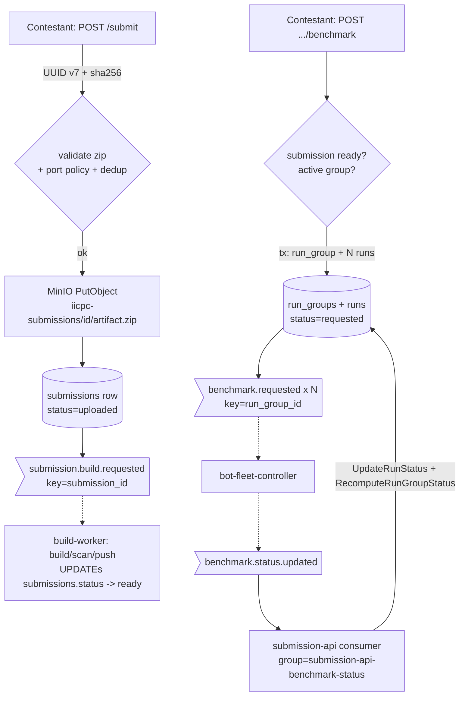

### Run-status fan-in: the one consumer

The single consumer (`consumer/kafka.go`) reads `benchmark.status.updated` (group `submission-api-benchmark-status`, overridable via `KAFKA_BENCHMARK_STATUS_GROUP`). For each message it validates the status against the `RunStatus*` enum (`requested|deploying|waiting_ready|barrier_fired|running|completed|failed`), then `UpdateRunStatus(session_id, status, message)`. That UPDATE is **terminal-safe**: `WHERE session_id=$1 AND status NOT IN ('completed','failed')` (`postgres.go:471-475`), so a late/duplicate message can never resurrect a finished run. It then calls `RecomputeRunGroupStatus` (`postgres.go:424`), which aggregates the child runs into the parent status (`completed` when all children completed, `failed` when all terminal and ≥1 failed, `requested` when all still requested, else `running`). The consumer uses manual offset commits (`CommitInterval:0`); decode errors, invalid statuses, and unknown-run updates are logged and committed (skipped) so a poison message can't block the partition, while store errors are *not* committed and will be retried.

### State ownership and key data structures

| Store | Owns | Key tables/objects |
|---|---|---|
| Postgres (`pgxpool`) | submissions, scenarios, run_groups, runs | created idempotently at startup via `createTableSQL` (`postgres.go:23-129`) with `ADD COLUMN IF NOT EXISTS` migrations |
| MinIO | artifact zips | `iicpc-submissions/{id}/artifact.zip` in bucket `submissions` |

Key tables: `submissions(submission_id PK, contestant_id, sha256 UNIQUE, language, protocol, port, team_name, artifact_path, image_ref, status, created_at)`; `scenarios(scenario_id PK, name UNIQUE, duration_ns, task_specs JSONB, sort_order)`; `run_groups(run_group_id PK, submission_id, contestant_id, status)`; `runs(session_id PK, submission_id, contestant_id, run_group_id, scenario_id, status, message)`. A second partial unique index `idx_runs_unique_scenario_per_group(run_group_id, scenario_id)` defends against duplicate child rows on a benchmark re-publish.

Owned queries (each instrumented via `recordDB` → `db_query_total`/`db_query_duration_seconds`): `insert_submission`, `find_submission_by_sha256`, `get_submission_by_id`, `claim_submission_contestant`, `insert_run_group_with_children`, `find_active_run_group`, `get_run_group`, `list_run_groups`, `get_run`, `list_runs_by_group`, `update_run_status`, `recompute_run_group_status`, `list_scenarios`, `seed_scenarios`. `list_run_groups` filters by contestant, optional `submission_id[]`, and caps `limit` to 200 (default 100). `list_runs_by_group` LEFT JOINs `scenarios` and orders by `sort_order, name` so the frontend renders constant→spike→ramp in execution order.

### Scenario seeding

On startup, the service builds the constant/spike/ramp scenarios in code (`scenarios/builder.go`) and upserts them via `SeedScenarios` (`postgres.go:538`). Each scenario's `task_specs` is the full list of `TaskSpec`s (one tokio task = one TCP connection = one constant-rate sender), computed from a market mix. Every scenario parameter is env-configurable over compiled defaults (`builder.go:99-122`): durations and rates (`CONSTANT_TOTAL_RPS`, `SPIKE_PEAK_RPS`, `RAMP_PEAK_RPS`, `*_DURATION_S`, `SPIKE_PREWINDOW_S`, `SPIKE_BURST_S`), the population mix (`MIX_HFT_PCT` / `MIX_RETAIL_PCT` / `MIX_INSTITUTIONAL_PCT`, defaults 60% HFT @1000rps, 25% retail @5rps, 15% institutional @300rps), and per-population action mixes (`{HFT,RETAIL,INSTITUTIONAL}_{MARKET,CANCEL,REPLACE}_PCT`). Moving these to env means load-shape changes are a redeploy, not a rebuild. With `RESEED_SCENARIOS=false` (prod default) seeding is `ON CONFLICT (name) DO NOTHING`; with `true` it overwrites duration/task_specs/sort_order. The controller later shards each scenario's task list across worker pods.

### Kafka topics

**Produces `submission.build.requested`** — 3 partitions (`ops/kafka/create-topics.sh:35`). **Partition key = `submission_id`** (`publisher/kafka.go:135`), via kafka-go's `kafka.Hash{}` balancer with `RequiredAcks=RequireOne`. Keying by submission id means all events for one submission land on one partition (per-submission ordering for the build pipeline) while distinct submissions spread across partitions, letting build-workers scale by adding consumers up to the partition count.

**Produces `benchmark.requested`** — 3 partitions (`ops/kafka/create-topics.sh:37`). **Partition key = `run_group_id`** (falling back to `session_id` if empty; `publisher/kafka.go:178-183`), `kafka.Hash{}` balancer, `RequiredAcks=RequireAll` (stronger durability since this fans out a full run). Keying by run_group co-locates all N sibling sessions of one click on one partition, so the bot-fleet-controller processes a run-group's sessions in order on a single consumer while different run-groups parallelise across partitions/controller instances.

**Consumes `benchmark.status.updated`** — 3 partitions (`ops/kafka/create-topics.sh:38`), **consumer group `submission-api-benchmark-status`**. Produced by the bot-fleet-controller keyed so that a session's updates are ordered; the group lets the (currently 2) replicas split partitions, so status fan-in scales horizontally with partition count.

(The order-id co-partition `partition_for` FNV-1a hash in `schemas/rust/src/lib.rs:26` governs the high-volume `orders.sent`/`orders.acked`/`workload.assignments` topics — 24 partitions each — which submission-api does **not** touch.)

### Metrics

`submissions_accepted_total{language,protocol}`, `submission_duplicate_total`, `submission_validation_failures_total{reason}`, `submission_upload_bytes` (histogram), `benchmark_requests_total{result}`, `active_run_group_conflicts_total`, `run_groups_created_total`, `run_group_children_created_total{scenario_name}`, `benchmark_publish_failures_total{topic}`, `run_status_updates_total{status}`, plus shared infra metrics: `db_query_total`/`db_query_duration_seconds{operation}`, `pgxpool_*` gauges (pool stats sampled every 15s, `main.go:76-87`), `kafka_messages_produced_total` / `kafka_messages_consumed_total` / `kafka_consumer_commit_total`, `minio_operation_duration_seconds`. (`submission_status_transition_total` is emitted by build-worker, not here.)

### Concurrency, failure handling, and scaling model

**Concurrency:** one goroutine per HTTP request (chi/net-http), one background pool-stats ticker, and one consumer goroutine running the `benchmark.status.updated` fetch/commit loop. Graceful shutdown drains the HTTP server with a 10s timeout on SIGTERM/SIGINT (`main.go:185-193`).

**Scaling:** the HTTP path is **stateless** and horizontally scalable — all durable state is in shared Postgres/MinIO/Kafka. Deployed at **`replicas: 2`** (`k8s/platform/submission-api/deployment.yaml:14`), **not KEDA-autoscaled** (it's a low-QPS control-plane service; KEDA is reserved for the bot-worker fleet). The unit of horizontal scale is "add replicas, up to the consumer-group partition count of `benchmark.status.updated` (3)." The bottleneck is **Postgres**, not the service: the upload path is bounded by streaming the artifact to MinIO and a sha256 pass, and the run-mint path is one short transaction.

### Limitations / scope for improvement

- **Seed-on-every-replica + reseed race.** Every replica runs `SeedScenarios` on startup; with `ON CONFLICT DO NOTHING` this is benign, but with `RESEED_SCENARIOS=true` two starting replicas can race to overwrite scenario `task_specs`/`sort_order` (`postgres.go:538-572`). Seeding belongs in an init job, not the request service.
- **`RecomputeRunGroupStatus` read-modify-write race.** It aggregates children then UPDATEs without `SELECT … FOR UPDATE` or a CAS; two replicas processing sibling `benchmark.status.updated` messages concurrently can interleave (last-writer-wins). It is eventually consistent because every message recomputes, but a transient stale parent status is possible (`postgres.go:424-464`).
- **Orphaned MinIO artifacts.** A Postgres insert failure after a successful MinIO upload only logs "orphaned minio artifact"; there is no cleanup/GC (`submit.go:172, 201`).
- **Build-request publish is best-effort.** A Kafka failure on `submission.build.requested` is WARN-logged and swallowed (`submit.go:219`); the submission sits at `uploaded` with no reconcile loop to re-drive the build.
- **Status surface is polling-only.** submission-api exposes no SSE/event-stream — the frontend long-polls `GET /submissions/{id}` and `GET /run-groups/{id}` (SSE lives in the leaderboard service).
- **Scenario set is implicitly fixed at 3.** Run-group expansion is `len(scenarios)` so it's data-driven, but the partial-unique-index idempotency and the frontend's three-histogram layout assume the constant/spike/ramp triple; adding scenarios is not exercised end-to-end.

---

## Build Pipeline & Sandbox Orchestrator (Go)

> **Why Go:** both are pure Kubernetes control-plane orchestration — minting and watching build Jobs, contestant Pods, Services, and capture Jobs — and Go is the native language of that ecosystem (`client-go`), so the work is idiomatic and fully supported. Neither sits on the measured path, so a GC'd runtime is a non-issue.

These two Go services bridge a contestant's *source code* and a *running, measurable target*. The **build-worker** turns an uploaded source bundle into a hardened OCI image in a registry; the **sandbox-orchestrator** later mints exactly one isolated, CPU-pinned pod from that image plus its co-located privileged eBPF capture job, and reports the pod's reachable endpoint so the controller can fire load at it. They are decoupled — build-worker is Kafka-driven and asynchronous; sandbox-orchestrator is a synchronous HTTP control plane the `bot-fleet-controller` calls per session.

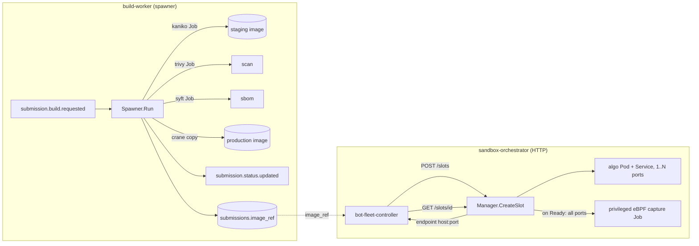

### (a) build-worker — source → scanned/SBOM'd registry image

**Role.** Consumes one build request, deterministically produces a Dockerfile, builds the contestant artifact with **Kaniko** inside an ephemeral k8s Job, scans it (Trivy) and generates an SBOM (Syft) in parallel, promotes it to a production registry ref, persists that ref to Postgres, and emits status transitions throughout.

**Two deployment shapes (one consumer, two handlers).** The service ships two `main`s that share `internal/consumer`, `internal/publisher`, `internal/store`:
- `cmd/spawner` (production): `Spawner.Run` spawns Kubernetes **Jobs** (build/scan/sbom) and never builds in-process (`services/build-worker/internal/k8s/spawner.go:182`). This is the EKS/k3s path.
- `cmd/worker` (dev): a `pipeline.LocalRunner` builds via the local Docker daemon in-process (`services/build-worker/cmd/worker/main.go:86`, `internal/pipeline/local_runner.go:44`). Out of scope for the cluster.

The rest of this subsection describes the spawner path.

**Pipeline (`spawner.go:182-377`), phase by phase:**
1. **precheck** — download `artifact.zip` from MinIO at `msg.ArtifactPath`, run a zip-slip guard that rejects any entry escaping the extraction root (`internal/precheck/zipslip.go:18`).
2. **dockerfile** — `dockerfile.Generate(language, buildType, buildTarget, port)` renders one of three hardcoded multi-stage templates (cpp/rust/go) and validates `buildTarget` against `^[A-Za-z0-9_.-]{1,64}$` so build metadata cannot become a Dockerfile-injection vector (`internal/dockerfile/generate.go:17,76`). The rendered file is base64-encoded and passed to the build Job via env.
3. **build** — ensure the registry repo exists (ECR `CreateRepository`, no-op for Harbor), refresh the ECR docker-config Secret if in ECR mode, then create the kaniko Job and block on it. Status → `building`. Metric `build_jobs_created_total{mode="build"}`; on failure `build_jobs_failed_total{mode="build"}`.
4. **scan + sbom (parallel)** — two Jobs created and awaited concurrently via a `sync.WaitGroup` + channels; Trivy report and Syft SPDX SBOM are uploaded to MinIO. On success the statuses `scanned` then `sbom_ready` are published (`spawner.go:276-329`). Metrics tagged `mode="scan"` / `mode="sbom"`.
5. **promote** — **Harbor only**: `crane.Copy(stagingRef → productionRef)` between the two distinct registries. **ECR is a single registry**, so the kaniko-built staging image *is* the final image and promote is skipped entirely (`spawner.go:331-364`), avoiding a redundant same-ref copy.
6. **persist + ready** — `UpdateImageRef` writes the final `image_ref` into `submissions` (DB op `update_submission_image_ref`, `internal/store/postgres.go:105`), then status → `ready`.

Each status transition is *dual-written*: published to Kafka **and** written to Postgres with a monotonic rank guard so a later out-of-order message can't regress a submission's status, and `failed` is terminal (`postgres.go:55-101`). The `image_ref` column is auto-migrated on startup with `ADD COLUMN IF NOT EXISTS` (`postgres.go:18`).

**The k8s Job/spawner model.** The spawner is a long-lived Deployment (`replicas: 1`, `k8s/build/spawner/deployment.ecr.yaml:15`) that acts purely as a *controller* for short-lived Jobs. Every Job is created with `BackoffLimit=0` (no retries — a build either works or fails cleanly), an `ActiveDeadlineSeconds` (build 600s, scan 900s for Trivy's cold DB pull, sbom 600s), and `TTLSecondsAfterFinished=300` so finished Jobs self-garbage-collect after logs are read (`spawner.go:36-43,461-554`). `waitForJob` polls Job conditions every 5s rather than watching. The build Job uses an **init container** (`fetcher`, the spawner's own image) to pull+extract the artifact and write the Dockerfile into a shared `emptyDir` workspace, then the kaniko container builds from it (`spawner.go:525-549`, `cmd/fetcher/main.go`).

**Security posture of build Jobs.** Build/scan/sbom pods are `RunAsNonRoot`, drop `ALL` caps, read-only rootfs, `RunAsUser=65532` for fetcher/trivy/syft. Kaniko is the deliberate exception — it needs uid 0 and a writable rootfs to assemble layers, but still runs `AllowPrivilegeEscalation=false` (`spawner.go:869-900`). A NetworkPolicy (`k8s/build/network-policy.yaml`) locks `app=build-job` pods to MinIO (9000), DNS, the registry, and 80/443 *to the internet only* (RFC1918 carved out) for package mirrors.

**Registry auth.** Two providers behind `REGISTRY_PROVIDER`: `""` → Harbor (basic-auth creds written into kaniko's `config.json` by the fetcher; staging→production crane copy); `"ecr"` → AWS ECR via **IRSA**. In ECR mode the spawner mints a fresh `GetAuthorizationToken` and stores it in an Opaque Secret `build-ecr-dockercfg` (`spawner.go:100-123`, `internal/k8s/ecr_aws.go:37`), refreshed *per build* (token lasts ~12h), which kaniko/trivy/syft mount read-only for registry auth. This is why the build-spawner Role needs `secrets: create/get/update/patch` (`k8s/build/rbac.yaml:31-33`) on top of `jobs` and `pods/log`.

**Kafka.**
- **Consumes** `submission.build.requested` — **3 partitions**, consumer group **`build-worker-spawner`** (`cmd/spawner/main.go:52`; `consumer/kafka.go:40`). Partition key is the producer's choice (submission-api); within build-worker the message is processed *serially* — `consumer.Start` calls `handler.Run` synchronously and commits the offset only after the entire multi-minute pipeline returns (`consumer/kafka.go:75-83`). Horizontal scale: more spawner replicas in the same group split the 3 partitions, so up to 3 concurrent builds; beyond that the topic's partition count is the cap.
- **Produces** `submission.status.updated` — **3 partitions**, **partition key = `submission_id`** (`publisher/kafka.go:80`). Keying by submission keeps all status transitions for one submission in a single partition so consumers observe them in order; the writer uses `RequireOne` acks, synchronous.

**Metrics.** `build_jobs_created_total{mode}`, `build_jobs_failed_total{mode}`, `build_phase_total/_duration_seconds{phase,result}`, `build_request_duration_seconds`, `harbor_promote_total`, plus Kafka/DB families.

**Limitations / scope-for-improvement:**
- **Strictly serial per replica + at-most-3-parallel cluster-wide** — the consumer blocks on each ~minutes-long build before committing/fetching the next; throughput is bounded by the 3 partitions of `submission.build.requested`, not by node capacity.
- **No retries on transient Job failure** — `BackoffLimit=0` means a flaky kaniko/registry blip fails the whole submission as `failed` (terminal in the DB rank guard).
- **Only 3 languages** are buildable (cpp/rust/go) and the Dockerfile templates are hardcoded (`generate.go:26-71`); `BuildType`/`Protocol` from the request are not used to select build logic.
- **Logs are polled, not watched**, and `waitForJob` reads only the *first* matching pod's logs (`spawner.go:443`), so a retried pod's logs could be missed (mitigated by `BackoffLimit=0`).
- **ECR `image_ref` is `:latest`** per submission id, so re-running a build for the same id overwrites the prior image rather than versioning by digest.

### (b) sandbox-orchestrator — one pinned algo pod + co-located eBPF capture

**Role.** A small HTTP control plane (chi router, `replicas: 1`) that allocates/refreshes/releases sandbox **slots**. A slot = one algo `Pod` + a `Service` (and, when capture is enabled, one privileged eBPF capture `Job`). It hands the algo's stable Service FQDN and port list back to the caller so load can be fired at it. It is **not** a Kafka consumer or producer — its only Kafka touch is injecting `KAFKA_BROKERS` into the *capture* Job's env so the capture binary can publish `orders.acked`.

**API surface (`main.go:104-106`).**
- `POST /slots {slot_id, contestant_id, image, ports}` → `Manager.CreateSlot`. The request carries `ports []int` — one entry per listener the contestant image binds (both 9898 and 8080 for a multi-protocol submission). The legacy single-`port` field still works: `resolvePorts` normalizes it into a one-entry list so older callers are unaffected (`internal/handler/slot.go:28-37`). At least one positive port is required (`handler/slot.go:71-78`).
- `GET /slots/{slot_id}` → `Refresh` (re-derives live state, lazily spawns capture once Ready)
- `DELETE /slots/{slot_id}` → tears down pod + service + capture job
- `/healthz`, `/readyz`, `/metrics`

**State ownership.** Slot metadata lives in an in-memory `SlotStore` (a mutex-guarded `map[string]*Slot`, copy-in/copy-out, `internal/store/slot.go:44`); the `Slot` record now carries the full `Ports` list alongside the primary port (`handler/slot.go:125-129`). **Kubernetes is the source of truth, not the map** — on startup `ListExisting` rebuilds the map from cluster pods labelled `app=algo,app.kubernetes.io/managed-by=sandbox-orchestrator`, recovering the port list from the pod's declared `ContainerPort`s (`internal/k8s/slot.go:306-316`), and `Refresh` always re-reads the live pod and calls `deriveState`. Slot state is one of `creating | ready | failed | terminating`, derived from pod phase, terminal waiting reasons (ImagePullBackOff, CrashLoopBackOff, etc.), and the `PodReady` condition. `PodSucceeded` is treated as `failed` because the algo is supposed to stay running.

**Multi-port slots.** `CreateSlot(ctx, slotID, contestantID, image, ports []int)` (`slot.go:141`) validates every requested port against `capturablePorts = {8080, 9898}` when capture is enabled (`slot.go:45,146-148`) and builds one `ContainerPort` per entry on the algo container (`containerPortSpecs`, `slot.go:458-461`) plus a matching `ServicePort` per entry on the Service (`serviceSpec`, `slot.go:171`). A multi-protocol contestant therefore gets a single pod and a single Service FQDN exposing both listeners.

**All-ports readiness.** Kubernetes supports only one readiness probe per container, so the native TCP probe covers `ports[0]` only (`slot.go:408-416`). `Refresh` closes the gap: once the probe reports ready, `dialAllPorts` TCP-dials every remaining declared port on the pod IP with a short timeout, and the slot stays `creating` until all listeners answer (`slot.go:236-275`). A contestant that binds one declared port but never the other fails `WaitForReady` instead of failing mid-run when the bot-workers first connect to the dead listener.

**The algo pod — Guaranteed QoS with integer-core cpuset pinning.** `containerResources` sets **request == limit** for both CPU and memory, which is the only way to qualify for Guaranteed QoS:

```go
// internal/k8s/slot.go — request==limit (Guaranteed QoS) is what unlocks
// the kubelet static CPU manager's *exclusive* cpuset pinning for the algo.
func (m *Manager) containerResources() corev1.ResourceRequirements {
	list := corev1.ResourceList{}
	if m.cpu != "" { list[corev1.ResourceCPU] = resource.MustParse(m.cpu) }
	if m.memory != "" { list[corev1.ResourceMemory] = resource.MustParse(m.memory) }
	return corev1.ResourceRequirements{Requests: list.DeepCopy(), Limits: list.DeepCopy()}
}
```

Crucially, `validateConfig` **rejects non-integer CPU** at startup (`strconv.Atoi(cfg.CPU)` and `cpu.MilliValue%1000 != 0`, `slot.go:122`). A millicpu value like `"2000m"` is still Guaranteed yet the CPU manager *silently skips* exclusive pinning, dropping the algo into CFS bandwidth throttling and a tail-latency cliff — the integer-core gate is what actually makes pinning engage. Prod default `ALGO_CPU=2`, `ALGO_MEMORY=1Gi` (`deployment.yaml:46-49`).

**Algo pod hardening.** `RestartPolicy=Never`, `ActiveDeadlineSeconds=3600` (auto-reap leaked pods), `AutomountServiceAccountToken=false`, read-only rootfs with four tmpfs `emptyDir{Medium:Memory}` mounts for `/tmp,/var/tmp,/var/log,/var/run`, drop `ALL` caps, `AllowPrivilegeEscalation=false`, `RuntimeDefault` seccomp (`slot.go:369-430`). Optional CNI bandwidth throttling via `kubernetes.io/{egress,ingress}-bandwidth` annotations (prod `100M`). The readiness path is the probe-on-primary-port plus `dialAllPorts` described above. `RuntimeClassName` (gVisor) is set only if `RUNTIME_CLASS` is non-empty — prod ships `RUNTIME_CLASS=""` (gVisor optional), so isolation then leans on the hardened context + default-deny netpol.

**Node taints / pinning.** When `SANDBOX_NODE_POOL` is set, the pod gets `nodeSelector pool=<value>` plus a toleration for taint **`sandbox=true:NoSchedule`**, keeping platform workloads off contestant nodes and letting integer-core sizing fill the node (one algo per node by design). Empty pool disables this for dev k3s.

**The privileged eBPF capture Job.** Spawned lazily by `ensureCapture` the first time a slot is observed `Ready`. It is deliberately **co-located on the algo's exact node** (`NodeName = pod.Spec.NodeName`), runs `HostPID=true`, `Privileged=true` with caps `BPF,NET_ADMIN,SYS_ADMIN`, mounts the host `/sys/fs/bpf` bpffs, and is told the algo's pod UID + container ID + interface so it can attach at the algo's veth. It is **Burstable on purpose** (request 200m < limit 4 CPU, `captureResources`) so the static CPU manager never hands it an exclusive cpuset — measuring must not steal the algo's pinned cores. It carries an `ownerReference` to the algo pod so it's GC'd with it, and `reapOrphanCaptureJobs` cleans up captures whose slot no longer exists on restart. The capture Job env includes `KAFKA_BROKERS` so it publishes `orders.acked` itself. Because capture attaches at the veth, one attach point observes traffic on both mandated ports; the `capturablePorts` constant is the contract between the slot API and the eBPF program's port filter.

**How TargetHost/TargetPort reach the controller.** The endpoint is the **stable Service FQDN**, not the ephemeral pod IP: `ServiceFQDN(slotID, ns) = algo-<slot_id>.<ns>.svc.cluster.local` (`slot.go:312`), returned in the `slotResponse.endpoint{host,port}` JSON alongside the full `ports` list (`internal/handler/slot.go:125-129, :226`). The `bot-fleet-controller` flow (`services/bot-fleet-controller/internal/controller/runner.go`): transition session → `RunStatusDeploying` (149) → `orch.CreateSlot` (152, keyed by `sess.SessionID` as slot id) → `orch.WaitForReady` polling `GET /slots/{id}` until `ready`/`failed` (161) → store `slot.Endpoint` on the session (174). Connection routing then rides the `WorkloadSpec` published to `workload.assignments`: the controller stamps a `targets` table — one `TargetSpec{protocol, port}` per protocol the submission offers, all three (FIX:9898, REST:8080, WS:8080) for a `protocol: ALL` submission (`submissionTargets`, `runner.go:342-357`) — and each task carries a `target_idx` into that table, assigned round-robin (`runner.go:372-377`). The legacy single `TargetHost`/`TargetPort` fields are still populated from `targets[0]` for pre-change workers (`runner.go:385-396`). Note the controller's orchestrator client still requests the slot with the submission's single declared port (`orchestrator/client.go:73`, `runner.go:152`), which the handler's back-compat path accepts; wiring the full target port list into `CreateSlot` is the remaining seam for `ALL` submissions. On any failure or completion the controller `DeleteSlot`s. The slot id used by the controller is the **session id**, so a slot is per-benchmark-session, not per-submission.

**RBAC (`k8s/sandbox/sandbox-orchestrator/rbac.yaml`).** Namespaced `Role` `slot-manager` granting `create/get/list/watch/delete` on `pods`, `services`, and `batch/jobs` (jobs for the capture). Bound to the `sandbox-orchestrator` ServiceAccount in the `sandbox` namespace. It notably does **not** grant `secrets` (no registry-minting role like build-worker) and is strictly namespace-scoped, not cluster-wide.

**Concurrency model.** Each HTTP request runs in its own goroutine; the only shared mutable state is the mutex-guarded `SlotStore`. `CreateSlot` is idempotent: a repeat with the same image triggers a `Refresh` instead of recreate, and a mismatched image returns `409 Conflict` (`handler/slot.go:62-96`). Pod/service create paths tolerate `AlreadyExists` races (`slot.go:155-191`).

**Scaling model.** Effectively a **singleton** (`replicas: 1`). It is not KEDA-autoscaled; the unit of horizontal scale is *sandbox nodes* (one Guaranteed-pinned algo pod fills a node), not orchestrator replicas. The orchestrator itself is light (mints pods, polls state) and would only contend if many sessions started simultaneously. Because cluster state is the source of truth and the in-memory map is rebuilt on boot, the singleton can restart safely — but two replicas would race on the same slot id without external coordination, and the in-memory map isn't shared.

**Limitations / scope-for-improvement:**
- **Single replica, in-memory slot map** — horizontal scale would need leader election or a shared store; the map is purely a cache rebuilt from k8s on restart.
- **Capture is restricted to `ports {8080, 9898}`** when enabled (`capturablePorts`, `slot.go:45,146-148`) — any other requested port is rejected with `ErrInvalidRequest`. With the submission-api's port policy now mandating exactly these two ports, the two constants agree by construction, but they are declared independently in two services.
- **Controller requests single-port slots** — `orch.CreateSlot` passes only `sub.Port` (`runner.go:152`, `orchestrator/client.go:73`); a `protocol: ALL` submission needs the controller to request both mandated ports for the second listener to be exposed and readiness-gated.
- **Polling, not watching** — controller readiness is discovered by `WaitForReady` polling every 500ms against `GET /slots`, and capture spawn happens only when a `Refresh` observes `Ready` (so capture attaches *after* the algo is already serving, a small race window for the earliest packets).
- **gVisor optional in prod** (`RUNTIME_CLASS=""`) — when unset, isolation depends entirely on the hardened security context + NetworkPolicy rather than a user-space kernel.
- **Leak handling is time-based** — `ActiveDeadlineSeconds=3600` on both algo pod and capture Job is the backstop for slots the controller never deletes (e.g. controller crash mid-session).
## Bot-Fleet Controller (Go)

> **Why Go:** the controller is coordination, not computation — consume an event, shard a task list, fan in readiness, call the orchestrator over HTTP, drive a state machine. Goroutines + channels model the `bot.ready` fan-in cleanly, and it lives entirely on the control plane (one run at a time), so GC has no bearing on the measurement.

### Role

The bot-fleet-controller is the orchestration brain of a single benchmark run. It consumes one `benchmark.requested` event, materialises the contestant's sandbox, deterministically shards the scenario's task list across a fleet of bot-worker pods, fans in their readiness, computes a fresh synchronization barrier, lets the waves fire, then tears the slot down — emitting a `benchmark.status.updated` event at every state transition so the rest of the platform (frontend, validator, scoring) can follow along.

It is a small service (~1.7k LOC of non-test code) organised as `main.go` plus an `internal/` tree: `controller/` (the runner, consumer, producer, session manager, startup recovery), `store/` (Postgres reads/writes), `orchestrator/` (HTTP client to sandbox-orchestrator), and `handler/` (health/readiness).

### Responsibilities

1. Consume `benchmark.requested` (one session per message) and idempotently start a run (`consumer.go:67-99`, `runner.go:63`).
2. Load the `Scenario` + its full `TaskSpec` list from Postgres (`store.LoadScenario`, `postgres.go:172`).
3. Resolve the submission's built image and listen port (`store.GetSubmission`, `postgres.go:56`).
4. Allocate a sandbox slot via the sandbox-orchestrator HTTP API and poll it to `ready` (`orchestrator/client.go:73,117`).
5. **Shard** the task list across N worker pods and publish one `WorkloadSpec` per worker to `workload.assignments` (`runner.go:338-372`, `producer.go:121`), stamping each spec with the run's protocol targets (below).
6. Fan in `bot.ready` `ReadySignal`s until all N workers report, or the ready deadline expires (`runner.go:303-334`).
7. Compute the barrier epoch **after** fan-in (fresh go-time) and publish a `BarrierEvent` (`runner.go:196-204`).
8. Wait out the scenario duration, release the slot, and mark the run completed (`runner.go:208-224`).
9. Drive the run-status state machine and emit `benchmark.status.updated` on every transition (`runner.go:240-259`).
10. On startup, fail-out any runs left mid-flight by a previous crash (`recovery.go:21`).

### State ownership & concurrency model

In-memory run state lives in a `SessionManager` — a `map[string]*Session` guarded by an `sync.RWMutex` (`session.go:36-47`). Each `Session` holds the worker count, a `ReadyReceived map[uint32]ReadySignal`, a buffered `readyCh chan ReadySignal`, and a per-session `context.CancelFunc` (`session.go:20-34`).

Two goroutines drive Kafka I/O, started from `main`:

- `StartBenchmarkRequested` — the **run-driver loop**. It fetches one `benchmark.requested`, calls `runner.Run(...)` **synchronously**, and only then commits the offset (`consumer.go:67-98`). Because `Run` blocks for the entire run lifecycle (slot deploy → fan-in → barrier → full scenario duration → teardown), this loop processes one run at a time per partition and the offset is committed only after the run finishes.
- `StartBotReady` — the **fan-in pump**. It decodes each `ReadySignal` and hands it to `SessionManager.DispatchReady`, which looks up the target session and non-blockingly pushes the signal onto that session's `readyCh` (`consumer.go:103-142`, `session.go:95-108`). The runner goroutine drains `readyCh` in `awaitReady`. This cleanly decouples the no-loss control-plane consumer from the per-run fan-in logic.

`DispatchReady` uses a `select { case ch <- sig: ... default: return false }` so a full channel never blocks the bot.ready consumer; the channel is sized `workerCount*2+1` (`runner.go:100`) to absorb duplicate redeliveries. Ready signals for unknown sessions are counted and dropped (`consumer.go:125-132`).

### The run state machine

Statuses are the `RunStatus*` constants in `schemas/go/topics/topics.go:51-59`. Each transition mutates the in-memory `Session` and publishes a `BenchmarkStatusUpdated`:

```
requested        (set by submission-api; controller's precheck guard)
   → deploying      "allocating sandbox slot"        runner.go:149
   → waiting_ready  "fanning in ready signals"       runner.go:185
   → barrier_fired  "barrier published"              runner.go:205
   → running        "bots firing"                    runner.go:206
   → completed | failed   (terminal)                 runner.go:223 / fail()
```

Two idempotency guards bracket the happy path: a **terminal-status precheck** that skips redelivered `benchmark.requested` for already-completed/failed runs (`runner.go:71-76`), and a **duplicate-session guard** — `SessionManager.Add` returns `existed=true` if the session is already tracked, so a redelivery during an active run is ignored rather than double-run (`runner.go:108-111`, `session.go:51-61`).

### Sharding: scenario tasks → workers → partitions → pods

This is the controller's most load-bearing logic. Given `total_tasks` and `MAX_TASKS_PER_WORKER` (default 1000, `runner.go:20`), the worker count is a ceiling-divide:

```go
// runner.go:229 — worker_count = ceil(total_tasks / MAX_TASKS_PER_WORKER), floored at 1.
func computeWorkerCount(totalTasks, maxTasksPerWorker int) uint32 {
	if totalTasks <= 0 { return 1 }
	if maxTasksPerWorker <= 0 { maxTasksPerWorker = DefaultMaxTasksPerWorker }
	count := (totalTasks + maxTasksPerWorker - 1) / maxTasksPerWorker
	return uint32(count)
}
```

Tasks are then **round-robin sharded** by index into per-worker buckets (`shard = i % workerCount`, `runner.go:348-351`), and one `WorkloadSpec` is built per worker carrying its `WorkerIndex`, the total `WorkerCount`, the resolved target host, the run's protocol targets, and that worker's task slice (`runner.go:353-371`). The `GlobalSeed` is identical across all specs so every contestant gets the same logical workload.

#### Per-task protocol targets (Shape A)

A `WorkloadSpec` no longer carries a single protocol and port. The schema now carries `targets: Vec<TargetSpec{protocol, port}>` at the spec level, and each `TaskSpec` carries a `target_idx` index into that list (`schemas/rust/src/lib.rs:96,113,161`; mirrored in `schemas/go/topics/topics.go`; commit 938f2c1). This is what lets one run offer FIX, REST, and WS to the same contestant simultaneously: when the scenario requests `ProtocolAll`, the controller fans each logical task out into three tasks — one per protocol — assigning `target_idx` round-robin over the FIX/REST/WS targets and minting unique `task_id`s so the seeded generators stay distinct (`services/bot-fleet-controller/internal/controller/runner.go`, e7632cc). Ports are platform constants now (9898 = FIX, 8080 = shared HTTP + WS), not contestant-chosen. `WorkloadSpec.resolved_targets()` (`schemas/rust/src/lib.rs:129-134`) falls back to a single-entry legacy target when `targets` is empty, so old specs still decode. The full rationale for shaping it this way — targets on the spec, an index on the task, rather than a protocol string per task — is in `docs/tps-improvement-plan.md:319-384`.

#### The 1 WorkloadSpec → 1 partition → 1 worker pod mapping

`workload.assignments` has **24 partitions** (`ops/kafka/create-topics.sh:39`, `topic-init-job.yaml:52`). The controller pins each spec to a specific partition rather than letting Kafka hash it. It uses a custom `workerIndexBalancer` that reads the spec's `WorkerIndex` (stashed in `kafka.Message.WriterData`) and computes `partition = worker_index % numPartitions` (`producer.go:71-86`, `buildWorkloadMessages` at `producer.go:155-171`). The message key is `session_id:worker_index` for traceability, but the partition is decided by `WriterData`, not the key hash.

The reason: librdkafka's default `range,roundrobin` assignor (range wins) would hand one consumer pod a contiguous block of partitions, so multiple specs would land on one pod and run serially — the extra specs would miss the barrier and the run would be collision-degraded. By pinning spec `i` to partition `i` and having the workers consume with the **roundrobin** assignment strategy (`schemas/rust .../kafka.rs`), each spec reaches a distinct pod, provided the bot-fleet has `replicas ≥ worker_count`. That is exactly the KEDA pre-scale caveat the producer logs (`producer.go:142-146`).

A hard guard enforces the invariant: before publishing, the controller reads the live partition count from Kafka metadata (cached after first read, `producer.go:175-195`) and rejects the run if `worker_count > partitions`, with a precise error explaining that two specs would otherwise share a partition (`validateWorkerCapacity`, `producer.go:88-101`). In practice this caps a single run at **24 workers**.

This partitioning is what drives the worker fan-out and how the bot fleet scales horizontally: the unit of horizontal scale is the partition. Adding worker pods (up to 24) lets distinct WorkloadSpecs execute in parallel; the bot-fleet *workers* (not the controller) are KEDA-autoscaled 2→50 on `workload.assignments` lag, bounded to ≤24 effective by this layout.

### Barrier-after-fan-in / fresh go-time

The controller does **not** embed the barrier epoch in the WorkloadSpec. It waits for all ready signals first (`awaitReady`), then computes:

```go
// runner.go:196 — epoch computed AFTER fan-in so go-time stays fresh.
barrierEpochNs := uint64(time.Now().Add(r.runConfig.BarrierSafetyGap).UnixNano())
```

and publishes a `BarrierEvent{SessionID, TargetEpochUnixNanos}` to the `barrier` topic (`producer.go:199`). The rationale: fan-in can take up to the 30s `ReadyDeadline`; an epoch stamped *before* fan-in would be stale by barrier time, causing workers to fire immediately and destroying synchronization. Computing it after fan-in with a 500ms `BarrierSafetyGap` (configurable) means the only residual variance is Kafka delivery (~ms), and connections are already pre-warmed (worker side). The total run wait is `scenario.DurationNs + BarrierSafetyGap` (`runner.go:208`).

### Fan-in (waiting_ready) details

`awaitReady` loops until `len(ReadyReceived) == WorkerCount`, draining `readyCh` and indexing signals by `WorkerIndex` so duplicates collapse (`runner.go:303-334`). It is governed by a single `ReadyDeadline` timer (default 30s):

- **Full fan-in** → proceed to barrier (`ready_signals_total{result=full}`).
- **Deadline with zero signals** → hard error `"no ready signals before deadline"`, run fails (`ready_none_total`).
- **Deadline with partial fan-in** → log a warning, count `ready_partial_total`, and **proceed anyway** with whatever workers reported. This is a deliberate degrade-don't-stall choice, but it means a run can fire with fewer-than-intended workers and still be scored.
- **Context cancelled** → return `ctx.Err`.

### `benchmark.status.updated` emission

Every `transition` builds a `BenchmarkStatusUpdated{SessionID, SubmissionID, RunGroupID, Status, Message, UpdatedAt}` and publishes it keyed by `session_id` (`runner.go:242-259`, `producer.go:225-244`). `RunGroupID` is carried on every event so the frontend/SSE and the score rollup can correlate sibling sessions of the same run-group. The terminal `completed` status on the happy path is what triggers the downstream correctness validator.

### Failure handling & cleanup

Every failure path routes through `fail` → `transition(RunStatusFailed, ...)`, and crucially calls `releaseSlot` to DELETE the orchestrator slot so a failed run never leaks a sandbox pod (`runner.go:170-172,181,191,201`). Three notable design choices:

- `fail`, `publishFailure`, and `releaseSlot` all create a fresh 10s `context.Background` rather than reusing the run's (possibly already-cancelled) context, so cleanup and the failure status still get published even when the run was torn down by shutdown (`runner.go:263-299`).
- On `ctx.Done` *during the run wait*, the controller releases the slot and marks the run failed with `"controller shutdown during run"` (`runner.go:210-218`).
- An **early failure** before a `Session` exists (e.g. scenario load failure, zero-task scenario) uses `publishFailure` to still emit a `failed` status (`runner.go:79-87,270-286`).

#### Startup recovery (crash safety for a singleton)

Because the controller is a singleton holding all run state in memory, a crash mid-run would otherwise leave Postgres `runs` stuck in a non-terminal status forever. `RecoverInFlightRuns` runs **before** the consumers start: it lists every `runs` row not in `(completed, failed)`, marks each (and its parent `run_group`, de-duplicated) failed with `"controller restart — re-trigger benchmark"`, and publishes a `failed` status for each (`recovery.go:21-65`, `store.ListInFlightRuns/MarkRunFailed/MarkRunGroupFailed`). If recovery itself fails, `main` exits non-zero rather than start dirty (`main.go:72-75`).

#### `workload.failed` — declared but not consumed

The `workload.failed` topic exists (3 partitions, `create-topics.sh:42`, `topics.go:18`, Rust `TOPIC_WORKLOAD_FAILED`), but the bot-fleet-controller does not consume it — its only readers are `benchmark.requested` and `bot.ready` (`consumer.go:34-51`). A worker that aborts its WorkloadSpec therefore cannot proactively fail the run; the controller learns of trouble via missing `bot.ready` signals (caught by `ReadyDeadline`) or by the run timing out. Wiring up a `workload.failed` consumer so active worker-side failures fail the run fast is a clear future enhancement.

### Kafka topic contract

| Topic | Dir | Partitions | Partition key (and why) | Consumer group |
|---|---|---|---|---|
| `benchmark.requested` | consume | 3 | producer-side hash on `session_id` | `bot-fleet-controller` (env `KAFKA_BENCHMARK_GROUP`) |
| `bot.ready` | consume | 3 | key `session_id:worker_id` (worker side) | `bot-fleet-controller-ready` (env `KAFKA_BOT_READY_GROUP`) |
| `workload.assignments` | produce | **24** | **explicit partition = `worker_index % 24`** via `workerIndexBalancer` — gives the 1 spec → 1 partition → 1 pod mapping (see the sharding section above) | — |
| `barrier` | produce | 3 | `kafka.Hash` on key = `session_id` — all of a session's consumers see the same barrier deterministically | — |
| `benchmark.status.updated` | produce | 3 | `kafka.Hash` on key = `session_id` — keeps a session's status events ordered on one partition | — |

Note: `benchmark.requested` and `bot.ready` use FetchMessage + manual commit with `CommitInterval: 0` (commit explicitly after processing), giving at-least-once delivery (`consumer.go:34-51`). The producer uses `RequiredAcks: RequireAll`, `Async: false`, `AllowAutoTopicCreation: false` for all three writers (`producer.go:44-53`) — the control plane is durability-first.

The `workload.assignments` partitioning is the lever for horizontal worker fan-out: each `WorkloadSpec` deterministically lands on its own partition, so adding bot-worker replicas (KEDA-scaled on this topic's lag) lets distinct specs run in true parallel up to the 24-partition ceiling.

### Scaling model

The **controller itself is a singleton**: `replicas: 1`, `strategy: Recreate` (`k8s/benchmark/bot-fleet-controller/deployment.yaml:14-16`), PDB `maxUnavailable: 1` (`pdb.yaml:14`). It is not KEDA-autoscaled (there is no ScaledObject for it; the only bot-fleet ScaledObject targets the workers). This is intentional and correct: all run state is in-process memory (`SessionManager`), the run-driver loop is single-threaded, and `Recreate` plus startup recovery guarantees no two controller instances ever fan-in the same session concurrently.

The thing that scales is the **bot-fleet of workers**, fanned out by the 24-partition `workload.assignments` topic (workers KEDA-scaled 2→50, effective ≤24 per run). The controller is the fixed orchestration point that drives them.

**Bottlenecks / limits:**

- **Single-threaded run throughput.** `StartBenchmarkRequested` runs `runner.Run` synchronously and commits only after the *entire* run (including the full scenario wall-clock), so a single controller serialises concurrent benchmark requests on a partition. With 3 `benchmark.requested` partitions and one consumer instance, at most 3 partitions' worth of work is interleaved, but each is blocked end-to-end on `runner.Run`. This is the dominant throughput ceiling for *number of concurrent runs*.
- **24-worker hard cap per run** from `validateWorkerCapacity` (`producer.go:88-101`), driven by the fixed 24-partition layout. Larger scenarios cannot exceed this without repartitioning the topic or raising `MAX_TASKS_PER_WORKER` (which packs more tasks per worker instead). Note that `ProtocolAll` fan-out triples the task count before sharding, so mixed-protocol runs hit the cap sooner.
- **Pre-scale dependency.** The 1:1 spec→pod mapping only holds when bot-fleet `replicas ≥ worker_count` *before* fan-in; the controller logs this but cannot enforce it (`producer.go:142-146`). If under-scaled, multiple specs share a pod's consumer and serialise, missing the barrier.
- **No `workload.failed` handling** (above) — active worker failures are not surfaced.
- **Partial fan-in fires anyway** (`awaitReady`, `runner.go:317-327`) — a degraded run is not failed.
- **Hardcoded timeouts** as fallbacks: `DeployDeadline` 60s, `ReadyDeadline` 30s, `BarrierSafetyGap` 500ms (all env-overridable, `runner.go:149-151` / `main.go:142-155`); writer/HTTP timeouts of 5s and 15s (`producer.go:21`, `client.go:58`).

### Data flow

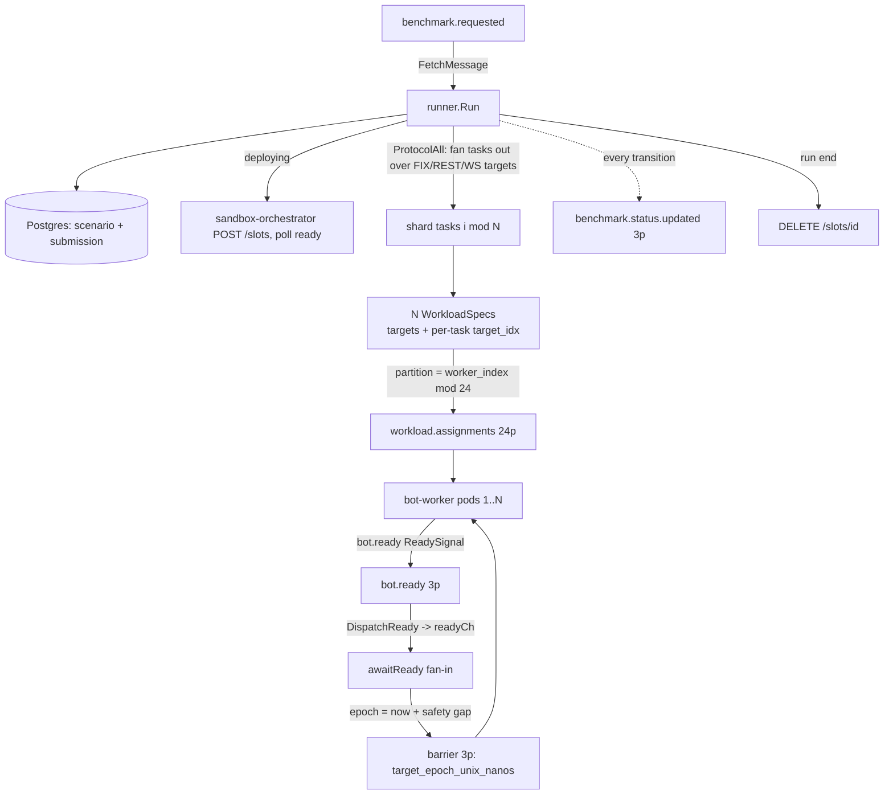

---

## Bot-Fleet Load Generator (Rust)

> **Why Rust:** this is the load generator's whole reason to be a systems language. It must hold an open-loop schedule at hundreds of thousands of orders/sec while *itself* being the timing reference — a single GC pause would inject jitter straight into the send timestamps it records. Rust gives zero-GC execution, explicit control over allocation (per-task frame templates, reused per-task buffers), and Tokio for the per-connection task fan-out, yielding the predictable tail behavior a garbage-collected runtime cannot guarantee.

`services/bot-fleet` is the platform's **open-loop load generator** — the single most performance-critical service. One pod is one Kafka partition's worth of work: it consumes a `WorkloadSpec` from `workload.assignments`, opens N connections (FIX / REST / WS, chosen per task via `spec.targets[task.target_idx]`) to a contestant's sandbox, fires deterministically-generated orders at a fixed paced schedule, captures the contestant's response, and streams every offered order to `orders.sent` for downstream HDR latency analysis. Its design goal is to push the genuine raw send ceiling of a node at a contestant while never *hiding* the latency it induces (coordinated-omission correctness).

### Responsibilities and module layout

| Module | Role |
|---|---|
| `src/main.rs` | Boot: Loki guard, Prometheus server on `:9090`, then `worker::run(Config::from_env())`. |
| `src/config.rs` | Env-driven `Config`; topic names from the shared schema crate; `validate` invariants. Hot-path knobs live here too: `BOT_MAX_INFLIGHT_PER_TASK` and `BOT_WRITE_BATCH` are parsed in `Config::from_env` (`config.rs:32-33`, `:107-116`) rather than scattered `LazyLock`s. |
| `src/worker.rs` (~88 KB, the core) | Consume loop, spec validation, connect fan-out, barrier wait, the protocol task runners, the **pacer**, the pending-map + expiry-queue watchdog. |
| `src/content.rs` | `TaskGenerator` — seeded, deterministic order stream (limit/market/cancel/replace) with a bounded resting-order ledger. |
| `src/fix.rs` | Frame templates: `TemplateCache` (`fix.rs:744`) renders `OrderFrame`s for the task's single assigned protocol by patching a per-task template in place. |
| `src/telemetry.rs` | `TelemetrySink` → background aggregator → pipelined, size-bounded, co-partitioned `orders.sent` batches. |
| `src/kafka.rs` | Producers (split control vs telemetry), consumer config, partition-explicit enqueue, barrier wait. |
| `src/metrics.rs` | Hand-rolled Prometheus registry + `/metrics` HTTP server; per-protocol counters and read-and-reset pacing-fidelity snapshots. |
| `src/time.rs` | `unix_nanos()` and an allocation-free FIX timestamp formatter. |

### Control flow: assignment → barrier → fire

`run()` (`worker.rs:105`) ensures topics, builds a **control producer** and a **telemetry producer**, reads the live partition count of `orders.sent` from broker metadata (overriding `ORDERS_PARTITIONS` so the telemetry co-partition hash always matches reality, `worker.rs:119-128`), then loops on `workload.assignments` with manual offset commit. A spawned task watches SIGINT/SIGTERM and trips a `watch`-channel `CancelToken` for graceful drain (`worker.rs:142-160`). Each `WorkloadSpec` is handled by `run_workload()`:

1. **Validate** (`validate_spec`, `worker.rs:288`): non-empty tasks, `task_count ≤ max_bots_per_worker`, `target_rps>0`, `duration_ns>0`, valid `worker_index < worker_count`, wire-safe identifiers, and — critically — that **worst-case wall time** (barrier wait + max(`start_offset_ns`+`duration_ns`) + 5 s drain) is below `max.poll.interval.ms`. The assignment offset commits only *after* the run, so a run that outlives the poll ceiling would trigger a Kafka rebalance and **re-deliver mid-run** (duplicate execution) — this guard rejects such specs up front (`worker.rs:324-334`).
2. **Connect fan-out** (`connect_tasks`, `worker.rs:381`): resolve the target host once, then a `JoinSet` connects every task concurrently. Each task's protocol and port come from `spec.targets[task.target_idx]`, with a legacy single-target fallback for old specs (`WorkloadSpec::resolved_targets`, e7632cc). **Nagle is disabled on every connection** — `set_nodelay(true)` is set on the FIX, REST, and plain-WS sockets at connect so a small order frame is put on the wire immediately rather than held by Nagle's algorithm; FIX additionally sends a logon frame, REST keeps the socket alive, WS dials `ws://host:port/`. Failed connects are dropped and counted, not fatal — connections are **pre-warmed before the barrier** so connect latency never contaminates the measured spike.
3. **Publish `ReadySignal`** to `bot.ready` (acks=all), keyed `session_id:worker_id`, reporting `connected_count` for the controller's fan-in.
4. **Barrier wait** (`kafka::wait_for_barrier`, `kafka.rs:307`): a *per-worker* consumer group (`{group}-barrier-{worker_id}`, deliberately **not** per-session so it is stable across runs, `worker.rs:343`) reads `barrier` until a `BarrierEvent` matching this `session_id` arrives, yielding `target_epoch_unix_nanos` — a fresh, post-fan-in go-time. Hard timeout `BARRIER_WAIT = 120 s`.
5. **Fire** (`fire_workload`): one Tokio task per connected task, each running the protocol-appropriate loop set; the shared `TelemetrySink` is then `close()`d to drain remaining telemetry.

### The open-loop pacer with catch-up (the throughput fix)

This is the load-bearing performance work. The original per-task pacer slept `interval_ns` between each individual send; a single Tokio timer task tops out around **~1,000 wakeups/s**, so any task asked for >1k orders/s simply couldn't keep schedule and aggregate load collapsed far below the node's real capacity. The fix is **catch-up pacing plus write coalescing**: the loop parks *only* when genuinely ahead of the next due order, then drains *every* order that is already due into one buffer and issues a **single `write_all`** — so under load one syscall + one reactor round-trip amortizes across up to `BOT_WRITE_BATCH` (default 64) orders, the dominant per-order cost found by profiling.

```rust
// worker.rs — fix_write_loop, catch-up + coalesce
if next_send_ns > unix_nanos() {                       // park ONLY if ahead of schedule
    tokio::select! {
        _ = time::sleep_until(instant_from_unix_nanos(next_send_ns)) => {}
        _ = cancel.cancelled() => break,
    }
}
frames.clear(); targets.clear(); batch_buf.clear();
let now_ns = unix_nanos();
while frames.len() < batch_max && next_send_ns <= now_ns {   // drain every DUE order
    let action = generator.next();
    let mut frame = render_frame(&mut template_cache, &action); // P2: patch template
    frame.patch_timestamp(unix_nanos());                        // O(1) in-place SendingTime
    batch_buf.extend_from_slice(&frame.bytes);
    targets.push(next_send_ns);                                 // t0 captured BEFORE the write
    frames.push(frame);
    next_send_ns = next_send_ns.saturating_add(interval_ns);    // fixed step, no jitter
}
```

*Caption:* the `while next_send_ns <= now_ns` loop is the catch-up — a task that fell behind emits a batch larger than one to re-converge on schedule, instead of being timer-rate-limited; a task under the ceiling still paces normally and writes batches of one. Pacing semantics are unchanged: `interval_ns = 1e9 / target_rps` advances by a fixed step regardless of how fast the contestant answers.

**Coordinated-omission correctness.** The intended fire time `target_send_ts_ns` is pushed to `targets` **before** the sleep and before the write. A slow contestant whose backed-up TCP window stalls `write_all` therefore produces a monotonically growing `send_ts_ns − target_send_ts_ns` gap — the CO signal — captured per order as `schedule_slip` (`worker.rs:867-868`). It does *not* let the generator silently slow down its own schedule; `next_send_ns` keeps advancing on the ideal clock.

**Backpressure, not death.** The FIX writer deliberately does **not** impose a per-write timeout (`_write_timeout` is unused, `worker.rs:710-712`). When the contestant can't drain, its receive window fills and `write_all` blocks; TCP flow control then paces *this* task down to the contestant's honest service rate, so aggregate load plateaus at the sink's capacity instead of overshooting. A short timeout did the opposite — `write_all` isn't cancel-safe, so a timeout left a partial frame and forced the task to exit; under sustained backpressure *every* loaded task exited at once and offered load collapsed to zero. A genuinely dead peer still surfaces as a write error and exits the writer. REST/WS still keep a per-write timeout via `time::timeout(write_timeout, …)` (the `write_timeout` field at `worker.rs:655`) — a residual asymmetry, though the write itself is now batched (below).

**In-flight cap (closed-loop safety valve).** A per-task `MAX_INFLIGHT` (`BOT_MAX_INFLIGHT_PER_TASK`, default 10,000, parsed in `Config::from_env`, `config.rs:107-116`) bounds the pending map so a slow contestant or stalled telemetry path can't grow memory unbounded and OOM the worker. At the cap the writer waits on a `tokio::sync::Notify` (`worker.rs:27`, `:677`) that the read loop signals whenever it removes pending entries — the writer wakes the moment capacity frees up, replacing the earlier 1 ms sleep-poll which wasted wakeups when idle and added up to 1 ms of latency when capacity returned (d520955). A healthy contestant sits at `rate × RTT`, orders of magnitude under the cap, so it never false-throttles.

### Single-protocol template-and-patch rendering

Frame rendering went through two revisions. Originally every order eagerly rendered **all three** wire encodings (FIX + full HTTP request + WS frame) even though a task only ever writes one — the "triple-render waste" documented at `docs/tps-improvement-plan.md:64-77`. P1 (d520955) made rendering single-protocol: a task renders only the encoding its `target_idx` resolves to. P2 (ed1184c) then removed the per-order `format!` rebuild entirely: `fix::TemplateCache` (`fix.rs:744`) holds one pre-rendered template per `FrameKind`, created **once per task** (`worker.rs:746-749` for FIX, `worker.rs:1339` for REST/WS) and reused for the task's whole lifetime. `render_frame` (`worker.rs:822`) patches the changing fields (ClOrdID, side, qty, price) into the template in place; only a ClOrdID digit-width rollover or, for REST/WS, a side/qty/price digit-width change forces a template re-render. The hot-path FIX mutation is unchanged from before: `patch_timestamp` overwrites the 21-byte FIX `SendingTime` (tag 52) in place and repairs the checksum with O(1) delta arithmetic (sum the byte deltas, adjust mod 256) rather than re-summing the frame.

The reasoning is the same as everywhere else in this service: a per-message heap allocation or format pass during a wave shows up as jitter in the measured schedule. The per-task buffers (`frames`/`targets`/`batch_buf`) are allocated once and `clear`ed each iteration, so the pacer's hot path is: clock read → template patch → buffer copy → one TCP write. The serialization cost that used to be tracked by an `#[ignore]`d test is now a criterion benchmark (ed1184c).

One piece is deliberately unfinished: raw-WS frames still fall back to full rendering (P2' left unwired, per the 7a4b837 commit message).

### Deterministic content generation

`TaskGenerator` (`content.rs:102`) is seeded with `global_seed ^ task_id`, so a fast and a slow algo receive the **byte-identical** stream — cross-contestant fairness. The RNG draw order is a fixed determinism contract. Order kind is chosen from the per-task `market/cancel/replace` mix; cancel/replace targets are drawn from the bot's *own* bounded `VecDeque` ledger of recently-rested orders (never from observed fills, so the stream can't diverge on contestant behavior). The ledger uses `VecDeque` with `pop_front`/`swap_remove_back` (both O(1)) — a prior `Vec::remove(0)` memmove dominated CPU (~87% in profiling) at high rates with `cancel_pct=0` (`content.rs:109-113`).

### Three-loop send/recv capture across protocols

Every protocol runs the same **three concurrent loops** in a `JoinSet`, sharing one `pending: Arc<Mutex<HashMap<order_id, PendingOrder>>>` plus a per-task `ExpiryQueue`:

- **write loop** — the pacer above; inserts each order into `pending` (with `send_ts_ns=0`), writes, then patches `send_ts_ns` on success and pushes `(deadline, order_id)` onto the expiry queue. The FIX path is `fix_write_loop` (`worker.rs:779`); REST/WS share `rw_write_loop` (`worker.rs:1303`), which since P3' (7a4b837) mirrors the FIX coalescing: it drains every already-due order from the backlog and writes them together — REST as one pipelined `write_all` of N requests, WS as N `feed()` calls followed by a single `flush()`. The earlier one-syscall-per-order behavior is gone; only the per-write timeout asymmetry remains.
- **read loop** — drains responses and matches them to `pending` by client order id: FIX matches tag-11 `ClOrdID` on ExecutionReports (`MsgType=8`, `fix_read_loop`, `worker.rs:973`); REST frames responses by `Content-Length` *or* chunked transfer-encoding; WS reads each frame. For REST/WS the `cl_ord_id` is pulled by a cheap key scan over the response bytes rather than a full `serde_json` parse (P4, 7a4b837) — the id is all the accounting needs. On a match it removes the entry (first-response-wins), signals the writer's `Notify`, and records an `OrderSentEvent` with `recv_done_ts_ns` (r9) and `timed_out=false`.
- **watchdog loop** (`watchdog_loop`, `worker.rs:1070`) — every 250 ms evicts orders older than `RESPONSE_TIMEOUT_NS = 5 s`, recording them as `timed_out=true` (`recv_done_ts_ns=0`); on the **final tick** it evicts *everything* still pending — including writes still in flight (`send_ts_ns==0`) — so **every offered order is accounted** as either matched or timed-out. No phantom drops, which the coordinated-omission and coverage scoring gates depend on. Since P3 (7a4b837) the watchdog no longer scans the whole pending map each tick. Because a task's writer inserts orders in send order, deadlines are monotonically non-decreasing, so a FIFO `ExpiryQueue: VecDeque<(deadline_ns, order_id)>` (`worker.rs:576-592`) is sufficient: `pop_due_expirations` pops only from the front until it hits a not-yet-due entry (or drains everything on the last tick, `worker.rs:1065-1088`). Ids already acked by the read loop are stale queue entries and are skipped, not errors. The full-scan version cost O(pending) per tick — meaningful with the 10k in-flight cap across hundreds of tasks; the queue version costs O(due). Timeout and final-tick accounting semantics are unchanged.

All three loops run until `drain_end_ns = task_end_ns + RESPONSE_TIMEOUT_NS`, giving a 5 s post-send drain window for late responses.

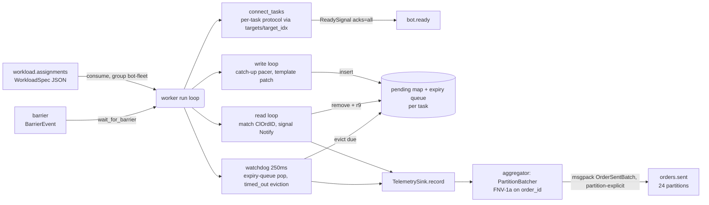

### Telemetry flush path: pipelined, size-bounded, co-partitioned

`TelemetrySink::record` (`telemetry.rs:93`) sends each `OrderSentEvent` over a bounded mpsc channel (`telemetry_channel_capacity`, default 65,536). It is **lossless by backpressure**: a full channel makes `record` `.await` rather than drop, so the generator self-paces to the sustainable telemetry rate (a dropped event would mean a permanent hole in the HDR histogram). The only counted drop is the channel being closed at shutdown.

A single background `run_aggregator` (`telemetry.rs:144`) drives a `biased` `select!` over three arms: (1) account completed deliveries from a `FuturesUnordered` `inflight` set first (keeps it bounded), (2) `recv_many` up to 4,096 events per wake into a `PartitionBatcher`, (3) a flush ticker (default 5 ms) that drains partial batches. The `PartitionBatcher` (`telemetry.rs:283`) buckets events by `partition_for(order_id, num_partitions)` and emits a chunk the instant a partition reaches `MAX_EVENTS_PER_BATCH = 1000` (~360 KB, safely under the 1 MiB `max.message.bytes`). Each chunk is msgpack-encoded as `OrderSentBatch` (`rmp_serde::to_vec_named`) and **enqueued without awaiting delivery** via `enqueue_to_partition` (`send_result`), letting rdkafka pipeline and batch in the background — this decouples drain rate from per-batch broker RTT, which is the core fix (the old await-per-flush loop serialized one round-trip per batch → ~5.7k/s ceiling and ~90% drops). A full producer queue surfaces as `Ok(None)`; the aggregator polls + retries (lossless backpressure) rather than dropping.

`BOT_DISABLE_TELEMETRY=1` makes `record` a no-op and skips the aggregator entirely — used to measure *raw send capacity* against a drain contestant, where there's no validation and a single-broker Kafka can't absorb one event per order.

### Kafka topics

| Topic | Dir | Partitions | Key / partition decider | Group | Why |
|---|---|---|---|---|---|
| `workload.assignments` | consume | **24** | controller sets partition `worker_index % N`; consumed with `partition.assignment.strategy=roundrobin` | `bot-fleet` | 1:1 spec→partition→pod; roundrobin (vs librdkafka's range default) gives each spec a distinct pod when replicas ≥ worker_count. Horizontal scale unit = **one worker per partition** (`worker_count ≤ 24`). |
| `barrier` | consume | 3 | n/a (scans all for matching `session_id`) | `{group}-barrier-{worker_id}` (per-worker, ephemeral) | Low-volume control signal; per-worker group so every worker independently sees the go-time. |
| `bot.ready` | produce | 3 | key `session_id:worker_id` | — | Control-plane fan-in to the controller; `acks=all`, `linger.ms=0` for durability. |
| `orders.sent` | produce | **24** | **explicit partition = FNV-1a(order_id) % 24** (`partition_for`, `schemas/rust/src/lib.rs:26`) | — | **Co-partitioned with `orders.acked`**: the same `order_id` lands on the same partition number in both topics (ebpf-latency, also Rust, uses the identical `partition_for`), so the telemetry ingester can join sent↔acked partition-locally — no cross-partition shuffle. 24 partitions let the ingester scale to 24 parallel consumers; the bot writes the partition itself (bypassing producer-side hashing) to guarantee the contract. |

`partition_for` is FNV-1a 64-bit (`offset basis 0xcbf29ce484222325`, prime `0x100000001b3`) mod partition count. Both `orders.*` producers are Rust (`bot-fleet` and `ebpf-latency`) and call this same function, so they compute byte-identical partitions for a given `order_id`. There is **no Go reimplementation** — the only Go consumer of these topics (the correctness-validator) never recomputes the partition; it simply reads every partition directly.

### Metrics & watchdog accounting

The hand-rolled Prometheus registry (`metrics.rs`) exposes, among others: `iicpc_bot_orders_sent` (the headline send counter, incremented per coalesced batch via `orders_sent_by`), `iicpc_bot_telemetry_events_dropped` (the backpressure/loss probe — lossless operation keeps this at 0), `iicpc_bot_telemetry_events_flushed`/`_batches`, `iicpc_bot_write_seconds` (wall time inside `write_all` — the direct drain-backpressure signal), `iicpc_bot_schedule_slip_seconds` (the CO signal `send_ts − target_send_ts`), and `iicpc_bot_write_batch_size` (how effectively catch-up batching amortizes the syscall).

Two additions since the original list. First, `orders_sent`, `order_write_error`, and the write/slip histograms carry a `protocol` label (`fix`|`rest`|`ws`, `metrics.rs:42-45`; QoL-3) — with mixed-protocol runs a stall cannot be attributed to a transport without it. Second, a set of read-and-reset snapshot stats (`metrics.rs:25-32`) back the 1 s snapshot logger: the worst coalesced batch size, worst schedule slip, and write count seen since the last snapshot read. These are the pacing-fidelity signals the task-count sweeps key on, and they survive even when 15 s Prometheus scraping is too coarse or the port-forward drops. Together with the watchdog's every-order accounting, these make both throughput and induced latency observable.

### Scaling model

**Stateless, partition-sharded, KEDA-autoscaled.** Each worker holds no durable state; its only "ownership" is the set of `workload.assignments` partitions Kafka assigns it. The `ScaledObject` (`k8s/benchmark/bot-fleet/scaledobject.yaml`) scales on a **Kafka consumer-lag trigger**: topic `workload.assignments`, group `bot-fleet`, `lagThreshold "1"`, `offsetResetPolicy: earliest`, **min 2 / max 50** replicas, 5 s polling. `earliest` is required so an unconsumed backlog registers as lag (with `latest` a fresh group reads zero lag and never scales up). The unit of horizontal scale is **one worker per partition**, bounding effective parallelism to the 24-partition layout (`worker_count ≤ 24`); the controller pins each spec to `worker_index % N` so distinct specs reach distinct pods. Deterministic large runs should pre-scale rather than wait on lag. The deployment pins workers to a tainted `botworker` node pool so load generation doesn't crowd the measurement plane.

**Per-pod ceiling.** A single pod's raw generation ceiling is exercised by the per-pod generation-ceiling ramp: three *serial* constant-RPS scenarios at 20k / 60k / 150k aggregate RPS over a **fixed 256-connection fan**, pure new-limit orders (Market/Cancel/Replace = 0), 120 s each — produced by `services/submission-api/cmd/loadgen-seed/main.go` (`buildLean` spreads `target/conns` rps per task with a +1 remainder). bot-fleet honors this purely through `target_rps` pacing and `start_offset_ns` staggering in the `TaskSpec`s; there is no ramp logic *inside* the worker. Resource limits are `cpu: 3` / `memory: 6Gi` (the 6 Gi sized to the worst-case in-flight cap: ≤1000 tasks × 10k in-flight × ~350 B ≈ 3.5 GiB pending + 1 GiB Kafka queue + runtime). An init container clamps `eth0` MTU to 1500 and disables segmentation offload so eBPF latency capture (1536 B cap) doesn't truncate FIX frames.

**Where the ceiling sits after P1-P4.** The pre-improvement drain ceiling on a c6i.xlarge EKS node was ~600-790k orders/s, with a recorded peak of 747,911/s (`deploy-bench/drain-raw-tps.tsv`). After single-protocol rendering, template-and-patch, the expiry-queue watchdog, and batched REST/WS writes, a local 4-thread drain run sustains 2.2-2.6M orders/s — roughly 3× — per the d16086c commit message, with the usual caveat that a laptop is not a c6i node. The EKS re-sweep is pending; `docs/tps-improvement-plan.md:281-284` records 747,911/s as the number to beat.

Local task-count sweeps (`deploy-bench/task-sweep-1784112347.tsv`, `-1784114113.tsv`, `-1784113948.tsv`) characterise pacing fidelity as offered load rises. Up to ~300k/s per worker the schedule is clean: average coalesced batch ~1.3-2.2, max slip under 10 ms. A knee appears at ~400-500k/s, where batches saturate toward the 64 cap and slip grows to 60-400 ms. At 700k-1M offered the pacer collapses: batch pinned at 64, slip 5-9 s, and median achieved rate falls below target. Splitting the same load across two processes (the "split" rows) does not beat a single process, which is consistent with the earlier profiling finding of zero lock contention (`docs/tps-improvement-plan.md:34-37`) — the wall is not a shared mutex.

One measurement trap to know: the echo contestant used by `measure-capacity-sweep.sh` builds each ExecutionReport reply with a per-reply `format!` and an unbatched write, which moves the observed pacing knee from ~500-700k/s (true drain sink) down to ~300k/s (4162fb5; `docs/tps-improvement-plan.md:208-215`). Echo-based sweep numbers therefore under-report pipeline capacity until `execution_report_frame` gets the same template treatment as the bot's own rendering (deferred). For raw-capacity work, the `bot_worker_fix_roundtrip` example now doubles as the load/profiling harness: `EXAMPLE_SINK=drain` gives a true read-and-discard sink (`examples/bot_worker_fix_roundtrip.rs:511-519`), and `DROP_EVERY`/`MAX_INFLIGHT` pass through for drain-mode runs. Its `Config` is built with `..Config::from_env()` (`bot_worker_fix_roundtrip.rs:161-163`) — it previously used `..Config::default()`, which silently ignored `BOT_MAX_INFLIGHT_PER_TASK`/`BOT_WRITE_BATCH` and capped drain runs at ~tasks × 10k/s of in-flight (fixed in d16086c).

Telemetry — a single aggregator per worker, and a single-broker Kafka in the smoke cluster — is the other practical ceiling (hence `BOT_DISABLE_TELEMETRY` for raw-capacity runs). The old telemetry-on/off gap (445k vs 600-790k) was framed against the pre-P1 ceiling and needs re-anchoring against the new one.

### Limitations / scope for improvement

- **`worker_count ≤ 24`** is a hard structural cap from the 24-partition `workload.assignments`/`orders.sent` layout; scaling past 24 generators per session requires re-partitioning both topics in lockstep (the co-partition contract couples them).
- **One telemetry aggregator task per worker** (`telemetry.rs:62-72`) — the per-pod telemetry drain is a single Tokio task; it has been hardened (recv_many, pipelined enqueue) but is still the serial point if a single pod must emit far above its in-flight ceiling. Sharding it (P5 in the plan) remains open.
- **REST/WS retain a per-write timeout** (`write_timeout`, `worker.rs:655`) that the FIX path deliberately abandoned; under backpressure a REST/WS task exits the writer on timeout rather than self-pacing, so those transports don't get the same graceful load-plateau behavior as FIX. Their writes are batched now (P3'), so the gap is the timeout semantics, not per-order syscalls.
- **Raw-WS templates unwired** — P2' left the raw-WS frame path on full rendering (7a4b837); WS-heavy runs pay a render cost FIX and REST no longer do.
- **Single FIX session per connection** with a hardcoded logon (`98=0/108=30`, `SenderCompID=IICPC-BOT`, `fix.rs:82`); no FIX heartbeat/resend handling — fine for a measurement harness but not a conformant FIX engine.
- **`max_bots_per_worker` default 1000** (config + `MAX_BOTS_PER_WORKER` env) caps tasks per spec; combined with the in-flight cap this is what sizes the 6 Gi memory limit — raising either requires re-deriving the OOM headroom comment.
- **Read buffers reset on overflow** (FIX/REST drop the buffer at 1 MiB, `worker.rs:973`/`1460`) — a pathological non-framing contestant loses in-flight matches (they then surface as `timed_out`), correct for accounting but lossy for latency samples.
## eBPF Latency Capture (Rust)

> **Why Rust:** the [aya] toolchain lets the in-kernel BPF program and the userspace loader/parser/publisher share one language, with no C/libbpf split. Rust's allocation-explicit style maps directly onto BPF's constraints (bounded copies, no in-kernel heap), and the userspace drain is zero-GC, so it keeps pace with a 64 MiB ring buffer at line rate without GC pauses. A pause here would drop captured packets, and on the scoring instrument a dropped packet is a lost latency sample.

`services/ebpf-latency` (Rust + [aya], ~4490 LOC) is the platform's scoring instrument. It measures every contestant's wire-to-wire pod service time, `service_time = t7 − t3`, by stamping two timestamps in the kernel, on the wire, outside the contestant's process: `t3` at XDP ingress (the request packet enters the algo pod's veth) and `t7` at tc egress (the response packet leaves it). The contestant's userspace code never touches the clock, so the only way to lower the measured number is to genuinely respond faster on the wire. The captured bytes are reassembled, framed, and matched per `ClOrdID` (the FIX order id) entirely in userspace, then published to Kafka as `orders.acked`.

The component splits into a deliberately dumb kernel program and a smart userspace binary. The in-kernel BPF program does the minimum: parse eth/ip/tcp headers, stamp a timestamp, copy the TCP payload to a ring buffer. That keeps the BPF verifier surface tiny and keeps the captured bytes opaque, so a contestant's protocol layout (FIX field order, HTTP header order, WS masking) cannot break the capture. All protocol understanding lives in userspace, where it can be tested and changed without touching the kernel program.

### Why this measurement is un-gameable

- **Kernel-stamped, outside the sandbox.** Both stamps come from `bpf_ktime_get_ns` (helper id 5) called from `try_xdp_ingress` and `try_tc_egress`; the single stamp site is `ebpf.rs:276` (`ptr::addr_of_mut!((*rec).timestamp_ns).write(bpf_ktime_get_ns())`). XDP is used for ingress because it fires before the kernel network stack, giving the most faithful "order entered the pod" point; tc egress is the only hook available for the response leg.
- **Skew-invariant.** Both stamps are `CLOCK_MONOTONIC` from the same node, and the scored subtraction `t7 − t3` happens in the monotonic domain at `matcher.rs:118` (`let pod_service_time_ns = t7_ns.saturating_sub(inflight.t3_ns)`). Userspace samples a `realtime − monotonic` offset once at startup (`pipeline.rs:146`, `realtime_minus_monotonic_ns`) and adds the same `clock_offset_ns` to both stamps (`pipeline.rs:42`, `to_realtime`), purely to align with the bot fleet's realtime `t0/t1/r9` for diagnostics. Because the offset is added to both, it cancels exactly in the difference: the scored metric needs no PTP/NTP and is immune to NTP steps and inter-node drift.
- **Syscall-model-agnostic (io_uring-proof).** Stamping at the packet boundary (veth) rather than the syscall boundary means the measurement is identical for `recv`/`recvmsg`/`recvmmsg`/io_uring. A tracepoint-on-syscall approach would emit zero events for an io_uring contestant and silently bias scoring by I/O model; the wire-boundary capture has no such blind spot.

### Kernel program (`src/ebpf.rs`, capture-only)

Compiled to a separate `cdylib` for `target_arch = "bpf"` (`Cargo.toml:23-30`, feature `ebpf`); the same file compiles to a no-op `host_placeholder` on the host so the workspace builds without a BPF toolchain. Two programs:

- `#[xdp] iicpc_xdp_ingress` (`ebpf.rs:198`) — RX path; always returns `XDP_PASS` (capture-only, never drops or mangles a packet).
- `iicpc_tc_egress` (`ebpf.rs:208`, `#[link_section = "classifier"]`) — TX path; always returns `TC_ACT_PIPE`.

Both resolve the TCP payload bounds, stamp `bpf_ktime_get_ns`, and copy the payload into a per-CPU `SCRATCH` `CaptureRecord`, which is then `EVENTS.output()`-ed to a 64 MiB `BPF_MAP_TYPE_RINGBUF` (`ebpf.rs:135`). Direction is decided by server port, which doubles as the request/response discriminator: ingress matches `dest ∈ {9898 FIX, 8080 HTTP/WS}` → `DIR_REQUEST`; egress matches `source ∈ {9898, 8080}` → `DIR_RESPONSE` (`ebpf.rs:325`, `ebpf.rs:391`). These two ports are platform constants: submissions are validated to serve FIX on 9898 and HTTP/WS on a shared 8080, so the hardcoded set is a design choice rather than an accident.

**Payload length from the IP header, not the frame.** `xdp_payload_bounds` / `parse_skb_ip_tcp_at` compute `ip_total = u16::from_be(ip.tot_len)`, derive `ip_end`, and set `payload_len = ip_end − payload_offset` (`ebpf.rs:338`, `ebpf.rs:406`). This is the true on-wire payload length even when the verifier-bounded copy captures fewer bytes, which is exactly how userspace later detects truncation.

**Verifier-safe bounded variable-length copy (`CAPTURE_CAP = 1536`).** This is the program's most load-bearing and non-obvious code. The length argument to `bpf_xdp_load_bytes`/`bpf_skb_load_bytes` is `ARG_CONST_SIZE`, which the kernel 6.1 verifier (EKS AL2023) only accepts if the length register carries `umin ≥ 1` and `umax ≤ value_size − payload_off`. Two verifier facts shape `capture_len`:

```rust
// services/ebpf-latency/src/ebpf.rs:180 — verifier-safe clamp to [2, 1536].
fn capture_len(bounds: &PacketBounds) -> Option<usize> {
    let len = unsafe { ptr::read_volatile(&bounds.payload_len) }; // (1) opaque to LLVM
    if len < MIN_CAPTURE_LEN { return None; }                     // (2) JLT raises umin≥2
    if len > COPY_CAP {                                           //     JGT lowers umax≤1536
        if let Some(c) = TRUNCATED_CAPTURES.get_ptr_mut(0) {
            unsafe { ptr::write(c, ptr::read(c).saturating_add(1)) };
        }
        return Some(COPY_CAP);                                   // CLAMP (const) — not skip/mask
    }
    Some(len)
}
```

The `read_volatile` stops LLVM from rewriting the compare on `payload_len` (`= pkt_end − payload_off`) into a compare on the pointer operands, which would refine the pointers but leave the length register unbounded at the call. The bounds are established with relational comparisons (`< 2` lowers to `JLT`, `> 1536` to `JGT`): only relational compares tighten `umin`/`umax`. An equality test (`== 0`) does not, and an AND-mask would reset `umin` to 0. Oversized payloads are clamped to the constant `COPY_CAP`, never skipped. The reason: the tc egress hook runs before GSO segmentation, so it can see a large coalesced skb; skipping would drop every response in a coalesced packet, while clamping captures the leading 1536 B and lets the userspace parser recover whatever complete FIX messages fit, a sampled and acceptable loss for a latency distribution. Returning the constant keeps the length verifier-trivial (`umin = umax = 1536`). Layout: `CAPTURE_HEADER_LEN (28) + COPY_CAP (1536) = 1564 ≤ 1568` value_size.

Per-CPU counters back the metrics: `DROPPED_EVENTS` (ringbuf full, `ebpf.rs:288`) and `TRUNCATED_CAPTURES` (oversized clamp, `ebpf.rs:186`). Records are variable-length: only `CAPTURE_HEADER_LEN + captured_len` bytes are emitted (`ebpf.rs:274`), not the full 1536-byte buffer, so small FIX messages cost ~28 + ~150 B on the ring, not 1.5 KiB.

### Userspace pipeline (`src/main.rs` + modules)

A single multi-threaded Tokio runtime drives one `select!` loop (`main.rs:183`):

1. **`capture.rs`** decodes the ring-buffer ABI: a fixed little-endian 28-byte header + `captured_len` payload bytes, validating `captured_len ≤ available ≤ CAPTURE_CAP`. It derives `Transport::Fix` (port 9898) vs `Transport::HttpWs` (8080) and the `FlowKey {client_ip, client_port}`.
2. **`reassembly.rs`** keeps one `Reassembler` per `(FlowKey, Direction)`. It performs wrap-safe 32-bit TCP sequence reassembly: in-order append, out-of-order hold (`BTreeMap` by seq, capped at 64 segments), overlap/retransmit detection, and gap-fill. `marks: Vec<(abs_offset, ts, seq)>` records the byte offset where each segment landed so that `timestamp_at(offset)` attributes a message's `t3`/`t7` to the segment carrying its first byte — the correct stamp when one message straddles two segments or several messages coalesce into one (`reassembly.rs:285`, `:270`). `reset_for_truncation` re-anchors the stream after a truncated capture.
3. **`parse.rs`** is fully layout-agnostic, with no fixed offsets. FIX is framed by `9=BodyLength` then field-scanned for tags `35/11/41/150/39/32/31`; HTTP by `Content-Length` or chunked terminator; WebSocket by frame length + mask bit (rejecting wrong-direction masking). It returns `Frame::Message(n) | Incomplete | Resync(skip)`, where `Resync` lets the parser recover after a corrupt or truncated stream instead of stalling.
4. **`matcher.rs`** holds an `inflight: HashMap<ClOrdID, Inflight>`. `on_request` records `t3` once (a duplicate request bumps `retransmission_count` but keeps the first `t3`); `on_response` does `get_mut` (not remove), so every ExecutionReport for an order — ACK, each partial fill — emits its own `MatchedEvent`, all sharing the request's single `t3`. Matching is per-`ClOrdID`, not FIFO, so pipelined orders that complete out of order still get the right `t3` (`matcher.rs:166`, `:189`). Idle inflight entries are evicted after 5 s; a hard cap of 1M entries evicts the oldest.
5. **`pipeline.rs`** ties it together and owns the monotonic→realtime offset. On each capture it detects truncation as `cap.payload_len > cap.payload.len` and, if so, calls `reset_for_truncation` instead of feeding corrupt bytes downstream.

#### Truncation re-anchor (the MTU/GSO safety valve)

```rust
// services/ebpf-latency/src/pipeline.rs:59 — on-wire len > captured len ⇒ truncated.
let truncated = cap.payload_len as usize > cap.payload.len();
if truncated {
    re.reset_for_truncation();   // drop the corrupt stream, re-sync on the next clean segment
} else {
    let reordered = re.push(cap.tcp_seq, ts, cap.payload).reordered;
    // ... frame + parse loop ...
}
```

Because the kernel records the true IP-derived `payload_len` but copies at most 1536 B, userspace can tell exactly when a frame was clipped (a super-MTU GSO/TSO/GRO segment) and refuses to corrupt the reassembly buffer with it; it discards and re-anchors on the next clean segment rather than stalling the flow. This is what makes the 1536-byte cap safe rather than a silent latency-loss bug, provided on-wire frames stay ≤ MTU (see the deployment fix below).

#### Losslessness on shutdown and under broker pressure

- **SIGTERM/SIGINT (retain-on-failure).** Kubernetes stops the per-slot Job with SIGTERM; both signals flush the buffered `orders.acked` tail and `return Ok(())` → exit 0, so teardown loses no events and the Job completes `Succeeded` (`main.rs:185`, `ShutdownSignal` at `main.rs:218`).
- **Non-blocking drain.** `drain_ringbuf` is synchronous and never `.await`s on Kafka; `flush` enqueues via `send_result` (`enqueue_to_partition`), polls and retries once on `QueueFull`, then drops the batch (`main.rs:309`). `orders.acked` is loss-tolerant, and graceful latency-coverage loss beats stalling the drain and overflowing the 64 MiB ring — an earlier blocking `send.await` froze the capture at ~107k/s.

### Kafka

**Produces:** `orders.acked` — msgpack-encoded `OrderAckedBatchRef` (`rmp_serde::to_vec_named`), one batch per partition per flush.

- **Topic / partitions:** `orders.acked`, 24 partitions (`ops/kafka/create-topics.sh:44`, `k8s/data/kafka/topic-init-job.yaml:57`). The runtime partition count is auto-detected from broker metadata at startup (`main.rs:142`, `topic_partition_count`).
- **Partition key:** the order id (`ClOrdID`), hashed with FNV-1a 64-bit via `partition_for(order_id, n)` (`schemas/rust/src/lib.rs:26`, seed `0xcbf29ce484222325`, prime `0x100000001b3`). The producer enqueues to an explicit partition (`batch_by_partition` → `enqueue_to_partition`, `main.rs:281`/`:351`).
- **Why this key:** it co-partitions `orders.acked` with `orders.sent`. The bot fleet (also Rust) publishes `orders.sent` keyed by the same `order_id` through the identical FNV-1a `partition_for`, so every order's *sent* and *acked* records land on the same partition number. Both order producers are Rust; there is no Go reimplementation of `partition_for`. This lets the downstream telemetry-ingester join the two streams per order within a single partition, with no cross-partition shuffle. Note this contract is independent of the per-task protocol-targets work in the bot fleet: whatever protocol a task uses, the join key is still `order_id`.
- **Consumer group:** none — the component is a pure producer (it consumes only from the kernel ring buffer, not Kafka).
- **Horizontal-scale link:** co-partitioning by `order_id` means the ingester can scale to N consumers, each owning a slice of the 24 partitions, and still see both legs of every order locally.

### Placement & scaling model — NOT horizontally pooled

This is a per-contestant, privileged, singleton capture pod, scheduled 1:1 with the algo pod (`k8s/benchmark/ebpf-latency/job-template.yaml`, `app=ebpf-capture`, one `Job` per `<SLOT_ID>`). It is not stateless, not sharded, not KEDA-autoscaled, and cannot be pooled, for a structural reason: each instance attaches XDP+tc to one specific NIC (the algo pod's `eth0` veth) inside one specific network namespace. A capture only sees the packets crossing that veth, so there must be exactly one capture per contestant.

Concretely:
- The Job pins to the algo pod's node (`nodeName: <ALGO_POD_NODE>`), runs `hostPID: true` and `privileged` with `BPF, NET_ADMIN, SYS_ADMIN`, and resolves the algo pod's netns from its pod UID by scanning `/proc/*/cgroup` (`netns.rs`, `resolve_netns_path`). It then `setns(CLONE_NEWNET)` into that namespace and attaches there (`with_network_namespace`, `main.rs:456`), restoring the original netns afterward.
- XDP attaches DRV mode first, with SKB-mode fallback (`main.rs:500`).
- The Job is `restartPolicy: Never`, `backoffLimit: 0`, `ttlSecondsAfterFinished: 300` — lifecycle is tied to the slot, not a Deployment.
- The unit of horizontal scale is the contestant/slot: more contestants means more capture Jobs, each on the node of its algo pod. There is no fan-out within one capture.
- **Bottleneck:** the single userspace drain+parse+publish loop. The pod requests up to 4 vCPU (raised from 2 because at >150k delivered/s a 2-core cap CFS-throttled the loop and caused ring-buffer drops). The pipeline holds lossless at ≥ ~144k samples/s; beyond that the limiter is one CPU draining one 64 MiB ring. Because it cannot be pooled, a single very-hot contestant cannot be relieved by adding capture replicas — only by giving its one capture pod more CPU.

### EKS jumbo-frame fidelity issue & the deployment-layer fix

The 1536-byte `CAPTURE_CAP` is safe only if on-wire frames stay ≤ ~1500 B. EKS VPC-CNI nodes default to MTU 9001 (jumbo) with GSO/TSO/GRO on, so a single super-frame exceeds `CAPTURE_CAP`, gets truncated, corrupts FIX framing, resets reassembly, and silently loses ~98% of latency samples while the run still "succeeds". Two layers defend against this:

1. **In-component (best-effort, at attach time, inside the algo netns):** the loader runs `ethtool -K <iface> {tso,gso,gro,lro} off` (`disable_offloads`, `main.rs:430`) and clamps the interface MTU to `CAPTURE_CLAMP_MTU` (default 9001 since `ccf0f80` — the EKS jumbo MTU, which fits one `CAPTURE_CAP`-sized record; 1500 is the rollback lever, `0` disables) via raw `SIOCGIFMTU`/`SIOCSIFMTU` ioctls, so no iproute2 is needed in the image (`mtu.rs`). The clamp only ever lowers the MTU (`mtu_clamp_target`) and is best-effort: failure logs loudly but never aborts the capture.
2. **At the deployment layer (the real fix on EKS):** because generic-mode XDP and cross-node coalescing happen outside the algo veth, the fix is config-only with no code change. The bot-fleet worker's `net-tune` initContainer sets its `eth0` to MTU 1500 + GSO/TSO off (sender side), and `k8s/sandbox/gro-disable-daemonset.yaml` disables GRO on the sandbox nodes' host interfaces (receiver side) so cross-node request segments aren't re-coalesced before the capture sees them (`e2e/02-bootstrap.sh:43-48`). With both in place, match rate goes from ~2% to ~99.9%, `TRUNCATED_CAPTURES` and `iicpc_ebpf_ringbuf_dropped` stay ~0, and `unmatched_responses` drops from millions to a handful.

### Metrics

A small hand-rolled HTTP server on `:9090/metrics` (`metrics.rs`) exposes Prometheus counters. The operationally important ones:
- `iicpc_ebpf_ringbuf_dropped` — kernel ring buffer overflowed (drain can't keep up). Should be ~0; nonzero means a CPU-starved drain.
- `unmatched_responses` (logged from `pipeline.unmatched_responses`, `main.rs:200`) — responses seen with no prior request capture to pair. The canonical signal that the capture-fidelity (truncation) problem above is occurring.
- Also: `iicpc_ebpf_events_decoded`, `_decode_errors`, `_events_flushed`, `_flushes`, `iicpc_ebpf_acked_dropped` (Kafka `QueueFull` graceful drops), `_reordering_detected`, `_retransmissions`, `iicpc_ebpf_attach{result}`.

### Data flow

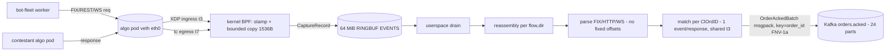

### Limitations / scope for improvement

- **Single-NIC singleton, CPU-bound drain.** One capture per contestant veth; the whole userspace pipeline is one drain loop on one ring. A hot contestant can only be helped with more CPU on its one pod, not more replicas. Sharding the ring by RX queue with per-CPU consumers would lift the per-contestant ceiling but is not implemented.
- **Hardcoded port set {9898, 8080}** in the BPF program (`ebpf.rs:32-34`). Since submission-api now rejects manifests that don't use exactly these platform ports, the compile-time set matches the enforced contract; the residual risk is a mis-provisioned slot, which the orchestrator's `capturablePorts` preflight guards.
- **IPv4-only.** Both `xdp_payload_bounds` and `parse_skb_ip_tcp_at` bail on non-`ETH_P_IP` / non-IPv4 (`ebpf.rs:301`, `:306`); no IPv6 capture.
- **Lossy under sustained truncation or broker backpressure.** `orders.acked` is intentionally loss-tolerant: oversized frames are sampled-clamped (kernel) and `QueueFull` batches are dropped (userspace, `acked_dropped`). Correct for a latency distribution, but it is not an exactly-once stream; losslessness depends on the MTU/GRO deployment fix and a non-saturated broker.
- **Reassembly hard caps.** `MAX_HOLD_SEGMENTS = 64` and `MAX_BUFFERED = 1 MiB` per flow (`reassembly.rs:9-10`); exceeding either resets the stream (counted as a `reset`), which would drop in-flight messages under pathological reordering.
- **`ethtool`/MTU clamp are best-effort and external-tool-dependent.** `disable_offloads` shells out to `ethtool` (must be in the image) and only warns on failure; the real EKS guarantee comes from the deployment-layer net-tune + gro-disable DaemonSet, not the in-pod attempt.

---

## Telemetry Ingester & Rollup (Rust)

> **Why Rust:** the ingester decodes the MessagePack firehose and records into HDR histograms at the full order rate. Zero-GC plus tight control over per-event allocation keep a single replica CPU-efficient and its memory bounded by *in-flight* (not total) orders, and the HDR crate's native, lossless histogram merge is what lets the two-stage shard→rollup design produce percentiles identical to a single global histogram.

The telemetry tier turns two raw Kafka streams — `orders.sent` (what the load generator fired) and `orders.acked` (what eBPF saw egress the contestant pod) — into per-`(session, wave)` HDR-histogram latency distributions and live counters, then persists them to TimescaleDB and Redis for the leaderboard. It is a two-stage, horizontally-scalable design: N stateless *ingester* replicas each own a subset of the 24 co-partitioned partitions and write per-shard partial rows; a single *rollup* worker losslessly merges those partials into the canonical metric rows via native HDR addition. The whole tier lives in `services/telemetry-ingester` (~2.2k LOC of library code; two binaries, `telemetry-ingester` and `telemetry-rollup`).

### Responsibilities & module map

- `src/main.rs` — ingester entrypoint: start Loki + Prometheus, then `ingester::run(Config::from_env())`.
- `src/bin/rollup.rs` — rollup entrypoint: `rollup::run(timescale_url, interval)`.
- `src/ingester.rs` — the consume/snapshot loop (`tokio::select!` over Kafka recv + a snapshot ticker + Ctrl-C).
- `src/aggregate.rs` — the core: the `Aggregator`, per-`(session, wave)` `Window`s, HDR histograms, sent↔acked matching, wave bucketing, eviction, and the `Snapshot` emitted each tick.
- `src/join.rs` — `FirstResponseTracker`: order-id dedup ("first response is the scored sample") with idle eviction.
- `src/store.rs` — TimescaleDB pool, schema bootstrap (`metrics`, `metrics_partial`, hypertables, continuous aggregate), and per-shard `INSERT INTO metrics_partial`.
- `src/rollup.rs` — stage-2 merge: read changed `(session, wave)` partials, carry-forward per-shard cumulative HDR blobs, sum per-bucket counters, UPSERT into `metrics`.
- `src/redis_sink.rs` — hot per-`(contestant, session, wave)` hash for the live dashboard.
- `src/metrics.rs` — hand-rolled Prometheus `/metrics` exporter.

### Data model: what is measured per event

Each `OrderSentEvent` carries `target_send_ts_ns` (t0, when it *should* fire), `send_ts_ns` (t1, when it actually fired), `recv_done_ts_ns` (r9, client-observed full response), a `timed_out` flag, and `barrier_epoch_ns` (`schemas/rust/src/lib.rs:145-164`). Each `OrderAckedEvent` carries kernel timestamps `t3_xdp_ingress_ns`, `t7_xdp_egress_ns`, `pod_service_time_ns` (t7−t3), `exec_type`, and `fill_qty` (`schemas/rust/src/lib.rs:178-194`). From these the aggregator builds four HDR histograms per window (`aggregate.rs:56-67`):

- **`service_time`** = `pod_service_time_ns` (algo-internal time, the latency the contestant owns), from acked.
- **`response_time`** = `r9 − t0` (full client round trip), from sent.
- **`schedule_slip`** = `t1 − t0` (loadgen back-pressure / pacer slip), from sent.
- **`fill_latency`** = in-memory only (tracked, never serialized).

All histograms use identical bounds — `1 ns … 60 s, 3 significant figures` (`aggregate.rs:99-102`, `HDR_MAX_NS=60_000_000_000`, `HDR_SIGFIG=3`) — which is what makes them mergeable across shards: every blob shares the same bucket layout, so HDR `add()` never fails on range (`rollup.rs:49-58`).

### Co-partitioning: why each replica sees both streams for its orders

Co-partitioning is what makes the tier horizontally scalable at all. Both `orders.sent` and `orders.acked` have 24 partitions (`ops/kafka/create-topics.sh:43-44`, `k8s/data/kafka/topic-init-job.yaml:56-57`). The producers do not rely on Kafka's default key-hash — they compute the partition explicitly with `partition_for(order_id, 24)`, an FNV-1a 64-bit hash (`schemas/rust/src/lib.rs:26-37`), and pin the record to that partition. The function itself is reproduced in [the Kafka topology section](#3-the-co-partition-design--the-linchpin-of-horizontal-scale) and lives in the shared schema crate (see [Platform Foundations](#platform-foundations-auth-shared-libraries--schemas)).

The bot-fleet sent-producer groups events with `partition_for(&event.order_id, num_partitions)` and sends each chunk to that explicit `.partition` (`services/bot-fleet/src/telemetry.rs:298`, `services/bot-fleet/src/kafka.rs:281-284`); the eBPF acked-producer does the identical `batch_by_partition` keyed on `partition_for(&e.order_id, ...)` (`services/ebpf-latency/src/main.rs:286-288`). Both order producers are Rust, so they share the one `partition_for` implementation; there is no Go twin (the only Go consumer, the correctness-validator, reads all partitions directly rather than recomputing).

Consequence: for any given `order_id`, its sent event and its acked event always land on the same partition number in their respective topics. Kafka's consumer-group rebalance assigns whole partitions to consumers, so a replica that owns partition *p* of `orders.sent` is the same replica that owns partition *p* of `orders.acked`. It therefore sees both halves of every order it is responsible for, with zero cross-replica coordination: the sent↔acked join is a purely local in-memory `HashMap` lookup. The bot fleet's per-task protocol targets don't disturb this — the join key is `order_id` regardless of which protocol carried the order.

#### Kafka contract summary

| Topic | Partitions | Partition key | Why | Consumer group |
|---|---|---|---|---|
| `orders.sent` (consume) | 24 | `partition_for(order_id)` (FNV-1a, producer-set) | Co-locate an order's sent+acked on the same partition number so one replica owns both | `telemetry-ingester` |
| `orders.acked` (consume) | 24 | `partition_for(order_id)` (FNV-1a, producer-set) | Same hash as `orders.sent` ⇒ matched join is partition-local | `telemetry-ingester` |

It produces no Kafka topics; its outputs are TimescaleDB rows and Redis hashes. The consumer is configured `enable.auto.commit=true`, `auto.offset.reset=latest`, `session.timeout.ms=10000`, `max.poll.interval.ms=300000` (`kafka.rs:13-28`). Telemetry is intentionally loss-tolerant — a dropped event is just an HDR gap — so `latest`/auto-commit is acceptable and avoids replaying old data on restart.

**Scaling unit:** one ingester replica per *N* of the 24 partitions. With `replicas=2` each owns 12 partitions; the ceiling is 24 replicas (one partition each), beyond which extra replicas sit idle since there are no more partitions to assign. The rollup count is independent (and is a singleton, see below).

### Ingester control/data flow

The run loop (`ingester.rs:48-72`) is a single-threaded `tokio::select!`:

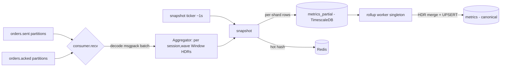

- **Consume:** each Kafka message is an msgpack `OrderSentBatch`/`OrderAckedBatch` (`ingester.rs:76-104`); per event it calls `agg.observe_sent` / `agg.observe_acked`. Decode failures bump `decode_errors{topic}` and are dropped, not retried.
- **Snapshot:** every `SNAPSHOT_INTERVAL_MS` (default 1000) `flush` runs `agg.snapshot(now, interval)`, writes the resulting `Snapshot`s to TimescaleDB then Redis, and publishes gauges/counters (`ingester.rs:108-137`).

**Concurrency model:** the `Aggregator` is not shared — it is owned by the single select loop, so all state mutation is serial and lock-free. The Tokio runtime is multi-thread, but the aggregation hot path is effectively single-threaded per replica; parallelism comes from running multiple replicas across partitions, not from threads within one replica. The DB pool is `deadpool_postgres` size 8 (`store.rs:104-108`); Redis uses one `MultiplexedConnection`.

### Sent↔acked matching & at-least-once dedup

Telemetry is at-least-once, and a streaming order can legitimately emit several acked events (partial fills, then a final fill), so the same `order_id` may be acked multiple times. The `FirstResponseTracker` (`join.rs`) records service_time exactly once per order, on the first acked seen:

```rust
// aggregate.rs:239 — only the first response is scored; later fills don't re-count
if self.first_response.observe(&e.order_id, e.t7_xdp_egress_ns) {
    record(&mut w.service_time, e.pod_service_time_ns);
    self.finalized += 1;
    w.responded += 1;
    if is_reject(&e.exec_type) { w.rejected += 1; } else { w.accepted += 1; }
}
```

`observe` returns `true` only the first time an `order_id` is seen, refreshing a last-activity timestamp otherwise (`join.rs:25-36`). `fill_latency` is still recorded on every qualifying fill (`aggregate.rs:249-252`). This is the dedup guard that test `late_streaming_fill_not_rescored` (H11) protects: a trailing fill of an already-scored order must not be counted as a new response.

### Barrier-derived wave bucketing (stable, control-plane-independent)

A "wave" is a `wave_ns` slice (default 20 s, `DEFAULT_WAVE_NS`) of a session's life. `wave_index = floor((t − session_start) / wave_ns)` (`aggregate.rs:165-174`). The subtlety: `session_start` must be identical across all replicas regardless of which event each one happens to see first, or two shards would bucket the same order into different waves and the rollup would merge mismatched populations. Two mechanisms guarantee stability:

1. **Barrier epoch override:** when `barrier_epoch_ns > 0` on a sent event, it is written directly as the session start (`aggregate.rs:179-182`). The control plane computes `barrier_epoch_ns` once (after all bots signal ready, +500ms gap) and stamps every order, so all shards derive identical wave boundaries, decoupled from the scenario/ramp schedule and from Kafka delivery order.
2. **Earliest-wins fallback:** absent a barrier, `wave_of` lowers `session_start` if a later-arriving event has an earlier timestamp (`aggregate.rs:170-172`), converging all shards to the same origin. Test `barrier_epoch_makes_wave_index_consumer_independent` (`aggregate.rs:416-436`) asserts two independent aggregators compute the same wave from out-of-order input.

### The snapshot: cumulative percentiles, per-interval rates, three blobs

`snapshot` (`aggregate.rs:258-320`) walks every active window and emits a `Snapshot` per window that has both a non-empty `service_time` histogram and a known `contestant_id`. The deliberate split:

- **Percentiles** (`p50/p90/p99/p999`, `rt_p50/p90/p99`) are read from histograms that are never reset, so they reflect the wave's whole life (a cumulative distribution).
- **`tps_1s` / `error_rate` / `offered` / `errors`** come from integer counters that are zeroed every snapshot (`aggregate.rs:301-306`), so they reflect just this interval.

Each snapshot serializes three HDR blobs with `V2DeflateSerializer` (`aggregate.rs:296-298, 343-347`): `hdr_encoded`=service_time, `rt_hdr_encoded`=response_time, `slip_hdr_encoded`=schedule_slip. This is the coordinated-omission decomposition: to see CO offline you need algo-time, full round-trip, and back-pressure as separate curves. Because each blob is cumulative-per-wave, the downstream merge contract is last-blob-per-wave then HDR-add across waves — never sum all rows, which would double-count the cumulative prefix. The same discipline is mirrored in the JS frontend `hdr.ts` and the Python plotter.


*The decomposition rendered for a real run: the flat blue curve is the scored algo service time; the rising yellow tail is the full round trip. The gap between them is non-algo overhead — coordinated omission + network + kernel queueing.*

### Tail-censoring fix: `service p99 ≤ response p99`

A subtle correctness bug the code fixes: when the load generator abandons an order at its 5 s `RESPONSE_TIMEOUT`, `observe_sent` excludes it from `response_time` (`aggregate.rs:209` requires `!e.timed_out`). But the pod can still egress a late response, so eBPF emits an acked with a huge `pod_service_time`. Recording that into `service_time` while `response_time` omits it would make the two histograms cover different populations, and `service p99` could then exceed `response p99`, which is impossible per order. The fix: a `timed_out_orders` map marks abandoned order-ids on the sent side (`aggregate.rs:198-205`) and `observe_acked` early-returns for any marked order (`aggregate.rs:226-229`), keeping both histograms over the same "answered-in-time" population. The marker map is bounded by `TIMED_OUT_IDLE_NS = 15 s` (`aggregate.rs:27`), deliberately short: under overload the map grows as `timeout_rate × window`, so a long window (e.g. the 60 s HDR ceiling) would OOM the ingester before the 5 s join buffer does. Tests `timed_out_order_excluded_from_service_time`, `ack_before_completed_sent_still_records_service`, and `timed_out_markers_are_evicted` (`aggregate.rs:561-616`) pin this behavior, including the assertion `s.p99_ns <= s.rt_p99_ns`.

### State ownership & eviction (memory safety)

The `Aggregator` owns five maps, all bounded by idle eviction in `snapshot` (`aggregate.rs:309-318`):
- `windows: (session,wave) → Window` — evicted after `WINDOW_IDLE_NS = 30 s` idle.
- `session_start`, `session_contestant` — pruned to sessions with a live window (test `session_state_pruned_after_window_eviction`, M29).
- `FirstResponseTracker.seen` — evicted after `FIRST_RESP_IDLE_NS = 5 s` idle; the eviction count is exported as `records_evicted` (in-flight orders that never got a scored sample).
- `timed_out_orders` — evicted after `TIMED_OUT_IDLE_NS = 15 s`.

These bounds keep a single replica's memory proportional to in-flight orders, not total run volume.

### Stage 2: the rollup (native HDR merge into canonical `metrics`)

Each replica writes to `metrics_partial` tagged with its `shard` id (`INGESTER_SHARD`, defaulting to pod name via `HOSTNAME`; `config.rs:39-43`, `store.rs:80-83`). The `telemetry-rollup` singleton (`bin/rollup.rs`) periodically (default 1 s) merges these into the canonical `metrics` table on a sealed-bucket watermark:

- `run()` (`rollup.rs:315-334`) advances a `watermark_ns`; it only rolls up buckets older than `ROLLUP_LAG_NS = 3 s`, so every shard's partial for that second has landed. The watermark advances only after a successful DB write, so a failed tick is retried.
- `roll_window` finds `DISTINCT (session_id, wave_index)` touched in the window, reloads each wave's full partial history ordered by 1-second bucket, and calls `roll_wave_buckets`.
- `roll_wave_buckets` (`rollup.rs:124-156`) implements last-observation-carried-forward per shard: per 1-second bucket it sums the per-interval counters (`tps`, `offered`, `errors`) across shards, but keeps each shard's latest cumulative HDR blob in a `BTreeMap<shard, blobs>`, so a shard that stopped flushing earlier still contributes its final cumulative tail to later buckets (test `roll_wave_buckets_carries_forward_a_shard_that_finished_earlier`).
- The merge itself is lossless native HDR addition: decode each shard's V2-deflate blob and `add()` into one accumulator, then read true merged percentiles:

```rust
// rollup.rs:63 — lossless cross-shard HDR merge → exact merged percentiles
fn merge_one<'a>(blobs: impl Iterator<Item = &'a [u8]>) -> Histogram<u64> {
    let mut acc = new_hist();
    for blob in blobs { decode_into(&mut acc, blob); }  // HDR add(), skips empty/garbage
    acc
}
```

- The result is UPSERTed into `metrics` keyed on `(time, session_id, wave_index)` (`UPSERT_METRICS`, `rollup.rs:169-178`), idempotent across rollup restarts. Test `merge_partials_equals_combined_histogram` proves the merged sketch's percentiles equal a histogram built from all raw samples (no fidelity loss vs. a single-node aggregator), and `merge_partials_single_shard_is_identity` proves the 1-shard path is a no-op merge.

### Storage layer & self-provisioning

`store.rs` bootstraps on startup (`init_schema`): creating the base `metrics`/`metrics_partial` tables is fatal on failure, while every TimescaleDB step is best-effort (logged + continue) so the service runs against plain Postgres without TimescaleDB. The TimescaleDB extras (`TIMESCALE_SETUP`, `store.rs:64-75`): a 1-hour-chunk hypertable on `metrics`, and a `metrics_10s` continuous aggregate (`avg(p99_ns)`, `max(tps_1s)`, `avg(error_rate)` per 10 s × contestant, refreshed every 10 s), giving the leaderboard pre-computed rollups without scanning raw rows. Redis stores a hot hash per window keyed `contestant:{contestant_id}:{session_id}:{wave_index}` (`redis_sink.rs:60-65`) for the live SSE dashboard.

### Observability

`/metrics` on `:9090` (hand-rolled HTTP server, `metrics.rs:130-148`). Key gauges/counters: `iicpc_telemetry_events_consumed{topic}`, `decode_errors{topic}`, `consume_errors` (the drop/ingest counters), `records_finalized` (real recorded-latency throughput — orders that got a service_time sample, not snapshot row count), `records_evicted` (in-flight orders dropped without a scored sample, a join-buffer-overflow signal), `join_buffer_size` (in-flight tracked orders), and TimescaleDB/Redis write + error counters with a write-duration histogram. Consumer lag is observed externally via Kafka group metrics on group `telemetry-ingester`; the service does not export lag itself.

### Scaling model, autoscaling & bottlenecks

- **Ingester:** stateless-per-partition / sharded. State is per-`(session,wave)` and fully reconstructable from the stream, so a replica can die and another picks up its partitions on rebalance. Horizontal scale unit = Kafka partition; ceiling = 24 replicas. Deployed `replicas: 2`, RollingUpdate, 1–2 CPU / 0.5–1 Gi (`k8s/benchmark/telemetry-ingester/deployment.yaml:13-76`).
- **Rollup:** singleton (`replicas: 1`, Recreate, `deployment.yaml:84-137`). It is not partitioned; a second rollup would race on the same `metrics_partial` rows. Idempotent UPSERTs make it safe to crash-restart, but not to scale out.
- **KEDA:** none for this tier. There is a KEDA `ScaledObject` for bot-fleet but no autoscaler for telemetry-ingester or rollup — both are fixed-replica Deployments. Scaling out is a manual `replicas` bump (≤24 for the ingester).
- **Bottlenecks:** (1) the ingester aggregation hot path is single-threaded per replica — at very high event rates one replica is CPU-bound on msgpack decode + HDR record, which is exactly why partition-sharding exists. (2) The rollup is a single process doing a per-tick full-history reload + HDR decode per touched wave; many concurrent waves/shards make it the throughput limiter and the reason for the 3 s seal lag. (3) The DB pool (8 ingester / 4 rollup) caps write concurrency.

### Limitations / scope for improvement

- **Rollup cannot scale horizontally** (singleton by construction; no partitioning of `metrics_partial`); it is also the only place that produces canonical `metrics`, so it is a single point of throughput limitation under many-shard fan-in.
- **No KEDA / HPA** on either deployment — capacity is provisioned, not autoscaled; an undersized replica count silently drops telemetry (loss-tolerant by design, visible only via `records_evicted` / consumer lag).
- **Auto-commit + `latest` offset** means a replica restart loses any unprocessed backlog rather than replaying it — acceptable for loss-tolerant telemetry but means brief gaps on rebalance.
- **`TIMED_OUT_IDLE_NS = 15 s` is a hardcoded OOM-safety cap:** a rare ack later than 15 s slips back into `service_time` (the comment acknowledges this; its `pod_service_time` is already >15 s so it barely perturbs p99).
- **`metrics_partial` retention** is never trimmed by the service (it relies on TimescaleDB chunk policies set elsewhere); the rollup reloads a wave's entire partial history on each touch, so long-lived waves grow the per-tick reload cost.
- **`fill_latency` is tracked but never serialized** (`aggregate.rs:251`), so fill-latency percentiles are not persisted despite the histogram being maintained.
## Correctness Validator (Go)

> **Why Go (even though it's CPU-heavy):** unlike the load generator and the capture, the validator runs offline, after the run completes. Correctness, not latency, is the goal, so a GC'd language is fine. Its bounded-memory single-pass design plus Go's `btree` ecosystem make the reference order-book replay and the six-violation diff productive to write and maintain; the platform never measures the validator's own speed, only its verdict.

### Role

The correctness-validator is the platform's correctness oracle. For each finished benchmark session it replays that session's entire `orders.sent` stream through an internal, ground-truth central-limit order book (CLOB) with true price-time priority, then diffs what a correct engine would have done against what the contestant's engine actually did (its fills, reported on `orders.acked`). The output is a single `scores.correctness` event per session: `valid_fills / total_fills` plus a per-violation taxonomy, persisted to Postgres and emitted to Kafka for the score-computer/leaderboard.

It is a Go service of ~2.6k LOC under `services/correctness-validator`, structured as a thin `main.go` driver around six internal packages: `book` (the reference CLOB), `replay` (canonical event ordering), `model`/`pipeline` (event→order assembly), `source` (bounded Kafka drain + reorder), `validate` (the diff engine), `publisher` + `store` (Kafka out + Postgres idempotency).

### Trigger and control flow

The validator does not stream-consume order events continuously. It is event-triggered per session: `concurrency` worker goroutines (default 4, `VALIDATOR_CONCURRENCY`) each run a `benchmark.status.updated` consumer in the consumer group `correctness-validator` (`main.go:90-92`, `main.go:310-320`). When a `RunStatusCompleted` message arrives, the worker:

1. **Idempotency check** — `store.SummaryStatus(sessionID)`. If already `scored`, it re-loads and re-publishes the cached score and skips re-validation (`main.go:175-193`). If a `timed_out` placeholder exists, it re-runs (`main.go:194-196`).
2. **Settle delay** — waits `SETTLE_DELAY_MS` (default 10s) so in-flight `orders.acked` writes land before draining (`main.go:198-202`).
3. **Drain + validate** — `source.StreamSession(...)` walks the session's order events (see *Bounded drain*), feeding each assembled order into a `validate.StreamValidator` and each unmatched fill in as a phantom (`main.go:204-217`).
4. **Persist + publish** — atomically `store.Save` (claim) the summary + violations, then `publisher.Publish` the `CorrectnessScoreEvent` (`main.go:223-261`).
5. **Commit** the `benchmark.status.updated` offset only on success; on error it does not commit, so the message redelivers and the session is retried (`main.go:360-367`).

Validation runs inside a `VALIDATION_TIMEOUT_MS` (default 60s) context. `checkTimeoutConfig` enforces `timeout > settle` at startup (`main.go:373-381`).

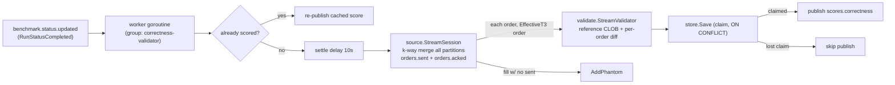

### Kafka topics

| Direction | Topic | Partitions | Key / partitioning | Consumer group |
|---|---|---|---|---|
| Consume (trigger) | `benchmark.status.updated` | 3 | n/a (read via group) | `correctness-validator` |
| Consume (data) | `orders.sent` | 24 | order_id → FNV-1a → partition | none (direct per-partition offset reads) |
| Consume (data) | `orders.acked` | 24 | order_id → FNV-1a → partition | none (direct per-partition offset reads) |
| Produce | `scores.correctness` | 3 | `session_id` | — |

Partition counts: `ops/kafka/create-topics.sh:38,43-45` and `k8s/data/kafka/topic-init-job.yaml:51,56-58`.

The co-partition contract is what makes the drain tractable. `orders.sent` and `orders.acked` are both partitioned by hashing the `order_id` with FNV-1a 64-bit (`schemas/rust/src/lib.rs`, `partition_for`). Because both producers use the same hash on the same key, every event about a given order — its send and all its acks/fills — lands on the same partition index in both topics. A single order's complete lifecycle is therefore contained within one (sent-partition, acked-partition) pair, so the two streams can be joined without a global shuffle. This is what makes per-partition (and ultimately per-session, see *Scaling*) sharding possible.

The trigger topic is consumed with a real consumer group (`KAFKA_STATUS_GROUP`, default `correctness-validator`, `main.go:311-320`), so the N worker goroutines (and any future replicas) split the 3 status partitions among themselves; each session is owned by exactly one worker. The two data topics are not consumed via a consumer group at all: `source.streamPartition` opens a partition-scoped `kafka.NewReader` and seeks to an explicit offset window (`stream.go:255-258`), reading every partition of the session. Producing to `scores.correctness` is keyed by `session_id` (`publisher/kafka.go:54`, `RequireAll` acks), so all scores for a session co-locate on one partition for ordered downstream consumption.

### The reference order book (ground truth)

`internal/book` is a textbook price-time-priority CLOB. Two `btree.BTreeG[*priceLevel]` trees hold the book — asks ascending, bids descending, so the best price of either side is `Min` (`book.go:73-75,94-95`). Each price level keeps a FIFO slice of `*restingOrder`; the front of the slice is the oldest, i.e. highest time priority (`book.go:66-69`). A monotonic `seq` stamps arrival rank as orders rest (`book.go:245-246`), and `seqByOrder` records it for later queue-jump reasoning.

`Process` dispatches on order kind (`book.go:181-192`): `NewLimit`/`NewMarket` → `matchAndRest`; `Cancel` → `remove`; `Replace` → `replace`. `matchAndRest` walks the opposite tree, crossing the aggressor against resting makers at each level front-first, emitting paired `Fill`s and a `Trade{MakerOrderID, TakerOrderID}` per match, evicting fully-consumed makers, and (for limits) resting the residual (`book.go:196-240`). `replace` models the subtle rule: a same-price down-size keeps queue position (mutate in place), but a price change removes and re-inserts at the tail and flags the order as `repriced` — the data needed to detect lost time priority on a REPLACE (`book.go:302-326`).

```go
// book.go:209-231 — the price-time-priority matching core (FIFO front-first per level)
for len(level.orders) > 0 && remaining > 0 {
    maker := level.orders[0]                       // front = oldest = time priority
    traded := min(remaining, maker.remaining)
    e.fills = append(e.fills, Fill{OrderID: o.OrderID, ...}, Fill{OrderID: maker.orderID, ...})
    e.trades = append(e.trades, Trade{MakerOrderID: maker.orderID, TakerOrderID: o.OrderID, ...})
    maker.remaining -= traded
    remaining -= traded
    if maker.remaining == 0 {
        level.orders = level.orders[1:]            // pop the filled maker off the front
        delete(e.index, maker.orderID)
        e.evicted = append(e.evicted, maker.orderID)
        e.closeAvail(maker, o.EffectiveT3)         // stamp liquidity exit at aggressor's t3
    }
}
```

The engine infers maker/taker rather than trusting the contestant: the `Trade.MakerOrderID`/`TakerOrderID` roles are assigned by which side was resting in the reference book at match time, never read from the ack. This lets the validator catch self-trades and queue jumps the contestant might mislabel.

### The six violation classes

`validate` defines exactly six (`validate.go:18-25`), and the per-order diff in `StreamValidator.scoreOrder` (`stream.go:123-171`) classifies every reported fill into one:

1. **Phantom** — a fill reported for an `order_id` that was never sent (`stream.go:94-98`).
2. **Overfill** — cumulative reported qty exceeds the order's own qty (`stream.go:134-137`).
3. **Price** — the reference produced no fill, or no fill at that price, or the cumulative reported qty exceeds the reference's fill qty and no queue-jump explains it (`stream.go:144-165`).
4. **Time** — the order filled ahead of an earlier same-price order that should have had time priority (a queue jump that was not a reprice).
5. **CancelReplaceLoss** — the same queue-jump situation, but the jumping order was `repriced`: a price-changing REPLACE forfeited its queue position, so its fill ahead of an order already resting at the new level is the violation (`validate.go:219-228`, `flagJump`).
6. **SelfTrade** — the reference match for this fill has the same participant (bot_id, parsed by `model.ParticipantOf` from the order_id) on both sides (`stream.go:139-142`).

**Queue-jump auto-split.** `flagJump` is the single entry point for both Time and CancelReplaceLoss; it consults `engine.Repriced(orderID)` to decide which to record (`validate.go:219-228`). The jumper itself is found by `queueJump` (`stream.go:175-201`): among orders still resting ahead of the filled order at the same price/side with a lower seq (and not a cross-flow tie), pick the earliest. The streaming rewrite deliberately checks only the real queue (orders actually resting) rather than every order that ever existed at that price (`stream.go:11-12`).

Under/short-reporting is never penalized. The diff only ever flags excess or wrong fills, so an engine that simply does less than optimal is not punished as incorrect.

### Canonical replay ordering (effective_t3, cross-flow tie)

A live in-sandbox engine sees orders in socket-readable order; the reference must replay them in the order TCP userspace would have delivered. `replay.Order`/`replay.Less` (`replay/order.go`) impose this:

- **TCP head-of-line promotion.** Within each flow (`SrcIP:SrcPort`), sort by wraparound-safe `tcp_seq`, then promote each order's `EffectiveT3` to the running-max of T3 (`order.go:27-37`). A packet reordered on the wire is buffered by TCP until its predecessor arrives, so its effective delivery time is its predecessor's — the contestant is never accountable for kernel/wire reordering it could not observe.
- **Global order** — stable sort by `(EffectiveT3, Flow, TCPSeq)` (`order.go:42-51`).
- **100ns cross-flow tie tolerance.** `CrossFlowTie` returns true only for orders on different flows whose `EffectiveT3` differ by `< TieToleranceNs` (100, `order.go:14,71-76`). Below the eBPF timestamp jitter floor the platform cannot prove which arrived first, so time-priority/queue-jump violations between such pairs are suppressed (`stream.go:193`, `validate.go:269`). Within a single flow the byte stream is unambiguous, so the check stays strict.

#### Known issue: strict cross-flow ordering penalizes epoll engines

The `(EffectiveT3, Flow, TCPSeq)` order fixes intra-flow ambiguity, but across flows it asserts more than a real engine can honor. A contestant process reads its sockets via epoll: when several connections have readable data, the order in which the process drains them is scheduler-dependent, not arrival-time-dependent. The engine's actual processing order across connections therefore differs from the capture-order the validator replays, even when the engine is doing everything a userspace program can do. The 100ns cross-flow tie tolerance only covers pairs inside eBPF timestamp jitter; two orders on different flows arriving 10µs apart are strictly ordered by the replay, yet the engine may legitimately process them the other way around.

The observable effect is false price and time violations against correct engines. Both the reference C++ and Go stock-socket engines score around 45% under strict grading; scoring high currently requires kernel-bypass techniques that make processing order track arrival order. Note the scope: this is a MULTI-flow problem, so it belongs to pass 2 (scale scenarios, many connections). Pass 1 runs a single task on a single connection, where `TCPSeq` totally orders the session and the replay order is the wire order — there is no cross-flow ambiguity to penalize. Fixing this — for example by widening the cross-flow tolerance to the epoll-scheduling scale, or by validating against any ordering consistent with per-flow sequence plus a bounded cross-flow window — is an open design item tied to the planned validator redesign. The `AGGRESSIVE_FILL_TOLERANCE_US` escape hatch that used to be cited here was deleted with the batch validator (2026-07-31): it was implemented only on the batch path, so it never took effect in production, and the availability windows feeding it grew O(session) in the engine. Any real mitigation needs a bounded per-level structure and a deliberate grading decision.

#### Zero-padded numeric fields (P2 wire-format interaction)

The bot-fleet's P2 template-and-patch renderer emits fixed-width, zero-padded numeric FIX fields (`38=`, `44=`, `34=`) so template offsets and BodyLength stay constant (`docs/tps-improvement-plan.md:125-130`). The plan's compatibility ledger (`docs/tps-improvement-plan.md:263`) flags the consequence for this service: zero-padded values must compare equal to unpadded ones (standard integer parsing handles this; a string compare would not). ClOrdID (`11=`) is deliberately excluded from padding — it stays exactly `sess_bot_seq_K`, unpadded, because it is the join key across telemetry, the eBPF matcher, and this validator. Documented here as a constraint on the planned redesign rather than a change already made.

### Aggressive-fill tolerance (removed 2026-07-31)

There is no fill tolerance. Grading is strict.

The mechanism that used to live here worked like this: market/IOC fills depend on which liquidity rested at the instant the order was processed, and a live engine cannot observe `effective_t3`, so the engine recorded each resting order's availability window `[enter_t3, exit_t3]` and `AGGRESSIVE_FILL_TOLERANCE_US > 0` accepted a fill the reference didn't produce when non-self opposite liquidity at that price had been resting within `±tolerance` of the aggressor's `EffectiveT3`.

It was deleted for three reasons. It was implemented only inside the batch `validate.Run`, which `main.go` never called, so the documented env knob was a production no-op. It addressed cross-flow interleaving ambiguity, which pass 1 does not have — one task, one connection, `TCPSeq` totally orders the session (see *Known issue: strict cross-flow ordering penalizes epoll engines* for where the ambiguity actually lives, and note that pass 2 is book-free and never consulted this path). And the `avail` slice backing it grew O(session) inside the engine with no trim, an unbounded allocation on the streaming path whose entire design premise is bounded memory. Overfill and self-trade were never tolerated even when it was live.

### Price-scale reconciliation

`orders.sent.price` is a raw FIX tag-44 integer; `orders.acked.fill_price` is fixed-point ×1e9 from the kernel parser. Without rescaling, every fill would be a phantom price violation. `pipeline.AssembleOrder` lifts the reference order price into the eBPF domain by multiplying by `topics.TelemetryPriceScale` (= `1_000_000_000`) at assembly time (`pipeline.go:36`, `schemas/go/topics/topics.go:23`), so reference and reported prices are compared in the same units.

### Bounded, UUIDv7-anchored Kafka drain

`source.StreamSession` is the data-plane heart. It discovers every partition of both topics, launches one bounded-channel reader goroutine per `(topic, partition)`, primes each reader's head, then does a k-way merge by event time (sent → `SendTSNS`, ack → `T3XDPIngressNS`; the bot and eBPF nodes are NTP-synced within a few ms) (`stream.go:65-225`). A single consumer walks the merged stream, joining each order to its acks in a `pendingOrder` map and flushing orders into the `Reorderer` once the watermark passes their send time plus a bounded `JoinWindow` (500ms) (`stream.go:137-173`). Memory is O(live book + join window + reorder window), never O(session). This bound is not optional: the batch path it replaced OOMed on real sessions (observed at 445k of 885k orders buffered), which is why streaming became the only wired path — and, since 2026-07-31, the only path at all.

The start offset is bounded by the session's UUIDv7 timestamp rather than a full-topic scan: `sessionStartFromID` decodes the 48-bit millisecond timestamp embedded in the v7 UUID (validating version nibble `raw[6]>>4 == 7`), and the reader seeks to `(session_start − 60s startMargin)` via Kafka time-offset lookup (`drain.go:23,267-299`, `stream.go:248`). This avoids re-reading the whole retention window for every session.

**The `-1` / `resolveStart` drain bug it fixes:** Kafka's `ReadOffset(time)` returns the sentinel `-1` when the requested time is after the last message in the partition (i.e. the session produced nothing to that partition). A naive `SetOffset(-1)` would be interpreted as "seek to latest" and silently read forward forever or produce garbage. `partitionOffsets` guards this: `resolveStart(seek, last)` maps a negative seek to `last`, so `start >= last` and the partition is correctly skipped (`drain.go:204,255,258-265`). Without this, empty partitions for a session would corrupt the drain.

### At-least-once acked dedup and recoverable timeout

`orders.acked` is at-least-once. In the legacy batch drain (`drain.go`), `ackedCollector` dedups on the composite key `{order_id, exec_type, t7_egress_ns}` (`drain.go:54-99`); the egress timestamp distinguishes genuine multiple responses from redeliveries. The dedup count is exported as `validator_events_drained_total{topic="orders_acked_duplicates"}`. In the streaming path acks are accumulated per `pendingOrder` and the per-order diff is naturally idempotent over identical responses.

If validation exceeds `VALIDATION_TIMEOUT_MS`, the worker writes a `timed_out` placeholder record with a zero `validate.Report{}` (`main.go:194-196,272-282`, `recordValidationTimeout` at `main.go:286-306`) and treats the message as handled (committing the offset). Because a future `benchmark.status.updated` redelivery will find status `timed_out` and re-run, the timeout is recoverable, not terminal. The score-computer treats a 0/0 placeholder as ungateable rather than as a real zero score.

### Idempotency / exactly-once-ish publish

`store.Save` is the claim mechanism. Its `INSERT ... ON CONFLICT (session_id) DO UPDATE ... WHERE correctness_summary.status = 'timed_out' AND EXCLUDED.status = 'scored'` (`postgres.go:138-158`) means the first worker to finish a `scored` result claims the row (RowsAffected > 0 → `claimed=true`), and a concurrent loser sees `RowsAffected == 0` and skips publishing (`main.go:239-243`). Violations are bulk-loaded via `COPY` in the same transaction (`postgres.go:173-188`). An already-`scored` session re-publishes the cached `CorrectnessScoreEvent` from `LoadScore` instead of re-validating (`main.go:175-193`).

### Metrics

- `validator_events_drained_total{topic}` — sent / acked / `orders_acked_duplicates` events drained (`main.go:219-220`, `drain.go:125`).
- `validator_scores_published_total` — scores emitted to `scores.correctness` (`main.go:189,260`).
- `validator_session_events_buffered` — histogram of the bounded in-flight order window per session (`stream.go:236-237`).
- `validator_validation_errors_total{stage}`, `validator_sessions_validated_total{result}`, `validator_violations_total{type}`, `validator_inflight_sessions`, `validator_drain_duration_seconds` (`main.go:139-157,164-168,218`).
- `submission_validation_failures_total{reason}` is declared in `libs/go/metrics/metrics.go:328` but not emitted by this service — validation failures here surface as `validator_validation_errors_total` / `validator_sessions_validated_total{result="error"}`.

### Scaling model

The validator is stateless (all durable state is in Postgres) and scales along two independent axes:

- **Within a replica:** `VALIDATOR_CONCURRENCY` worker goroutines (default 4) sharing one `benchmark.status.updated` consumer group, each validating a different session concurrently. The 3 status partitions cap a single replica's session-level parallelism at 3 in-flight sessions across the group.
- **Across replicas (latent):** the consumer group plus the Postgres claim make horizontal replicas safe — sessions partition across the group; double-validation is impossible because of the `ON CONFLICT` claim. The unit of horizontal scale is the session (one session = one drain = one reference replay).

Per-session memory is bounded by the streaming design: O(live reference book + 500ms join buffer + reorder window), independent of session length. The reorder window default is `1<<20` orders (`stream.go:30`).

**Bottleneck:** within a session, work is serial — a single goroutine k-way-merges all 24×2 partitions and feeds one engine, so a single huge session cannot be parallelized internally; its drain (network) + replay (CPU) latency is the floor, with `VALIDATION_TIMEOUT_MS` (60s) the hard cap before the recoverable timeout placeholder.

### Limitations / scope for improvement

- **False violations against epoll engines under strict cross-flow ordering** (see the *Known issue* subsection above): stock-socket reference engines score ~45% because their processing order across connections legitimately differs from the `(EffectiveT3, Flow, TCPSeq)` capture order. This is the highest-priority validator problem and is tied to the planned redesign.
- **Deployed as a single replica, no KEDA.** `k8s/benchmark/correctness-validator/deployment.yaml` sets `replicas: 1`; there is no `ScaledObject` for this service. The code is replica-safe (claim + group), but the autoscaling story is unrealized — scaling is currently only the in-process `VALIDATOR_CONCURRENCY`.
- ~~**Two parallel diff implementations.**~~ Resolved 2026-07-31: the batch path (`validate.Run` + `pipeline.Run` + `source.DrainSession`) is deleted, leaving `validate.StreamValidator` + `source.StreamSession` as the single implementation of full mode. Keeping both had been actively harmful, not merely redundant — because the equivalence tests compared the two paths to each other rather than to the specification, they hid that streaming could not detect a self-match at all, that `Time`/`CancelReplaceLoss` were unreachable on the live path, that `ScoredFills` underflowed, and that duplicate acks were double-counted. See `docs/remaining-work.md` §"Validator: the batch path is deleted".
- ~~**Aggressive-fill tolerance is currently strict-only.**~~ Resolved 2026-07-31 by deletion, not by porting: grading is strict, and `AGGRESSIVE_FILL_TOLERANCE_US` no longer exists. See *Aggressive-fill tolerance (removed)* above for why the epoll issue needs a different mitigation.
- **Zero-padded numeric compatibility** (see subsection above) must be preserved by any parser rework: padded `38=`/`44=` values from the P2 templates must compare equal to unpadded, and ClOrdID format must stay untouched.
- **Single-broker partition discovery.** `StreamSession`/`drainTopic` dial `brokers[0]` for partition + offset metadata (`stream.go:82`, `drain.go:141`, `partitionOffsets` `drain.go:234`). A down first broker fails discovery even if others are up.
- **Participant inference is order_id-format-coupled.** `model.ParticipantOf` parses the bot_id as the 3rd-from-last `_`-delimited field (`participant.go:12-18`); a malformed order_id silently returns the whole id, weakening self-trade detection.
- **Settle delay is a fixed wait, not completeness-driven.** The 10s `SETTLE_DELAY_MS` is a heuristic for "all acks landed"; a slow telemetry write past 10s + 500ms join window could under-count fills (surfaced via `sent/acked/matched` counts on the score event, which downstream coverage-gates).

---

## Score Computer & Leaderboard API (Go)

> **Why Go:** both are SQL-heavy and I/O-bound — bursty batch scoring over TimescaleDB and Postgres, plus SSE fan-out — with no presence on the measured path. Go's concurrency, `pgx`, and `net/http` streaming fit the workload directly, and the scoring math is plain arithmetic over query results rather than a latency-sensitive inner loop.

These two Go services form the scoring tail of the pipeline. The `score-computer` turns the per-session correctness verdicts and TimescaleDB latency telemetry of a completed run-group into a single ranked verdict (peak-sustained-TPS behind latency/error/correctness gates, with disqualification logic), persists it, and emits a `leaderboard.updates` event. The `leaderboard-api` consumes those events and serves the live leaderboard — plus run-detail and per-session HDR charts — to the Next.js frontend over Server-Sent Events, fronted by a short-TTL Redis cache.

The boundary between them is deliberate: `score-computer` is the single writer of the `scores` table (one replica, idempotent), while `leaderboard-api` is a fan-out read tier (many replicas, each broadcasting to its own SSE clients). They never share in-process state; the only coupling is the `leaderboard.updates` topic and the shared `scores`/TimescaleDB tables.

---

### (a) score-computer

#### Role and responsibilities

`score-computer` is an event-driven, idempotent batch scorer. It does not score per event; it waits until all sessions of a run-group are terminal and have correctness results, then computes the run-group's final metrics exactly once.

Per run-group it produces (`score.Result`, `internal/score/score.go:118`):

- **`peak_sustained_tps`** — the highest wave's offered RPS that passed the latency and error-rate gates.
- **`p99_at_peak_ns`** — p99 latency at that peak wave.
- **`spike_recovery_ns`** — how long after a spike the engine took to fall back within 110% of its baseline p99.
- **`total_correctness`** — `Σ valid_fills / Σ total_fills` across all sessions.
- **`disqualified` + `disqualification_code`** — DQ verdict.
- **`incomplete_telemetry`** — set when any session's telemetry coverage (`matched/sent`) fell below `min_coverage` (0.90), which suppresses violation-based DQ.

#### Trigger / readiness model (the "all sessions in" gate)

Two Kafka consumers feed a SQL-backed progress table rather than scoring inline:

- `RunStatus` consumes `benchmark.status.updated`; on a `completed`/`failed` terminal status it upserts `terminal_status` into `score_progress` (`internal/store/store.go:165`).
- `RunCorrectness` consumes `scores.correctness`; it upserts the per-session correctness counters — `valid_fills`, `total_fills`, `violation_count`, and the telemetry-completeness counters `sent_count`/`acked_count`/`matched_count` — keyed by `session_id` (`store.go:201`).

Both consumers, after persisting, call `ReadyRunGroups()` which asks Postgres whether the run-group is now complete and un-scored (`store.go:255`):

```sql
SELECT p.run_group_id FROM score_progress p
  JOIN runs r ON r.session_id=p.session_id
  LEFT JOIN scores sc ON sc.run_group_id=p.run_group_id
 WHERE p.run_group_id=$1 AND sc.run_group_id IS NULL
 GROUP BY p.run_group_id
HAVING COUNT(DISTINCT p.session_id) = (SELECT COUNT(DISTINCT session_id) FROM runs WHERE run_group_id=$1)
   AND COUNT(DISTINCT p.session_id) >= 3
   AND BOOL_AND(p.terminal_status IN ('completed','failed'))
   AND BOOL_AND(p.total_fills IS NOT NULL)
```
*(store.go:255 — the readiness join; a run-group fires only when every session is terminal, has correctness in, and ≥3 sessions exist — the constant/spike/ramp triad.)*

Ready ids are pushed onto an in-process buffered channel (`ready`, `main.go:62`) drained by a pool of `SCORER_CONCURRENCY` (default 4) worker goroutines (`main.go:68`). A key-agnostic design at the Kafka layer is acceptable precisely because readiness is decided in SQL, not by partition locality. On boot a recovery scan (`PendingRunGroups`, `store.go:284`) re-enqueues any run-group that became ready while the service was down, so an offset commit that lands before a crash can never silently drop a score.

#### The scoring computation (`score.Compute`, score.go:138)

1. **Aggregate correctness** across sessions; `< 0.95` → `correctness_below_threshold` (DQ gate). Each session's own ratio is also gated → `session_correctness_below_threshold`.
2. **Telemetry-coverage gate.** For each session, `coverage = matched/sent`; if any session is below `min_coverage` (0.90) the run is flagged `incomplete_telemetry` and the result marked ungateable rather than DQ'd (`score.go:148`). This protects against a half-drained telemetry stream falsely failing a correct engine.
3. **Wave schedule reconstruction.** `WaveSchedule` (`score.go:252`) rebuilds the offered-RPS profile per 20 s wave from the ramp scenario's `TaskSpec`s by integrating each task's `TargetRPS` over its overlap with the wave window.
4. **Peak-sustained-TPS gate.** Walk the schedule in wave order, skip wave 0 (warmup), and gate each wave on the median of its per-second p99 (`StableP99NS` via `medianU64`) — not the worst second — plus a max error-rate gate. Stop at the first failing wave; peak = last passing wave's offered RPS. Break-on-first-failure keeps peak monotonic.

```go
case m.MaxErrorRate > cfg.MaxErrorRate:   wr.Reason = "error_rate"
case m.StableP99NS > cfg.MaxP99NS:        wr.Reason = "p99_latency"
default:
    wr.Passed = true
    res.PeakSustainedTPS = wave.OfferedRPS
    res.P99AtPeakNS = m.MaxP99NS
```
*(score.go:207 — the gate is median-p99 (`StableP99NS`) for pass/fail, but the reported `P99AtPeakNS` is the wave's `MaxP99NS`; error-rate stays a max because a sustained error second is a real fault. Defaults: max p99 = 1 ms, max error-rate = 0.01, wave = 20 s.)*

5. **Spike recovery** (`spikeRecoveryNS`, score.go:356): from the `spike` session, find the peak-p99 wave; recovery is the ns-distance to the first later wave back within `1.10 × baseline`, else "never recovered" (counts to end of run).

The telemetry latency inputs are read from TimescaleDB (`loadMetrics`, store.go:382 — `MAX(p99_ns)`, `AVG(tps_1s)`, `MAX(error_rate)` grouped by `wave_index`); per-second p99 samples feed the median. Redis here is used only for liveness/`ZADD` helpers, not the gate.

#### Persist → rank → publish (worker.go:68)

Once computed, the worker does three SQL steps then one Kafka publish:

1. **`SaveScore`** — `INSERT … ON CONFLICT (run_group_id) DO NOTHING` (store.go:411). The full `score.Result` is also stored as `score_detail` JSONB. The `RowsAffected==1` return is the idempotency latch: a second worker (or a redelivery) that loses the insert race returns without publishing, so each run-group emits exactly one leaderboard update.
2. **`RankForRunGroup`** — a `ROW_NUMBER OVER (ORDER BY <rankOrderBy>)` window over the entire `scores` table (store.go:455). The order is `disqualified ASC, peak_sustained_tps DESC, p99_at_peak_ns ASC, spike_recovery_ns ASC, total_correctness DESC, run_group_id ASC` (DQ-ascending leads, so any DQ'd entry sorts below all qualified ones). `idx_scores_sort_v3` (store.go:92) is the covering index for exactly this order.
3. **`MarkPublished`** — writes `rank`, `rank_delta`, `published_at`.
4. **Publish** the `LeaderboardUpdateEvent`.

#### Kafka

| Direction | Topic | Partitions | Partition key | Consumer group | Why |
|-----------|-------|-----------:|---------------|----------------|-----|
| consume | `scores.correctness` | **3** | `session_id` set, but **ignored** — producer uses `LeastBytes` balancer | `score-computer-correctness` (`KAFKA_CORRECTNESS_GROUP`) | Round-robin spread; locality is irrelevant because aggregation happens in SQL keyed by `session_id` (the `score_progress` PK). |
| consume | `benchmark.status.updated` | **3** | n/a | `score-computer` (`KAFKA_STATUS_GROUP`) | Terminal-status trigger; same SQL-readiness model. |
| produce | `leaderboard.updates` | **3** | **`run_group_id`** (FNV via `kafka.Hash{}`, publisher/kafka.go:31/48) | — | All updates for one run-group land on one partition, giving in-order rank progression per run-group for any keyed consumer. |

`scores.correctness` and `leaderboard.updates` are 3 partitions each (`ops/kafka/create-topics.sh:45-46`, `k8s/data/kafka/topic-init-job.yaml:58-59`); only the data-plane topics (`orders.sent`, `orders.acked`, `workload.assignments`) are 24. The scoring control plane is low-volume (one message per finished session/run-group), so 3 is intentional.

> **Note — producer key vs. balancer on `scores.correctness`.** The correctness-validator sets `Key: ev.SessionID` but uses `Balancer: &kafka.LeastBytes{}` (`services/correctness-validator/internal/publisher/kafka.go:33,53`). `LeastBytes.Balance` routes by least-loaded partition and ignores the key, so the session key is effectively decorative — harmless here because aggregation is done in SQL keyed by `session_id`, not by partition locality.

#### Concurrency, state ownership, scaling

- **State ownership:** sole writer of `metadata.scores`; reads (not writes) `metadata.runs`, `run_groups`, `submissions`, `scenarios`, and `timescale.metrics`.
- **Concurrency:** two consumer goroutines + `SCORER_CONCURRENCY` worker goroutines fed by a channel; scoring of distinct run-groups is independent and parallel-safe.
- **Scaling model: effectively a singleton.** Deployed `replicas: 1` (`k8s/benchmark/score-computer/deployment.yaml:14`); no KEDA/HPA. Horizontal scale is possible but unused: the consumer groups would rebalance partitions, and the `ON CONFLICT DO NOTHING` latch makes double-scoring safe — but the per-run-group cost is a full-table `ROW_NUMBER` rank, and the work is bursty (one batch per finished run-group), so a single replica with internal worker concurrency is the chosen unit.
- **Bottleneck:** the global `ROW_NUMBER` rank query scales O(rows) per scored run-group; fine at contest scale (hundreds of run-groups), would need an incremental/Redis-ZSET rank if the table grew large.

#### Limitations / scope for improvement

- **`rank_delta` is hardcoded to `0`** (worker.go:86) — the schema and event carry it, but it is never computed against a previous rank, so the frontend "moved up/down" signal is dead.
- **No DLQ / poison-pill handling beyond decode-skip.** Decode errors are committed and skipped (`isDecodeError`, trigger/consumer.go:165); a *processing* error (e.g. DB down) is logged but not committed, so the message redelivers — correct for transient faults but a permanently-unscoreable run-group would loop.
- **`RecordPoolStats` is a no-op** (store.go:490) — pool saturation is invisible.
- **`recompute_run_group_status` / `total_score` are NOT in this service.** `recompute_run_group_status` lives in `submission-api` (`services/submission-api/internal/store/postgres.go:437`) and `total_score` is a sort alias in leaderboard-api's read store (mapped to `total_correctness`, store.go:501). score-computer's closest analogues are the `ReadyRunGroups()` readiness query and the `RankForRunGroup` window.

---

### (b) leaderboard-api

#### Role and responsibilities

`leaderboard-api` is the read/serve tier. It (1) consumes `leaderboard.updates` and pushes each event to connected SSE clients in real time, and (2) serves REST read endpoints backed by Postgres + TimescaleDB with a Redis cache in front of the hot leaderboard query.

Endpoints (`main.go:91`): `/api/leaderboard`, `/api/live`, `/api/runs/{run_group_id}`, `/api/charts/{session_id}`, `/api/health-panel`, and the SSE stream `/api/events`.

#### SSE fan-out (sse/broker.go)

The `Broker` holds a `map[chan []byte]struct{}` of connected clients under a mutex (broker.go:25). On connect, `ServeHTTP` (broker.go:61):

1. registers a buffered channel (cap 16), bumps the `leaderboard_api_sse_clients` gauge;
2. immediately writes a `snapshot` event — the top-100 leaderboard fetched fresh from the *uncached* reader (`main.go:60`) — so a new client renders instantly without waiting for the next update;
3. loops on the client channel + a 15 s keepalive ticker, flushing each `update` event.

`Broadcast` (broker.go:40) is a non-blocking fan-out with slow-client eviction:

```go
for ch := range b.clients {
    select {
    case ch <- payload:
    default:                         // client can't keep up
        close(ch); delete(b.clients, ch)
        metrics.Counter("leaderboard_api_sse_dropped_clients_total", …, 1)
    }
}
```
*(broker.go:47 — a `default` on the send means one stalled browser tab can never block the Kafka consumer or any other client; it is dropped and counted instead.)*

#### Cache read/write path (read/cache.go)

`CachedReader` wraps the base `Store` with a Redis-backed read-through cache for the hot leaderboard query only:

- **Cacheable iff** unfiltered, default sort (`rank`/empty, `asc`) and no cursor (`cacheableLeaderboard`, cache.go:90). Filtered/paged/alternately-sorted queries bypass the cache and hit Postgres directly.
- Key is `leaderboard-api:v1:top:<limit>` (cache.go:105). TTL is 2 s (`main.go:59`).
- On hit → increment `leaderboard_api_cache_reads_total{result="hit"}` and return the unmarshaled response; on miss → `…{result="miss"}`, query Postgres, then `Set` and increment `leaderboard_api_cache_writes_total{result="ok"|"error"}` (cache.go:46-66).
- A Redis read error is counted `{result="error"}` and degrades to Postgres — the cache is never on the correctness path.

#### Read queries (read/store.go)

- **Leaderboard list** (`Leaderboard`, store.go:111): a `ROW_NUMBER OVER (ORDER BY <rankedOrder>)` subquery — the same canonical order as score-computer's `rankOrderBy`, so rank is consistent across services — wrapped with optional filters (run_group / submission / contestant / `team_name ILIKE`) and an opaque base64 offset cursor (`limit+1` fetched to detect `next_cursor`). Caps: 500 rows, offset ≤ 100 000. `leaderboardOrderBy` (store.go:482) maps user-facing sort aliases (`peak_tps`, `p99`, `spike_recovery`, `total_score` → `total_correctness`, `team_name`, …) to safe whitelisted columns with per-sort tiebreaks — a SQL-injection-safe sort allowlist.
- **Run detail** (`RunDetail`, store.go:240) — the closest analogue to "get_run_group": joins the ranked `scores` row for the run-group with all its sessions (`runs ⋈ scenarios`), each session's TimescaleDB timeline (`Chart`), and its correctness violations. To keep the payload small it calls `keepLastPerWaveHDR` (store.go:294), which drops the base64 HDR blobs from all but the latest metric point per wave (~100× shrink) while preserving the numeric timeline.
- **Active runs** (`ActiveRuns`, store.go:396) — the "list_run_groups (live)" analogue: every run-group with a non-terminal session, grouped into `{run_group, team, sessions[]}`, capped at 500.
- **Chart** (`Chart`, store.go:310) — raw per-second TimescaleDB metrics for one session including base64-encoded latency/round-trip/slip HDR blobs (cap 20 000 points).
- If the `scores` table doesn't exist yet (fresh contest, `42P01`) the leaderboard returns an empty `{source:"frozen"}` instead of erroring (store.go:143).

#### Kafka

| Direction | Topic | Partitions | Partition key | Consumer group | Why |
|-----------|-------|-----------:|---------------|----------------|-----|
| consume | `leaderboard.updates` | **3** | produced keyed by `run_group_id` | **per-pod unique**: `leaderboard-api-sse-<POD_NAME>` (`config.go:45`) | A unique group per replica means every replica reads every partition and gets every update — required so all SSE clients, regardless of which pod they're pinned to, see all rank changes. |

This per-pod group id is the central scaling design choice: leaderboard-api is a broadcast/replicated consumer, not a sharded one. Partition-sharding would split updates across pods and starve clients of events for run-groups on other partitions; a unique group side-steps consumer-group rebalancing entirely. Consumption starts at `kafka.LastOffset` (consumer.go:41) — replicas only stream new updates (the initial state comes from the SSE snapshot + cache), and offsets are effectively throwaway.

#### Concurrency, state ownership, scaling

- **State ownership:** read-only over `metadata` and `timescale`; owns no tables. Redis is a derived cache.
- **Concurrency:** one Kafka consumer goroutine per pod feeding the shared `Broker`; HTTP handlers run on chi's goroutine-per-request. Note `WriteTimeout: 0` (main.go:103) is required so long-lived SSE responses are not killed.
- **Scaling model: horizontally scalable read tier.** `replicas: 2` (`k8s/platform/leaderboard-api/deployment.yaml:14`); no KEDA today, but it is trivially scalable — the unit of horizontal scale is the SSE client fan-out. Each added replica brings its own consumer (per-pod group) and its own client map; total SSE capacity ≈ replicas × per-pod client cap. The Redis cache (2 s TTL) collapses the read-query load so Postgres sees at most ~one top-100 query every 2 s per distinct `limit`, regardless of request volume.
- **Bottleneck:** per-replica SSE fan-out is a single mutex-guarded map iterated on every broadcast (`Broadcast`, broker.go:45) — O(clients) per event under one lock; at very high update rates × many clients this serializes on the broker mutex. The snapshot-on-connect path is uncached (`reader.Leaderboard`, main.go:60), so a connection storm bypasses Redis and hits Postgres directly.

#### Limitations / scope for improvement

- **Snapshot-on-connect is uncached** — a thundering herd of new SSE clients hits Postgres for the top-100 each, unlike the cached `/api/leaderboard` path.
- **No backpressure beyond drop** — a slow client is silently evicted (cap-16 channel + `default` send); there is no resume/replay, so a dropped client must reconnect to re-snapshot.
- **No KEDA autoscaling** on either service despite both being scale-ready; replica counts are static (1 and 2).
- **Cache is single-key-shape** — only the unfiltered top-N is cached; sorted/filtered/team-name views are always uncached Postgres scans.

---

### Data flow (one finished run-group)

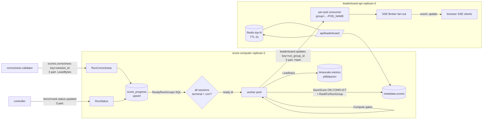

---

## Platform Foundations: Auth, Shared Libraries & Schemas

> **Why two languages at all:** the platform deliberately splits Go for the control plane (APIs, build/sandbox orchestration, the run controller, scoring, leaderboard) from Rust for the data plane (load generation, kernel capture, telemetry aggregation). Go wins wherever the work is I/O-bound and off the measured path — productivity, plus the native Kubernetes/Kafka/Postgres ecosystem. Rust wins wherever a GC pause would corrupt the very latency numbers being measured, or where the code runs in the kernel. These foundations — the dual-language schema contract and the mirrored logger/metrics libs — are what let the two halves share one wire format and one operational surface despite being different languages.

These are the small, cross-cutting pieces that every other component leans on: the OAuth/OIDC entry point (`auth-api`), the shared Go and Rust libraries that give every service the same JWT verifier, the same Loki-backed structured logging, and the same Prometheus metric catalog, and — most load-bearing of all — the single dual-language schema package that defines all 12 Kafka topics, all event structs, the per-task protocol-target table, and the cross-language co-partition hash that makes the hot `orders.*` path horizontally scalable. None of these are on the data-plane hot path themselves; their value is that they are identical contracts shared by polyglot services.

### (a) `auth-api` — Google OAuth / OIDC PKCE exchanger

`services/auth-api/main.go` is a ~513-LOC single-file Go HTTP service whose only job is to be the server-side half of a Google OAuth2 Authorization-Code-with-PKCE flow for the Next.js frontend. It holds the OAuth client secret (so the SPA never has to) and exchanges authorization codes for tokens.

**Responsibilities & routes.** It exposes five endpoints (`main.go:117-121`): `/health`, `/ready` (both return 200), `POST /token`, `POST /refresh`, `POST /logout`. The flow:

- `POST /token` (`main.go:165`) takes `{code, code_verifier, client_id, redirect_uri, nonce}`, validates the `client_id` matches its own and that `redirect_uri` is in a fail-closed allowlist (`redirectAllowed`, `main.go:341-344` — only exact-match URIs from `GOOGLE_ALLOWED_REDIRECT_URIS` are accepted), then POSTs an `authorization_code` grant to Google's token endpoint (`exchange`, `main.go:271`). It decodes the returned `id_token`, optionally checks the `nonce` against the request, sets the Google refresh token as an `HttpOnly` cookie, and returns `{access_token, id_token, platform_token, user}`.
- `POST /refresh` (`main.go:224`) reads the refresh-token cookie and runs a `refresh_token` grant.
- `POST /logout` (`main.go:260`) clears the cookie.

**Notable hardening.** Config is validated at boot and the service refuses to start without a client ID, client secret, and at least one allowed redirect URI (`loadConfig`, `main.go:393-401`). All upstream/request bodies are read through `io.LimitReader(..., 1<<20)` (1 MiB cap, `main.go:282`, `main.go:449`). Cookies are `HttpOnly`, with `Secure`/`SameSite` driven by env, and use the `__Host-` prefix when secure (`main.go:374-377`). It sets `X-Content-Type-Options: nosniff` and `X-Frame-Options: DENY` on every response (`securityHeaders`, `main.go:474`) and does a 15s graceful drain on SIGTERM/SIGINT (`main.go:151-158`).

**Key subtlety — it does NOT verify the ID token signature.** `parseClaims` (`main.go:320`) only base64url-decodes the JWT payload to read `sub`/`email`/`nonce`; it never checks the signature. This is acceptable here because the token was just received directly from Google over TLS in the code exchange. Signature verification is the job of the consumer services (`submission-api`), which independently re-verify any bearer token against Google's JWKS via the shared `libs/go/authn` verifier (see (b)). `auth-api` mints no tokens of its own: `platform_token` is simply the Google `id_token` passed through (`responseFromToken`, `main.go:313`).

**Auth model and its current toggle.** The intended model: the frontend signs in with Google, gets an `id_token`, and presents it as a `Bearer` token to `submission-api`, which verifies it and binds the submission/run to a `contestant_id` (= Google `sub`). In the current e2e/demo deployment, auth is turned off — the e2e/demo frontend runs with no login. On the API side this is gated by `AUTH_REQUIRED` (default `true`) in `submission-api/main.go:140`: when set to `false`, the router mounts `OptionalContestant` instead of `RequireContestant`, which never rejects a request and derives identity from an unverified `sub` claim if a token is present, else from `DEFAULT_CONTESTANT_ID` (`auth.go:66-76`, `submission-api/main.go:149-155`). So in the e2e deployment `auth-api` is effectively dormant and `submission-api` short-circuits verification.

> **Note — auth in the shipped demo.** The code fully supports JWT verification (`RequireContestant` + `authn.NewVerifier`, with `auth_middleware_test.go` coverage), but the e2e/demo deployment ships with `AUTH_REQUIRED=false`, so the running demo derives identity from an unverified token or a default contestant. The capability exists and is tested; it is simply toggled off for the benchmark flow.

**Kafka:** none — `auth-api` produces to and consumes from no topics.

### (b) `libs/go` and `libs/rust` — the shared service runtime

Every Go service imports `github.com/iicpc/libs/{authn,logger,metrics}`; every Rust service imports the `logger` crate and the `iicpc_schemas_rust` crate. These libraries are what make a fleet of independently-written services behave like one platform.

#### Shared JWKS verifier (`libs/go/authn`)

`authn.Verifier` (`verifier.go`) is the consumer-side counterpart to `auth-api`. `NewVerifier(clientID)` builds a `golang-jwt/v5` parser locked to RS256 only, with the client ID as required audience, expiry required, and 60s leeway (`verifier.go:63-69`). `Verify` (`verifier.go:75`) parses the token, resolves the signing key by `kid` against a cached JWKS, then independently checks the issuer is `accounts.google.com` and that `sub` is non-empty, returning `sub` as the contestant identity. The JWKS itself is fetched and cached by `jwksCache` (`jwks.go`): a 12-hour TTL (`jwks.go:21`), a 1 MiB body cap, a double-checked-lock single-flight fetch so a cache miss triggers at most one concurrent HTTP refresh (`jwks.go:54-59`), and strict key parsing that rejects non-RSA keys and implausible exponents (`jwks.go:148-167`). Only `submission-api` actually wires this in today (`submission-api/main.go:142`).

#### Loki structured logging (`libs/go/logger`, `libs/rust/logger`)

Both languages ship a near-identical async Loki client, deliberately mirrored down to the constants: Go's `DefaultConfig` (`loki.go:64-77`) and Rust's `Config::default` (`loki.rs:67-81`) both use `QueueSize=10000`, `BatchSize=256`, `BatchWait=500ms`, `HTTPTimeout=5s`, `MaxRetries=3`, and even emit the same "BatchSize larger than QueueSize" warning. The design: a background worker drains a bounded channel, batches by count or by a timer tick, and POSTs to `/loki/api/v1/push` with exponential backoff + jitter (`flush`, `loki.go:419`; `run_worker`, `loki.rs:661`). The queue is lossy by design — if the channel is full, lines are dropped and counted (`queueDrops`) rather than blocking the caller's hot path (`loki.go:349-356`, `loki.rs:270-280`). Both also use a `sync.Pool` / `thread_local` buffer pool to avoid per-log allocation, and both render the same RFC3339-nanosecond UTC timestamp format (the Rust side reimplements the civil-from-days date math and has a unit test asserting it matches Go's slog output, `loki.rs:1022-1043`). On the Go side, logging is wired as an slog handler chain (`NewProductionLogger`, `loki.go:182`): a JSON stdout handler, optionally wrapped by a `LokiHandler`, then a `ContextHandler` that pulls request-scoped attrs out of `context.Context` so per-request fields (request ID, contestant) ride along automatically.

The canonical mount pattern every Go service repeats verbatim at the top of `main`:

```go
logCfg := logger.DefaultConfig()
logCfg.ServiceName = "score-computer"
log, lokiClient := logger.NewProductionLogger(logCfg)
slog.SetDefault(log)
if lokiClient != nil {
    defer lokiClient.Close()  // drains the queue on shutdown
}
```
*(`services/score-computer/main.go:32-38`; `LokiClient` is nil when `LOKI_URL` is unset, so the same code runs locally with stdout-only logging.)*

#### Prometheus metrics (`libs/go/metrics`)

The Go metrics package is a closed catalog, not an open registry. All ~70 metrics are declared up front in `projectMetricCatalog` (`metrics.go:270-339`) — every counter/gauge/histogram name, help text, label set, and (for histograms) bucket layout the entire platform is allowed to emit. At runtime `Counter`/`Gauge`/`Histogram` (`metrics.go:100-150`) look the metric up by name; if it was never registered in the catalog, or the kind/labels/buckets don't match, the sample is silently dropped and an `iicpc_metrics_registry_errors_total` error counter is incremented (`metric`, `metrics.go:196-221`) rather than registered ad-hoc. This guarantees consistent cardinality and naming (everything is namespaced `iicpc_*`) across all services and makes a typo a no-op instead of a new time series. `HTTPMiddleware` (`http.go:56`) wraps any `http.Handler` to emit `http_requests_total` + `http_request_duration_seconds` labeled by `{service, method, path, status}`, using a `statusRecorder` that also implements `Flush`/`Unwrap` so it stays SSE/streaming-transparent. The shared serving pattern: `metrics.StartServer(addr)` (`metrics.go:160`) spins up a `/metrics` listener (default `:9090`), or services mount `metrics.Handler` directly on their existing router (`submission-api/main.go:137`). Eight Go services use these helpers (`correctness-validator`, `build-worker` worker/spawner, `sandbox-orchestrator`, `score-computer`, `bot-fleet-controller`, `leaderboard-api`, `submission-api`).

> Note: `libs/rust` ships only the `logger` crate — there is no shared Rust metrics library. Rust data-plane services (`telemetry-ingester`, `bot-fleet`, `ebpf-latency`) expose their own `iicpc_telemetry_*` / service-local Prometheus series directly (see each service's Metrics subsection). The bot-fleet's own surface grew with the TPS work: per-protocol labels on the orders_sent/order_write_error/write/slip series (`services/bot-fleet/src/metrics.rs:42-45`) and read-and-reset pacing-fidelity snapshot stats (worst coalesced batch and worst slip since last snapshot, `metrics.rs:25-32`).

### (c) `schemas/go` + `schemas/rust` — the single Kafka contract, mirrored across languages

One set of topic-name constants and event structs, written twice (once in Go, once in Rust) and kept byte-compatible on the wire, so a Go producer and a Rust consumer (or vice versa) agree on every field of every message. The Go side is `schemas/go/topics/topics.go` (its own module, `github.com/iicpc/schemas`); the Rust side is `schemas/rust/src/lib.rs` (`iicpc_schemas_rust`).

**Topic constants (the 12-topic catalog).** Both files declare the identical 12 topic-name constants (`topics.go:10-23`, `lib.rs:9-20`) plus `TelemetryPriceScale = 1_000_000_000` (the fixed-point scale for prices). These names are the only place topics are spelled out in code; producers/consumers reference the constants, never string literals. The Rust test `topic_constants_match_platform_contract` (`lib.rs:288`) asserts every name is non-empty lowercase-ASCII. (Partition counts live in `ops/kafka/create-topics.sh` and `k8s/data/kafka/topic-init-job.yaml`, not here — this package owns names and shapes, the ops scripts own partitions.)

**Two serialization regimes.** The split is deliberate:
- **Control plane → JSON.** `WorkloadSpec`, `BarrierEvent`, `ReadySignal`, `BenchmarkRequested`/`StatusUpdated`, `SubmissionBuildRequested`/`StatusUpdated`, `Scenario`, `CorrectnessScoreEvent`, `LeaderboardUpdateEvent` are JSON-tagged. These are low-volume orchestration messages where human-readability and schema flexibility win. The Rust structs carry matching `serde` field names and `#[serde(rename_all = "UPPERCASE")]` enums so Rust decodes the Go controller's JSON directly — proven by `workload_spec_decodes_go_controller_payload` (`lib.rs:318`), which feeds a literal Go-shaped JSON blob into the Rust `WorkloadSpec`.
- **Hot order path → MessagePack.** The high-volume `orders.sent` / `orders.acked` structs (`OrderSentEvent`, `OrderAckedEvent`, and their `*Batch` wrappers) carry both `json:` and `msgpack:` struct tags in Go (`topics.go:195-240`) and are encoded with `rmp_serde::to_vec_named` in Rust. The named msgpack form (field-keyed, not positional) is what makes cross-language and rolling-upgrade compatibility possible. The Rust side additionally has zero-copy `OrderAckedEventRef<'a>` / `OrderAckedBatchRef<'a>` borrow-based mirrors (`lib.rs:196-233`) for the eBPF egress producer to serialize without owning the strings.

**Per-task protocol targets (`TargetSpec` / `targets` / `target_idx`).** Since the Shape-A change (commits 938f2c1, e7632cc), a workload is no longer one protocol on one port. `TargetSpec` names one `{protocol, port}` pair a workload can dispatch tasks to (`schemas/rust/src/lib.rs:96`); its doc comment notes ports are platform-mandated, not contestant-chosen. `WorkloadSpec` carries `targets: Vec<TargetSpec>` (`lib.rs:113`, `#[serde(default)]`), and each `TaskSpec` carries a `target_idx: u8` (`lib.rs:161`, `#[serde(default)]` = 0) indexing into the owning spec's `targets` — or into the single resolved legacy target when `targets` is empty. The legacy `target_host`/`target_port`/`protocol` fields remain on `WorkloadSpec` for backward compatibility; a worker receiving a spec with an empty `targets` vec falls back to them. Both fields are mirrored in Go (`schemas/go/topics/topics.go`). The design rationale (`docs/tps-improvement-plan.md:319-384`): tagging protocol per task keeps one flat task list with already-unique task_ids (so ClOrdIDs cannot collide across protocols), keeps `worker_count = ceil(tasks/1000)` inside the 24-partition `workload.assignments` cap, and gives the `targets` vec a natural extension point for future multi-contestant `{protocol, host, port}` entries. The controller fans a `ProtocolAll` request out to FIX+REST+WS tasks with round-robin `target_idx` and unique task_ids (`services/bot-fleet-controller/internal/controller/runner.go`); the worker resolves connection and frame rendering via `spec.targets[task.target_idx]` (`services/bot-fleet/src/worker.rs`).

Ports themselves are platform constants — 9898 = FIX, 8080 = HTTP and WS shared — because the eBPF kernel program hardcodes its port filter and classifies transport by `server_port == 9898 → Fix else HttpWs`; `submission-api` validates manifests and rejects non-conforming port declarations at submit time (`services/submission-api/internal/validator/zip.go`; policy in `docs/tps-improvement-plan.md:353-371`).

**Forward-compat via `serde(default)`.** New fields on hot-path structs are added with `#[serde(default)]` (Rust) / a zero-value (Go) so that an old producer's message — missing the new field entirely — still decodes cleanly into the new struct, with the field defaulting to zero. `barrier_epoch_ns` on `OrderSentEvent` is the worked example (`lib.rs:163`), and there are two tests guarding it: `order_sent_event_barrier_epoch_round_trips` (`lib.rs:455`) confirms it survives a msgpack round-trip, and `order_sent_event_decodes_pre_field_message` (`lib.rs:484`) literally encodes an old struct lacking the field and decodes it into the new one, asserting the field defaults to 0. The `targets`/`target_idx` fields follow the same pattern, which is what makes the legacy single-target fallback work during rolling upgrades: you can deploy a new consumer before the new producer (or vice versa) without a coordinated flag day.

**The cross-language co-partition guarantee — `partition_for`.** The hot topics `orders.sent` and `orders.acked` are 24 partitions each (`create-topics.sh`), and a given order is produced to both topics by completely different services: `bot-fleet` (Rust) emits `orders.sent`, `ebpf-latency` (Rust) emits `orders.acked`. For a stateless consumer to join the sent and acked sides of one order locally (no cross-partition shuffle), both producers must independently put that order on the same partition number. They do so by hashing the `order_id` with a fixed FNV-1a 64-bit hash:

```rust
pub fn partition_for(order_id: &str, num_partitions: i32) -> i32 {
    if num_partitions <= 1 { return 0; }
    let mut hash: u64 = 0xcbf29ce484222325;          // FNV-1a offset basis
    for byte in order_id.as_bytes() {
        hash ^= u64::from(*byte);
        hash = hash.wrapping_mul(0x100000001b3);     // FNV prime
    }
    (hash % num_partitions as u64) as i32
}
```
*(`schemas/rust/src/lib.rs:26-37` — a hand-rolled, dependency-free FNV-1a so the partition assignment is byte-for-byte reproducible and pinned to the schema, not to any client library's default hasher.)* It is the single function callers across `bot-fleet/src/telemetry.rs:298`, `ebpf-latency/src/main.rs:288`, and the `inject` test tool all route through. Three tests pin its contract: determinism + in-range over 10k ids (`lib.rs:418`), good spread across partitions (`lib.rs:431`), and the single-partition degenerate case (`lib.rs:448`).

> Note on the "Go twin": there is **no Go reimplementation of `partition_for`** — `rg` finds the FNV constants only in the Rust schema, and `schemas/go` contains nothing but `topics.go`. The reason is that the order-id co-partition path is entirely Rust (both `orders.*` producers are Rust). The Go control-plane producer that does care about partition placement — `bot-fleet-controller` publishing `workload.assignments` (also 24 partitions) — uses a different key: a custom `workerIndexBalancer` that maps `worker_index % numPartitions` (`bot-fleet-controller/internal/controller/producer.go:75-84`), so each worker pod owns a stable partition. `validateWorkerCapacity` (`producer.go:88`) even refuses to start a run if `worker_count > partitions`, because two specs sharing a partition would serialize and miss the barrier. So the platform has two co-partition schemes — FNV-1a-by-order-id (Rust, `orders.*`) and modulo-by-worker-index (Go, `workload.assignments`) — and only the former lives in the schema package.

**How this enables horizontal scale.** Because order_id deterministically fixes the partition on both `orders.sent` and `orders.acked`, the `telemetry-ingester`/`correctness-validator` consumer fleet can scale to N replicas where each replica owns a disjoint subset of the 24 partitions and sees a complete sent+acked pair for every order it's responsible for — no cross-replica coordination, no global join. Add partitions (and replicas) → linear throughput. The schema package is the contract that makes that safe.

#### Event-struct catalog (brief)

The schema package defines every message body on the bus:

| Struct | Topic | Encoding | Notes |
|---|---|---|---|
| `SubmissionBuildRequested` / `SubmissionStatusUpdated` | `submission.build.requested` / `submission.status.updated` | JSON | build orchestration; status enum `uploaded→building→scanned→sbom_ready→ready/failed` |
| `BenchmarkRequested` / `BenchmarkStatusUpdated` | `benchmark.requested` / `benchmark.status.updated` | JSON | run lifecycle; `RunStatus*` enum `requested→deploying→waiting_ready→barrier_fired→running→completed/failed` |
| `WorkloadSpec` (+ `TaskSpec`) | `workload.assignments` | JSON | one per worker pod; controller shards the scenario's task list across workers; carries `targets: Vec<TargetSpec>` + legacy single-target fields, each task carries `target_idx` |
| `TargetSpec` | — (embedded in `WorkloadSpec`) | JSON | `{protocol, port}`; ports are platform constants (9898 FIX, 8080 HTTP+WS) |
| `Scenario` (+ `TaskSpec`) | — (DB/control) | JSON | full task list, `constant`/`spike`/`ramp` |
| `BarrierEvent` | `barrier` | JSON | the synchronized fire epoch |
| `ReadySignal` | `bot.ready` | JSON | fan-in: per-worker connected/ready report |
| `OrderSentEvent` / `OrderSentBatch` | `orders.sent` | **msgpack** | load-gen send-side telemetry, keyed by order_id |
| `OrderAckedEvent` / `OrderAckedBatch` (+ `*Ref`) | `orders.acked` | **msgpack** | eBPF-captured ack-side telemetry, keyed by order_id |
| `CorrectnessScoreEvent` | `scores.correctness` | JSON | validator output |
| `LeaderboardUpdateEvent` | `leaderboard.updates` | JSON | scorer → leaderboard-api |
| (none) | `workload.failed` | — | failure signal topic; name only, no struct here |

(The full topic→partition→consumer-group graph belongs to the other sections; this section owns the structs and the partitioning function.)

### Data-flow sketch — how the foundations plug in

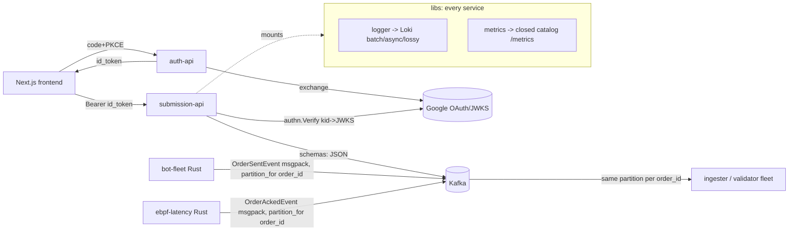

### Limitations / scope for improvement

- **Auth is off in the shipped demo.** `AUTH_REQUIRED=false` + `OptionalContestant` means identity is taken from an unverified token or a static default (`auth.go:66-76`); `auth-api` is deployed but unused. Re-enabling is a config flip; until then there is no authn/authz in the running benchmark system.
- **`auth-api` does no signature verification of the ID token** (`parseClaims`, `main.go:320`) — safe only because the token comes straight from Google in the exchange; any reuse of that function on an untrusted token would be a vulnerability.
- **`platform_token` is just the Google `id_token` passed through** (`main.go:313`) — there is no platform-minted/short-lived token, so token lifetime and revocation are entirely Google's, and only the verifier's 12h-cached JWKS + expiry checks bound it.
- **Loki logging is intentionally lossy** under backpressure (drops + counts rather than blocking, `loki.go:349-356`); acceptable for a metrics-grade benchmark, but log completeness is not guaranteed during bursts.
- **No shared Rust metrics library** — only `libs/rust/logger` exists; Rust services hand-roll their Prometheus surface, so the closed-catalog discipline the Go side enforces is not enforced for Rust series.
- **`partition_for` has no Go implementation.** Today fine (both `orders.*` producers are Rust), but a future Go producer to `orders.sent`/`orders.acked` would have to port the FNV-1a exactly or break co-partitioning; the contract lives in one language only.
- **The two schema modules can drift.** Go and Rust mirror each other only by convention plus the decode-Go-payload tests on the Rust side (`lib.rs:318`, `lib.rs:348`); there is no generated single-source IDL, so a field added in Go but forgotten in Rust would only surface when a decode test or a live message fails. The `targets`/`target_idx` addition raised the stakes here — it is now load-bearing schema state mirrored by hand in both languages.
- **`workload.assignments` is hard-capped by partition count.** `validateWorkerCapacity` (`producer.go:88`) makes `worker_count > 24` a startup error — scaling the bot fleet past 24 workers requires repartitioning the topic. Shape A's per-task protocol design was chosen in part to avoid tripling worker counts against this cap.

---
## Benchmarking, Bottleneck Hunt & Scope for Improvement

This section records how the platform was measured, what it generates and measures
losslessly, each bottleneck that was found and removed, and the open items that remain.
Every number traces to a data file, a benchmark script, or a source line. The design goal
is "generate ~2M orders/s and measure latency at the kernel without lying about the
tail"; the sections below lay out which parts of that claim are validated and which are
still open.

One reading note up front: the P1–P4 send-path improvements (single-protocol rendering,
template-and-patch FIX frames, the expiry-queue watchdog, batched REST/WS writes, cheap
response parsing) landed after most of the EKS numbers below were taken. The per-node
drain ceilings in §2A/2B are therefore the **pre-improvement baseline**; the
post-improvement local drain figure (2.2–2.6M orders/s) and the new pacing-fidelity
sweeps are covered in §2B′ and §2B″. The EKS re-sweep has not happened yet
(`docs/tps-improvement-plan.md:281-284` — the number to beat is 747,911/s).

There are three distinct harnesses, each isolating a different question:

| Harness | Dir | Question it answers | Contestant | Telemetry / capture |
|---|---|---|---|---|
| **Generation capacity** | `deploy-bench/` | how many orders/s can the bot-fleet *emit*? | **drain** (read-and-discard, never replies) | OFF |
| **Measurement capacity** | `deploy-bench/measure-capacity-sweep.sh` | how much offered load can the pipeline *measure* before it loses samples? | **echo** (µs-fast acker) | ON + eBPF capture |
| **Correctness + latency e2e** | `e2e/` and `bench/` | does a real run stay lossless & correct end-to-end? | matching-engine (qualifies) or echo (throughput) | ON, full stack |

For local profiling and sweeps there is a fourth entry point: the
`bot_worker_fix_roundtrip` example doubles as a load/profiling harness. With
`EXAMPLE_SINK=drain` it runs a true read-and-discard sink (no FIX parse, no replies,
matching the deploy-bench drain contestant) and passes `DROP_EVERY`/`MAX_INFLIGHT`
through to the worker
(`services/bot-fleet/examples/bot_worker_fix_roundtrip.rs:511-519`). One fix worth
knowing about when reproducing old runs: the harness used to build its `Config` with
`..Config::default()`, which silently ignored `BOT_MAX_INFLIGHT_PER_TASK` and
`BOT_WRITE_BATCH` and capped drain runs at roughly tasks × 10k/s of inflight. It now
spreads `..Config::from_env()`
(`services/bot-fleet/examples/bot_worker_fix_roundtrip.rs:161-163`), so the env knobs
take effect.

---

### 1. Benchmark methodology

**Why three contestant types isolate three different ceilings.** The platform has
several independent walls (send CPU, single-node networking, telemetry serialization,
Kafka ingest, ingester consume, contestant serve rate, validator memory). A single
mixed test cannot attribute a number to one of them. Each harness removes every
confound but one:

- **Drain sink (pure generation).** The contestant is replaced by a TCP read-and-discard
  engine that never replies, so it can never back-pressure the worker and there are no
  acks, no eBPF capture, and no validator. The only metric is the bot's own
  `iicpc_bot_orders_sent` rate, incremented on socket-write success. This is the
  cleanest possible generation number ("how fast can we put orders on the wire"), with
  telemetry also off (`BOT_DISABLE_TELEMETRY=1`); `deploy-bench/drain-scale-sweep.sh`
  implements the telemetry-off mode on EKS and `EXAMPLE_SINK=drain` implements it
  locally.

- **Echo contestant (measurement capacity).** A µs-fast acker that answers *every* order,
  so the contestant is never the bottleneck and eBPF always has a response to stamp. With
  capture + telemetry ON, `measure-capacity-sweep.sh` steps the offered rate up on a
  single worker / single sandbox node and watches **four loss signals** —
  `iicpc_ebpf_ringbuf_dropped_total` (kernel capture overrun),
  `iicpc_ebpf_acked_dropped_total` (publish queue drop),
  `iicpc_bot_telemetry_events_dropped_total` (send-side telemetry), and `coverage =
  flushed/sent` — declaring a step CLEAN only when all are ~0 and coverage ≥ COV_MIN
  (`deploy-bench/measure-capacity-sweep.sh:10-22`).

  One caveat now applies to every measure-capacity number: the echo contestant itself
  is slower than the improved send path. Its per-reply `format!`-based
  `execution_report_frame` builder and unbatched reply write move the pacing knee from
  ~500–700k/s (drain) down to ~300k/s (echo), so `measure-capacity-sweep.sh` figures
  under-report pipeline capacity until the echo server's reply rendering gets the same
  template-and-patch treatment the FIX send path got in P2. That work is deferred
  (`docs/tps-improvement-plan.md:208-215`).

- **Matching-engine contestant (correctness).** A correct price-time-priority order book
  (port of the validator's reference engine) that *qualifies* (correctness ≥ 0.95). This
  is the only flow that produces real correctness verdicts + HDR latency; it is bounded
  by the validator's and book's memory, so its scenarios are sized to stay under the
  delivered ceiling.

**Telemetry ON vs OFF — and why both numbers exist.** Telemetry IS the measurement
record; you cannot score what you dropped. But telemetry has its own pipeline ceiling.
So generation is reported twice: telemetry-**off** (raw send capacity, the upper bound)
and telemetry-**on** (durable, the production ceiling). The gap between them is itself a
bottleneck signal — the discipline is to check `iicpc_bot_orders_sent` vs
`iicpc_bot_telemetry_events_flushed` *before* acting, because a telemetry cap presents as
a "low TPS" symptom (see §3c).

**Why latency is kernel-stamped, not load-gen-timed.** Service time `t7−t3` is measured by
the eBPF capture at the contestant's veth (XDP ingress / tc egress), independent of the
load-gen's scheduling jitter and the contestant's userspace accounting. This is why
worker-side latency aggregation is explicitly not used for the scored metric.

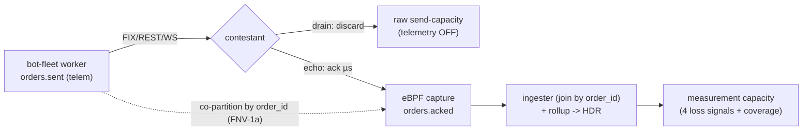

---

### 2. The numbers

**A. Validated ceilings**:

| layer | ceiling | notes |
|---|---|---|
| generation, telemetry OFF (drain), **pre-P1–P4** | **~600–790k/s per botworker node** | EKS `c6i.xlarge`; scales ~linearly — measured 2.02× at 2 nodes (§2B) |
| generation, telemetry OFF (drain), **post-P1–P4, local** | **2.2–2.6M orders/s sustained, 4 threads** | laptop, `EXAMPLE_SINK=drain`; ~3× the old baseline; EKS re-sweep pending (§2B′) |
| telemetry ON (single worker → 1 broker) | **~445k/s** | lossless `record` backpressure; measured against the old send path — needs re-anchoring against the new off-ceiling (§4) |
| measurement pipeline (capture→Kafka→ingester) | **lossless ≥ ~144k samples/s**, ceiling not yet reached | with the capture-fidelity fix |
| single echo contestant pod (cross-node) | **~150k delivered/s** | one pod + one TCP conn/task; caps before the pipeline, and the echo server's own render cost depresses this (§1) |
| kernel-stamped service-time p99 | **~98 µs healthy** | eBPF, independent of load-gen jitter |

**B. Single-node drain sweep (pre-improvement baseline)** — one `c6i.xlarge`, 15 s
buckets (`deploy-bench/drain-raw-tps.tsv`):

| elapsed_s | 0 | 15 | 30 | 45 | 60 | 75 | 90 | 105 | 120 |
|---|---|---|---|---|---|---|---|---|---|
| sent/s | 0 | 64,983 | **747,911** | 709,571 | 678,401 | 640,374 | 628,931 | 550,374 | 0 |

Peak **~748k/s**, sustained **~600–710k/s** on a single 4-vCPU node. (The first/last
buckets are warm-up/drain.) `deploy-bench/drain-raw-tps.png` plots this run. A separate
60 s run measured **47,401,664 orders = ~790k/s** at 3.94/4 cores (93% user, 7% kernel),
consistent with this. These runs predate P1–P4 and are kept as the EKS baseline to beat.

**Node scaling (measured).** Adding a second botworker node scales generation
near-linearly (drain sink, telemetry off): peak **745k/s → 1503k/s = 2.02×**, total orders
**42.5M → 84.8M = 2.00×**. Workers share no state and ride separate NICs, so the platform
adds throughput simply by adding nodes.


**B′. Post-improvement drain (local).** After P1 (single-protocol rendering per task),
P2 (per-task FIX template-and-patch, `fix::TemplateCache` at
`services/bot-fleet/src/fix.rs:744`, built once per task at
`services/bot-fleet/src/worker.rs:746-749`), P3/P3′ (expiry-queue watchdog, batched
REST/WS writes) and P4 (key-scan response parsing), a local 4-thread drain run
(`EXAMPLE_SINK=drain`, env knobs honored) sustains **2.2–2.6M orders/s** — roughly 3×
the 750k/s pre-improvement EKS xlarge figure. Laptop-vs-`c6i.xlarge` caveats apply in
both directions (different core counts, clocks, and no cross-node NIC), so the honest
statement is: the send path is ~3× cheaper per order, and the EKS per-node number needs
a re-sweep to become a validated ceiling.

**B″. Pacing-fidelity sweep (local, new).** Raw throughput is not the only question; the
pacer must also hit its schedule. Local task-count sweeps using the read-and-reset
snapshot stats (worst coalesced batch and worst schedule slip since last scrape,
`services/bot-fleet/src/metrics.rs:25-32`) locate the fidelity knee
(`deploy-bench/task-sweep-1784112347.tsv`, `-1784114113.tsv`, `-1784113948.tsv`):

| offered load (per worker) | avg max batch | max slip | verdict |
|---|---|---|---|
| ≤ ~300k/s | ~1.3–2.2 | < 10 ms | clean pacing — orders leave near their slots |
| ~400–500k/s | rising toward 64 (write-batch cap) | 60–400 ms | knee — catch-up batching dominates |
| ~700k–1M/s offered | pinned at 64 | 5–9 s | collapse — `rate_med` falls below target |

Two consequences. First, a single worker process is trustworthy as a *paced* load
generator up to ~300k/s; above that it still moves bytes but the schedule slips, which
shows up in `schedule_slip` exactly as the CO design intends (§3d). Second, the "split"
rows (same offered load across two processes) do not beat a single process, which is
consistent with the earlier zero-lock-contention profile
(`docs/tps-improvement-plan.md:34-37`): the wall is per-core send cost, not contention.

**C. Latency HDR percentiles** — local k3s, kernel-stamped service_time (µs), decoded
from the Rust V2-deflate HDR blobs by an independent Python `hdrh` cross-check
(`deploy-local/plot-hdr.py:5-11`, `deploy-local/plots/*.hgrm`):

| scenario | p50 | p99 | p99.9 | p99.99 (tail) |
|---|---|---|---|---|
| constant | 126 | 378 | 669 | 907 |
| spike    | 130 | 399 | 837 | 1240 |
| ramp     | 136 | 447 | 921 | 1750 |

The tail rises with load shape (ramp's climbing waves > spike's burst > constant's flat),
exactly as expected. These are small-n local runs (n≈20–60 per scenario in the `.hgrm`
files) — directional, not the EKS production tail (~98–120 µs p99 healthy).

**D. The 2M/s tier target** (`bench/bench.tfvars`,
`bench/kafka-bench.sh`):

| knob | e2e | **bench (2M/s tier)** |
|---|---|---|
| botworker nodes | 2 | **3** (`c6i.xlarge` → ~800k/s each ≈ ~2.4M/s, `bench.tfvars:43-46`) |
| Kafka | 1 broker, gp3-250 | **2-broker KRaft**, dedicated pool, gp3-500 (`kafka-bench.sh:12`, default `KBROKERS=2`) |
| topics | 24 part | **96 part, RF=1** (`kafka-bench.sh:76-80`, transient bench data) |
| ingesters | 2 | **8** (`kafka-bench.sh:88`) |
| nodes / vCPU | 5 / 32 | **8 / 44** (needs a vCPU quota bump) |

This is a **documented target, not a validated run**: the two open verifications are
eBPF capture throughput at 2M/s (one capture producing ~2M acks/s) and echo capacity at
2M/s, both UNVERIFIED. The drain variant (send + telemetry + ingester capacity) is the
first thing to validate now that Kafka is multi-broker. Note the sizing math above was
done against the ~800k/s pre-improvement per-node figure; if the local 3× carries even
partially to EKS, the tier may hit 2M/s with fewer botworker nodes, which matters for
the cost goal.

---

### 3. The bottleneck hunt narrative

Each wall was found by measurement, attributed to a root cause, fixed at the root, and
re-verified with a number. They are presented in the order they were hit.

#### (a) Per-task tokio-timer ~1000/s pacer cap → catch-up pacing (65–75×)

- **Symptom.** Each load-gen task pinned near ~1k orders/s *regardless of `target_rps`*,
  with the host CPU sitting >85% idle. Proof: a single task targeting 1,000,000/s emitted
  **53,868 orders in 60 s = ~898/s**.
- **Root cause.** The pacer called `tokio::time::sleep_until` before *every* order;
  tokio's timer wheel has a ~1 ms minimum granularity, so even a 20 µs interval — or a
  deadline already in the past — cost ~1 ms. Tasks were parked on timers, not working.
- **Fix.** Catch-up pacing, now the unconditional default in both write loops (the
  FIX-batch loop and the REST/WS loop in `services/bot-fleet/src/worker.rs`): only
  park on the timer when *ahead* of schedule; if the deadline already passed, send
  immediately and re-arm to the next slot.
- **Result.** A single task sustained **~58–68k/s (≈65–75×)** at the time; the FNV/CO
  contract is unchanged (§3d).

This is the single most load-bearing branch in the load generator:

```rust
let target_send_ts_ns = next_send_ns;          // captured BEFORE any sleep (CO-correct)
if next_send_ns > unix_nanos() {               // ahead of schedule -> park
    tokio::select! {
        _ = time::sleep_until(instant_from_unix_nanos(next_send_ns)) => {}
        _ = cancel.cancelled() => break,       // behind -> fall through, send now
    }
}
```
*The one branch that removed the ~898/s floor; "behind" deadlines skip the timer wheel
entirely. (Line numbers in `worker.rs` have shifted since P1–P4; the pattern is in both
write loops.)*

#### (a′) Two follow-on send-path fixes the timer fix exposed

Removing the timer cap surfaced the real CPU hogs, both visible in the bot-worker CPU
flame graph below:


- **`push_resting` O(n) memmove (87% of CPU).** The resting-order ledger was a `Vec`
  doing `Vec::remove(0)` on every order once full. Fixed to a `VecDeque` with O(1)
  `pop_front`/`swap_remove_back` (`services/bot-fleet/src/content.rs:113, 228-242`).
  Per-order CPU ~42 µs → ~5 µs.
- **One unbuffered `write` syscall per order (27% kernel CPU).** Added `BOT_WRITE_BATCH`
  (default 64) coalescing of *already-due* backlog orders into one `write_all`; the batch
  only ever coalesces the catch-up backlog, so the schedule is never distorted. Kernel
  syscall share ~27% → ~2%. Combined, these took a single node to the ~790k/s in §2B.

#### (a″) Frame rendering: triple render → single-protocol template-and-patch (P1/P2)

- **Symptom.** After (a) and (a′), profiling showed the remaining per-order cost was
  dominated by frame construction: every generated order rendered FIX *and* REST *and*
  WS bytes even though each task speaks exactly one protocol, and the FIX render itself
  was a `format!` per order (`docs/tps-improvement-plan.md:64-77`).
- **Fix, part 1 (P1).** Each task now renders only its own protocol. Combined with
  Shape A per-task protocol targets (a task carries a `target_idx` into the spec's
  `targets: Vec<TargetSpec{protocol,port}>`, `schemas/rust/src/lib.rs:96, :113, :161`),
  "one order → three wire formats" is gone from the hot path.
- **Fix, part 2 (P2).** FIX frames are built by template-and-patch: a
  `fix::TemplateCache` (`services/bot-fleet/src/fix.rs:744`) is constructed once per
  task (`services/bot-fleet/src/worker.rs:746-749`, `:822`, `:1339`) with the static
  tags pre-rendered; the hot path patches only the variable fields (cl_ord_id, price,
  qty, timestamp, checksum). The old ignored `serialization_cost` test is now a
  criterion bench, so the render cost is tracked rather than asserted once.
- **Related P3/P3′/P4 fixes.**
  - The pending-order watchdog no longer scans the full pending map every 250 ms; each
    task keeps a monotonic `ExpiryQueue` (`VecDeque<(deadline, order_id)>`) popped from
    the front (`services/bot-fleet/src/worker.rs:576-592`, `:1065-1088`).
    Timeout and final-tick accounting semantics are unchanged.
  - `rw_write_loop` (`services/bot-fleet/src/worker.rs:1288`) gained FIX-style
    coalescing of already-due backlog: REST pipelines N requests into one `write_all`,
    WS does N `feed()`s and a single flush.
  - Response handling replaced full `serde_json` parsing with a cl_ord_id key scan (P4).
  - In-flight backpressure at `BOT_MAX_INFLIGHT_PER_TASK` no longer polls with a 1 ms
    sleep; the writer parks on a `tokio::sync::Notify` signaled by the read loop
    (`services/bot-fleet/src/worker.rs:27`, `:677`, `:784`). Both
    `BOT_MAX_INFLIGHT_PER_TASK` and `BOT_WRITE_BATCH` live in `Config::from_env`
    (`services/bot-fleet/src/config.rs:32-33`, `:107-116`) rather than scattered
    `LazyLock`s.
- **Result.** Local 4-thread drain went from the ~750k/s-class baseline to
  **2.2–2.6M orders/s sustained** (§2B′). REST/WS still hold a per-write timeout
  (`services/bot-fleet/src/worker.rs:655`), so FIX remains the cheapest path, but the
  "one syscall per order" characterization of REST/WS no longer applies.

#### (b) The single-node veth/loopback wall (local only — gone on EKS)

- **Symptom.** With the code cap removed, throughput *decreased* as connections increased
  (1 task 58–67k > 4 tasks 37.5k > 8 tasks ~30k) while the host stayed >85% idle and both
  the worker (<1 core) and engine (<2 cores) were idle.
- **Root cause.** On a single laptop node, every order and its TCP signalling traverse one
  shared **veth pair + kernel CNI datapath** (~15–17 µs/op), which has limited parallelism;
  adding flows adds latency, not throughput. This is not a code-level issue: `TCP_NODELAY`
  is set on all three connect paths, the runtime is multi-thread at the CPU count, and a
  drain sink (no acks) didn't beat the ack engine — the wall is upstream of the engine
  entirely.
- **Fix.** None in code — this is a hardware/environment artifact, deliberately *not*
  "fixed." The EKS topology removes it: the bot fleet and the contestant are pinned to
  *separate* tainted node pools (`botworker` vs `sandbox`), so traffic rides a real
  cross-node NIC with multi-queue RSS + offloads instead of one shared veth. It is
  recorded as finding S2 alongside the telemetry serialization work specifically so it is
  never re-investigated as a code bug.
- **Result.** The wall does not appear on EKS; per-node generation reaches the ~600–790k/s
  in §2A/B (pre-improvement). The cross-node behavior — "more connections compound" — is
  argued from the NIC/RSS mechanism, not yet swept; see §4. The local 2.2–2.6M/s drain
  figure (§2B′) bypasses this wall by running worker and sink in-process rather than
  through the CNI.

#### (c) Telemetry serialization → msgpack + batching + split producers

- **Symptom.** Lossless (telemetry-persisted) send capped at **~5.7k orders/s** on EKS
  while raw send hit ~60k/s, with **~90–97% of telemetry events dropped** and a `warn!`
  log storm (~57k logs/s) burning CPU.
- **Root cause.** The per-worker aggregator was a *single* task that **awaited Kafka
  delivery inside each flush** (24-partition `join_all`); while flushing it did not drain
  the channel, so a ~175 ms flush let the channel fill and the old `try_send` dropped ~90%.
  Net drain ≈ 1000 events / 175 ms ≈ 5.7k/s. The producer config itself was already fast —
  the limiter was the await-delivery-per-flush, single-task design.
- **Fix.** Rewrote `services/bot-fleet/src/telemetry.rs`:
  1. **No inline delivery await** — a `select!` loop interleaves channel-drain and
     chunk-enqueue; deliveries are accounted asynchronously via
     `FuturesUnordered<AckFuture>` (`telemetry.rs:16, 156, 226`).
  2. **Batched drain** — `rx.recv_many(&mut buf, RECV_BATCH)` pulls a *slice* per wake
     instead of one event per iteration, amortizing wake overhead (`telemetry.rs:168`).
  3. **msgpack, not text** — payloads are serialized with `rmp_serde::to_vec_named` of an
     `OrderSentBatchRef` (`telemetry.rs:229`), and orders are sharded into per-partition
     batches via a unit-tested `PartitionBatcher` (`telemetry.rs:155`) keyed by
     `partition_for(order_id, N)` (`telemetry.rs:298`) — the same FNV-1a co-partition
     contract the ingester relies on.
  4. **Lossless backpressure, not drops** — `record` now `tx.send(event).await` blocks on
     a full 65536-deep channel rather than dropping (`telemetry.rs:87-90` and the LOSSLESS
     comment; producer queue is a hard 1 GiB that blocks, not grows).
- **Result.** Drops → **~0%**; the durable ceiling rose to the **~445k/s single-broker**
  number. The remaining named lever is the **single aggregator drain** — T1,
  "shard the aggregator across M tasks" (P5 in the tps plan), is identified but not done.
  On the ingester side, `auto.offset.reset` is `latest`, a correctness gotcha that reads
  as loss if the ingester starts late. Note also that ~445k/s was measured against the
  pre-P1–P4 send path; with the send side ~3× cheaper, the telemetry-on/off gap needs
  re-measuring before it can be attributed (§4).

#### (d) Coordinated-omission correctness (t0 before sleep)

- **Symptom.** Risk: catch-up pacing could be mistaken for "fixing" latency by hiding
  offered-vs-capacity overshoot — the classic coordinated-omission error.
- **Root cause / fix.** Each order's `target_send_ts_ns` is the *fixed schedule slot*,
  captured **before** the pacer sleeps and pushed into the batch's `targets` regardless of
  when the order actually goes out (both write loops in `services/bot-fleet/src/worker.rs`
  follow this pattern). So `schedule_slip = real_send − target` measures *true* lateness;
  when offered load exceeds capacity, slip grows unbounded — the correct CO signal. The
  fidelity sweep in §2B″ is this mechanism used as a diagnostic: the 5–9 s slips at
  700k–1M/s offered are the pacer honestly reporting saturation, not hiding it.
- **Result.** Pacing does **not** distort the measurement. The *scored* latency is `t7−t3`
  (kernel-stamped, independent of pacing entirely), so even the schedule-slip subtlety only
  affects the secondary `response_time`, never the gated metric.

#### (e) Ingester drops / backpressure → distributed co-partition + 2-stage rollup

- **Symptom.** A single ingester replica couldn't be scaled out: two naïve replicas would
  split a window's HDR histogram across pods, corrupting percentiles; under load a single
  replica dropped telemetry and back-pressured the worker (the T2/T3 coupling).
- **Root cause.** No co-partitioning meant an order's `sent` and `acked` events could land
  on different consumers, so a replica couldn't join locally; and HDR percentiles aren't
  averageable across shards.
- **Fix (4 parts):**
  1. **Co-partition the `sent ⋈ acked` join by `order_id`** with a shared FNV-1a
     `partition_for(order_id, N)` (`schemas/rust/src/lib.rs:26-38`); both producers publish
     each sub-batch to the explicit matching partition — bot-fleet `orders.sent`
     (`telemetry.rs:298, 242`) and ebpf-latency `orders.acked`
     (`services/ebpf-latency/src/main.rs:288, 313`). Matching pairs always co-locate on one
     consumer.
  2. **Deterministic wave bucketing** via `barrier_epoch_ns` so every worker buckets a wave
     identically.
  3. **Two-stage native HDR rollup** — ingester replicas write per-shard PARTIAL rows; a
     separate `telemetry-rollup` binary merges per `(session, wave, 1s-bucket)` natively
     (HDR V2-deflate decode → add → re-encode) and upserts the final `metrics` table, with
     `floor_to_second` alignment + LOCF carry-forward, both unit-tested.
  4. **Scale-out** to `replicas: 2` + a rollup deployment.
- **Result.** Smoke (local): **144,024 orders → 2 shards summing to exactly 144,024 (zero
  drops)** → merged → valid HDR (≥144k lossless in §2A). Max useful ingester replicas =
  partition count (24 e2e / 96 bench); the bench tier runs 8 (`kafka-bench.sh:88`).
  Consumer group `telemetry-ingester` (`services/telemetry-ingester/src/config.rs:30`).

#### (f) EKS jumbo-frame GSO/TSO/GRO truncation capping match-rate at ~2% → ~99.9%

- **Symptom.** On EKS, latency runs "succeeded" but `service_time` was near-empty and
  `unmatched_responses` was in the millions — **~98% of latency samples silently lost**;
  the capture logged `truncated oversized captures (check GSO/TSO off)`.
- **Root cause.** EKS VPC-CNI nodes default to **MTU 9001 (jumbo) with segmentation
  offloads on**. The eBPF capture copies at most `CAPTURE_CAP = 1536 B` per frame
  (`services/ebpf-latency/src/ebpf.rs:37`), so any GSO/TSO/GRO super-frame is **truncated** →
  FIX framing corrupts → request↔response reassembly resets → responses never match.
- **Fix (two config-level changes, no capture code change).** The capture *already* clamps
  its own veth (offloads off + MTU 1500 inside the algo netns at attach) — but that only
  covers the receive netns; the EKS *cross-node* coalescing happens on the host ENI/in the
  sender before the capture sees it. Two additions close it:
  1. **Sender:** the worker's `net-tune` initContainer sets `eth0` MTU 1500 + `ethtool -K
     eth0 gso off tso off gro off lro off` (`k8s/benchmark/bot-fleet/deployment.yaml:40-52`).
  2. **Receiver host:** `k8s/sandbox/gro-disable-daemonset.yaml` disables GRO on the
     **sandbox nodes' host interfaces** so cross-node request segments aren't re-coalesced
     before the generic-mode XDP capture sees them (`gro-disable-daemonset.yaml:1-9`).
  `02-bootstrap.sh` applies both.
- **Result.** Match rate **~2% → ~99.9%**, `iicpc_ebpf_ringbuf_dropped` ~0. Note that the
  in-pod offload/MTU clamp at capture attach is not enough on its own for EKS cross-node
  traffic: a *sender* initContainer and a *host-level* GRO DaemonSet are also required,
  because GRO re-coalesces on the host ENI before the capture's netns sees the packet. All
  three layers are in the shipped manifests.

#### (g) Telemetry tail-censoring (service p99 ≤ response p99)

- **Symptom.** Risk of a nonsensical metric: a client-timed-out order's *late* ack could
  inflate `service_time` past the client-observed `response_time`, producing `service p99 >
  response p99`.
- **Root cause.** An order the client abandoned (timed out) can still get a late ack whose
  `pod_service_time` is enormous; counting it pollutes the service-time histogram.
- **Fix.** The ingester excludes timed-out orders' acks from `service_time`/`fill_latency`:
  `TIMED_OUT_IDLE_NS = 15s` (`services/telemetry-ingester/src/aggregate.rs:27`); on a
  timed-out sent event it marks the order (`aggregate.rs:198-203`) and a later matching ack
  is dropped from the latency histograms (`aggregate.rs:226-251`). The timed-out map is
  idle-evicted at 15 s to bound memory.
- **Result.** `service p99 ≤ response p99` always holds; the gated latency metric can't be
  gamed by, or polluted by, abandoned orders.

---

### 4. Scope for improvement

These are the real gaps, each tied to a file. Items that used to live here — the
unbatched REST/WS write path, the full-map watchdog scan, triple frame rendering, the 1 ms
inflight sleep poll — were fixed by P1–P4/P3′ and moved into §3(a″). Of the tps plan's
items, P1, P2, P3, P3′, P4 and QoL-1/2/3/5/6/7 are done; still open are P2′ (raw-WS
templates left unwired), P5 (aggregator sharding), and the echo-server template render.

1. **The 2M/s tier is a target, not a validated run.** Two items remain UNVERIFIED:
   (a) **eBPF capture throughput at 2M/s** (one capture producing ~2M acks/s) and
   (b) **echo contestant capacity at 2M/s**. Only the drain variant (send + telemetry +
   ingester) is ready to validate first.

2. **The post-P1–P4 per-node number exists only locally.** The 2.2–2.6M/s drain figure
   (§2B′) is a laptop measurement; the EKS re-sweep against the 747,911/s baseline
   (`docs/tps-improvement-plan.md:281-284`) has not run. Node scaling is validated only to
   2 nodes (2.02×, pre-improvement); scaling beyond 2 nodes — and the 3-node ~2M/s tier —
   has not been swept.

3. **Single-pod contestant ceiling ~150k delivered/s, depressed by echo render cost.**
   One echo pod with one TCP connection per task caps before the measurement pipeline
   does, and the echo server's per-reply `format!` builder + unbatched write pulls the
   pacing knee down to ~300k/s (§1). To find the pipeline's *own* ceiling you must add
   responder pods / cores *and* give `execution_report_frame` the P2 template treatment
   (deferred); until then the measurement ceiling (>144k) is a floor, not the true limit.

4. **Telemetry-on ceiling (~445k) needs re-anchoring.** The single broker capped durable
   telemetry at ~445k/s against the *old* off-ceiling of ~600–790k/s; with the off-ceiling
   now ~3× higher locally, the on/off gap is wider and the **T1 aggregator-shard**
   fix (P5) is the named lever — `record` still drains through one task per worker. The
   2-broker split + aggregator sharding are the levers to close the gap; the gap itself
   must be re-measured post-P1–P4 first.

5. **Single-replica / non-sharded components.**
   - **correctness-validator does NOT shard** — it matches every order against a reference
     book, so memory + wall-clock scale with *total order volume*; it's the least-scalable
     component and OOMs/timeouts if a run overshoots the delivered ceiling. Its concurrent
     partition drain (`drainPartitionConcurrency = 12`,
     `services/correctness-validator/internal/source/drain.go:133`) fixed the 240 s→18 s
     *startup* cost but not the volume bound.
   - **telemetry-rollup is a single deployment** (the 2-stage merge), by design, but is the
     serialization point for final percentiles.

6. **eBPF `cpuset` pinning is disabled.** `enable_sandbox_cpuset=false` pending a NodeConfig
   conflict (`reservedSystemCPUs` is mutually exclusive with EKS auto kube/system-reserved,
   so the kubelet won't start); the contestant still gets 2 vCPU via Guaranteed QoS, but
   the capture shares the sandbox node's other 2 vCPU and can be starved if the contestant
   is given all cores.

7. **Auth is disabled for the benchmark flow.** The frontend runs with sign-in removed —
   fine for a benchmark harness, a gap for a multi-tenant contest. Production multi-tenant
   scheduling + supply-chain attestation are the headline future work.

8. **Ingester `auto.offset.reset=latest` + auto-commit** means a late-starting ingester
   skips the backlog and *reads as* telemetry loss when it isn't. An operational footgun to
   pin before re-measuring loss.

9. **Local HDR latency numbers are small-n / directional.** The `.hgrm` percentiles
   (§2C) come from n≈20–60 local k3s samples; the EKS healthy p99 is ~98–120 µs. The local
   plots demonstrate the pipeline, not the production tail.
## Deployment, Isolation & Observability

This section describes how the IICPC "match-bench" platform is physically deployed, how it
enforces measurement fairness and tenant isolation, how it preserves eBPF capture fidelity
on EKS, and how it is observed and presented to contestants. The infrastructure layer exists
to serve one contract: a benchmark is a scientific measurement, so the instrument
(measurement plane), the thing being measured (contestant), and the stimulus (load
generator) must live on physically separate hardware and never contend for the same cores,
cache, page-cache, or NIC.

---

### 1. Cluster topology — three (four) physically-isolated planes

The cluster is provisioned by a single Terraform module (`infra/terraform/main.tf`) that
stands up a VPC, an EKS control plane (Kubernetes `1.32`, `infra/terraform/variables.tf:23`),
and **five distinctly-purposed EKS managed node groups**, all on the `AL2023_x86_64_STANDARD`
AMI. Each non-general group is **tainted** so that nothing schedules onto it unless it
explicitly tolerates the taint. A taint, not a mere label, because a label-only
`nodeSelector` keeps your own pods off a node but does not stop EKS system pods or future
workloads from landing there. The taint flips the default to
"nothing lands here unless invited," which is the correct posture for an isolation boundary.

| Node group | Label / taint | Default type | Role / plane | desired (e2e / bench) |
|---|---|---|---|---|
| `general` | `role=general` (untainted) | `m6i.xlarge` (4 vCPU/16 GiB) | **Measurement plane** — Kafka, Postgres, TimescaleDB, Redis, MinIO, telemetry-ingester(+rollup), correctness-validator, score-computer, controllers, all APIs, build-spawner, observability, frontend | 3 / 2 |
| `sandbox` | `pool=sandbox`, taint `sandbox=true:NoSchedule` | `c6i.2xlarge` (8 vCPU/16 GiB) | **System-under-test** — exactly one contestant algo pod + its co-located privileged eBPF capture Job | 1 / 1 |
| `botworker` | `pool=botworker`, taint `botworker=true:NoSchedule` | `c6i.xlarge` (4 vCPU) | **Load generator** — bot-fleet workers; the horizontal-scale unit of the throughput sweep | 1 / 3 |
| `kafka` | `pool=kafka`, taint `kafka=true:NoSchedule` | `m6i.xlarge` (4 vCPU/16 GiB) | **Dedicated broker pool** — only for the 2M/s bench (I/O-isolated brokers) | 0 / 2 |
| (system) | — | — | EKS-managed `aws-node`, `kube-proxy`, `coredns`, EBS-CSI, KEDA, ALB controller | — |

Two validated topologies are committed as `*.tfvars`, both pointing at the same module
(the active `infra/terraform/terraform.tfvars` auto-loads on a bare `terraform apply`):

- **e2e — 5 nodes** (`e2e/e2e.tfvars`): `3× m6i.xlarge general + 1× c6i.2xlarge sandbox +
  1× c6i.xlarge botworker`, `kafka_desired_size=0` (Kafka runs **on** the general pool).
  The general pool was deliberately bumped 2→3 because at 2 nodes pod CPU *requests* hit
  ~95% and the telemetry-ingester (req cpu 1) went `Pending` and starved
  (`e2e/e2e.tfvars:9-11`, `infra/terraform/terraform.tfvars:19-23`). The sandbox node is
  8 vCPU so a responding contestant (`ALGO_CPU=4`) **and** its ~3-core capture both fit
  without CFS-throttling, which on the old 4-vCPU node capped delivery at ~150–168k
  (`e2e/e2e.tfvars:12-15`).
- **bench — 8 nodes, 44 vCPU** (`bench/bench.tfvars`): `2× m6i.2xlarge general + 2×
  m6i.xlarge kafka (dedicated) + 1× c6i.2xlarge sandbox + 3× c6i.xlarge botworker`. Here a
  **fourth plane** appears: the dedicated 2-broker Kafka pool (`kafka_desired_size=2`,
  `podAntiAffinity` one-per-node) I/O-isolated from the measurement plane to carry ~700 MB/s
  of telemetry at 2M orders/s, while 3 load-gen nodes provide generation headroom over the
  target (`bench/bench.tfvars:3-14`). The pre-improvement EKS drain sweep measured
  ~600–790k orders/s per botworker node (peak 747,911/s, `deploy-bench/drain-raw-tps.tsv`);
  after the P1–P4 hot-path work the local 4-thread drain sustains 2.2–2.6M orders/s, so the
  EKS per-node figure is due for a re-sweep (see §7). The tfvars warns that 44 vCPU exceeds
  the default 32-vCPU on-demand quota and must be raised first (`bench/bench.tfvars:18-20`).

> Terraform ignores `desired_size` on **updates** (so it doesn't fight autoscalers); it is
> honored only on first create. Re-scaling an existing node group is done via the AWS CLI,
> not Terraform (`e2e/e2e.tfvars:21-23`).

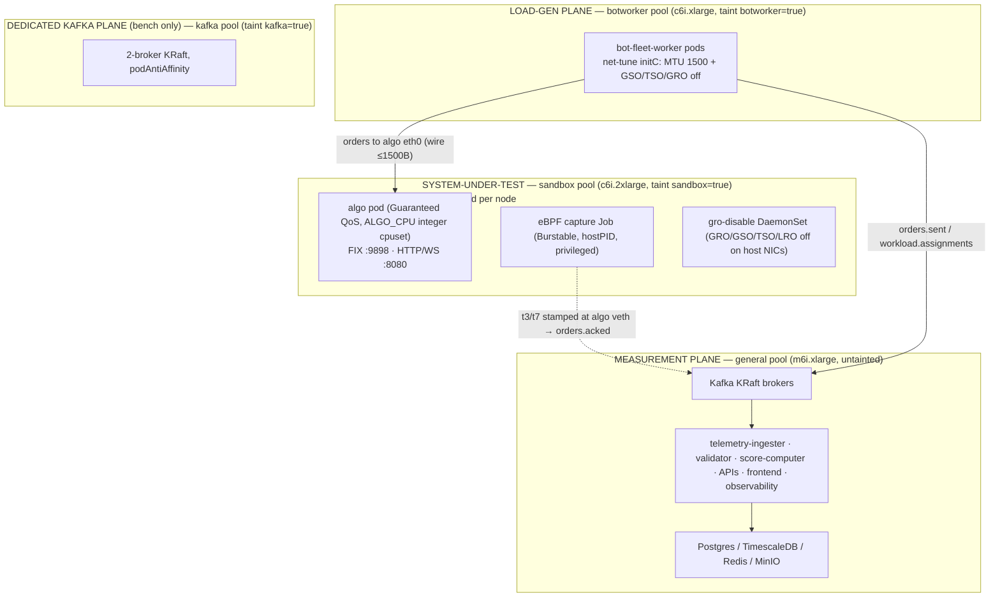

---

### 2. Namespaces and the data tier

Workloads are partitioned into six namespaces, each carrying a `name=<ns>` label
(`k8s/*/namespace.yaml`). That label is the selector every cross-namespace NetworkPolicy
keys on, so the partition is also the security boundary:

- **`data`** — the stateful tier: Kafka, Postgres, TimescaleDB, Redis, MinIO.
- **`platform`** — public-facing tier: `auth-api`, `submission-api`, `leaderboard-api`,
  `frontend`.
- **`build`** — `build-spawner` (mints build/scan/SBOM Jobs).
- **`sandbox`** — the contestant algo pods + eBPF capture Jobs + `sandbox-orchestrator`.
- **`benchmark`** — `bot-fleet-controller`, `bot-fleet-worker`, `telemetry-ingester`,
  `correctness-validator`, `score-computer`.
- **`observability`** — Prometheus, Grafana, Loki.

**Data-tier StatefulSets** (all in `data`, all `automountServiceAccountToken: false`, all
hardened with `runAsNonRoot`, dropped capabilities, `readOnlyRootFilesystem` where the image
allows, and an EBS gp3 `volumeClaimTemplate`):

- **Kafka** (`k8s/data/kafka/statefulset.yaml`) — `apache/kafka:3.7.1`, **KRaft** mode
  (`broker,controller`, no ZooKeeper), `replicas: 3`, `podManagementPolicy: Parallel`,
  `podAntiAffinity` (one broker per host, `topologyKey: kubernetes.io/hostname`) so a node
  loss can't take out two brokers or make them contend for the same page-cache/NIC. Node id
  is derived from the ordinal (`KAFKA_NODE_ID="${HOSTNAME##*-}"`). Two hard-won bootstrap
  fixes are baked in: topic data lives on the **PVC subdirectory** `/opt/kafka/data/logs`
  rather than the emptyDir default `/tmp/kafka-logs` (a resource-bump restart once wiped
  every topic), and on a *subdirectory* not the PVC root so Kafka's log loader doesn't try
  to parse ext4's `lost+found` as a topic-partition and crash. Memory limit is 8Gi (real
  page cache — the 2Gi default forced every produce to disk and backed up the telemetry
  producer); CPU request trimmed to 1 so the general pool's requests fit. A
  `kafka-exporter` sidecar exposes `:9308` for Prometheus.
- **TimescaleDB** (`timescaledb/statefulset.yaml`) — `timescale/timescaledb:2.17.2-pg16`,
  single replica, DB `metrics`, with a `postgres-exporter` sidecar on `:9187`. Stores the
  HDR latency/throughput timeseries from the telemetry-ingester.
- **Postgres** (`postgres/statefulset.yaml`) — `postgres:16-alpine`, single replica, DB
  `iicpc` (submissions, run-groups, scores). Exporter on `:9187`.
- **Redis** (`redis/statefulset.yaml`) — `redis:7-alpine`, single replica, **persistence
  off** (`--save "" --appendonly no`) — it is a leaderboard/telemetry cache, not a source of
  truth. Exporter on `:9121`.
- **MinIO** (`minio/statefulset.yaml`) — single replica, S3-compatible artifact store
  (50Gi PVC), Prometheus metrics public on `:9000`.

All data services except Kafka are **single-replica StatefulSets** — see Limitations.

---

### 3. Fairness & isolation — how the measurement stays fair

The platform's fairness guarantees are enforced not in prose but in
`services/sandbox-orchestrator/internal/k8s/slot.go`, which programmatically constructs every
untrusted contestant pod:

1. **Guaranteed-QoS, integer-core algo pod.** The orchestrator validates at startup that
   `ALGO_CPU` is a whole core count, then sets request == limit for both CPU and memory so
   Kubernetes assigns the pod **Guaranteed** QoS — the precondition for the static CPU
   manager to hand it an exclusive cpuset. The integer-core check is the load-bearing line:

   ```go
   // services/sandbox-orchestrator/internal/k8s/slot.go:117-124
   if cfg.CPU != "" {
       cpu, err := resource.ParseQuantity(cfg.CPU)
       if err != nil { return fmt.Errorf("invalid CPU resource %q: %w", cfg.CPU, err) }
       if _, err := strconv.Atoi(cfg.CPU); err != nil || cpu.MilliValue()%1000 != 0 {
           return fmt.Errorf("CPU must be an integer core count for cpuset pinning, got %q", cfg.CPU)
       }
   }
   ```
   Fractional cores are rejected up front: a `500m` algo can never get a pinned cpuset, so
   the platform fails fast rather than silently producing an unfair measurement.
   `containerResources` (slot.go:607) then deep-copies the same `ResourceList` into both
   Requests and Limits, guaranteeing QoS.

2. **Zero-disk-I/O untrusted pod.** The algo pod has **no PVC**. Its writable paths
   (`/tmp`, `/var/tmp`, `/var/log`, `/var/run`) are RAM-backed `emptyDir{ medium: Memory }`
   tmpfs (`writableVolumes`/`writableMounts`, slot.go:404-430) so a contestant can't
   perturb the measurement via disk contention and leaves no on-disk residue.

3. **Hardened untrusted-pod spec** (`podSpec`, slot.go:318-399): `RestartPolicyNever`,
   `ActiveDeadlineSeconds=3600` (a wedged algo self-terminates), `AutomountServiceAccountToken:
   false` (no API credentials), and a per-container `SecurityContext` with
   `ReadOnlyRootFilesystem`, `AllowPrivilegeEscalation:false`, `Capabilities.Drop:[ALL]`, and
   `SeccompProfile: RuntimeDefault`.

4. **gVisor as a pure config toggle.** `RUNTIME_CLASS` is read into `Manager.runtimeClass`;
   `runtimeClassName` is set **only when it is non-empty** (slot.go:384-387). The deployed
   value is `RUNTIME_CLASS=""` (`k8s/sandbox/sandbox-orchestrator/deployment.yaml:44-45`), so
   the pod spec is byte-identical across dev/prod and only the env value differs — gVisor can
   be switched on later by installing `runsc` and flipping the var, with **no code-path
   divergence**. Terraform can register the `gvisor` RuntimeClass (`enable_gvisor`,
   `infra/terraform/addons.tf:76-107`) but it defaults off.

5. **Default-deny networking + additive, label-scoped policies.** Each namespace ships a
   `podSelector: {}` policy with both `Ingress` and `Egress` policy types, i.e. a default-deny
   floor, then adds back exactly what is needed. The sandbox is the tightest
   (`k8s/sandbox/network-policy.yaml`): ingress **only** from the `benchmark` namespace
   (the load generator), and egress to the public internet **except** all RFC-1918 ranges
   (`10/8`, `172.16/12`, `192.168/16`) plus DNS to kube-system — so a contestant algorithm
   can reach the internet but **cannot reach Postgres, Kafka, MinIO, or another contestant**.
   A second policy (`ebpf-capture-egress`) scopes the capture pod (`app: ebpf-capture`) to
   exactly Kafka `:9092`, Loki `:3100`, and DNS. The data tier
   (`k8s/data/network-policy.yaml`) admits the sandbox **only** on Kafka `:9092`.

6. **Per-pod NIC bandwidth caps.** When `ALGO_*_BANDWIDTH` is set the orchestrator adds the
   CNI bandwidth-plugin annotations `kubernetes.io/{egress,ingress}-bandwidth` (slot.go:326-331);
   the deployment sets both to `100M` (deployment.yaml:52-55), throttling a contestant's NIC.

7. **One-pod-per-node pinning.** The sandbox node group is autoscaled and the design relies
   on exactly one algo pod per sandbox node so every packet processed on that node belongs to
   that contestant (no cross-tenant softirq leakage on a shared veth). The orchestrator pins
   the pod with the `sandbox=true` toleration + `pool` nodeSelector when `SANDBOX_NODE_POOL`
   is set (slot.go:389-397); `max_concurrent contestants = sandbox node count`
   (`variables.tf:99-103`).

8. **Least-privilege RBAC.** `sandbox-orchestrator` holds a namespaced `Role`
   (`k8s/sandbox/sandbox-orchestrator/rbac.yaml`) limited to `pods`, `services`, and `jobs`
   in `sandbox` only — no cluster-wide rights, no secrets, no node access. `build-spawner`
   is similarly scoped to `batch/jobs`, `pods`, `pods/log`, and `secrets` in `build`
   (`k8s/build/rbac.yaml`). The orchestrator itself runs hardened (read-only root, drop ALL,
   `runAsNonRoot`, uid 65532).

9. **Multi-port slots with capturable-port fast-fail.** A slot now carries `ports []int`
   rather than a single port, so one contestant pod can expose FIX (`:9898`) and HTTP+WS
   (`:8080`) simultaneously — the shape the per-task protocol targets (Shape A) require.
   `CreateSlot` emits one `ContainerPort`/`ServicePort` pair per entry and gates readiness on
   **all** listeners accepting connections (`services/sandbox-orchestrator/internal/k8s/slot.go`,
   `internal/handler/slot.go`, exercised by `internal/k8s/multiport_test.go`). When capture is
   enabled, any port outside the eBPF-capture allowlist `{8080, 9898}` is rejected *before*
   the pod is created (slot.go:43, 140-144) — a slot on an un-instrumentable port fails
   immediately rather than running and silently producing no latency data. The ports
   themselves are platform constants: 9898 = FIX, 8080 = shared HTTP+WS. Contestants no
   longer choose ports; the submission-api validates manifests against this policy and
   rejects non-conforming zips (`services/submission-api/internal/validator/zip.go`,
   `internal/errors/errors.go`).

10. **The instrument never steals the measured cores.** The capture Job
    (`captureJobSpec`/`captureResources`, slot.go:491-603, and
    `k8s/benchmark/ebpf-latency/job-template.yaml`) requests only `200m` CPU but is allowed
    to burst to `4` — i.e. **Burstable** QoS (request < limit). Because the algo pod is
    Guaranteed with a pinned cpuset, the bursty capture physically cannot run on the
    contestant's reserved cores; it lives on the remaining shared cores. The capture limit
    was raised 2→4 because at >150k delivered the userspace drain/parse/publish wants ~3
    cores and a 2-core cap CFS-throttled it into ring-buffer drops (job-template.yaml:52-55).
    The capture is a **Job, not a DaemonSet** (it carries per-slot identity and watches one
    algo pod), is pinned to the algo pod's node by `nodeName`, runs `hostPID: true` +
    `privileged` with `add: [BPF, NET_ADMIN, SYS_ADMIN]`, mounts `/sys/fs/bpf`, and is
    garbage-collected via `OwnerReference` on the algo pod + a reaper for orphans
    (`reapOrphanCaptureJobs`, slot.go:285-302).

---

### 4. eBPF capture-fidelity fixes — the two EKS jumbo-frame defenses

The measurement contract requires **one packet = one order/response**: the capture buffer is
a single MTU (`CAPTURE_CAP = 1536 B`), so any frame larger than that truncates, forces a lossy
flow reset in the reassembler, and the order is never matched. EKS's VPC CNI defaults to a
**jumbo MTU (9001) with all offloads on**, which on a stock cluster destroyed ~98% of latency
samples. Two complementary fixes are required because the request traverses two hosts:

- **Sender side — bot-fleet `net-tune` initContainer** (`k8s/benchmark/bot-fleet/deployment.yaml:43-56`).
  A privileged init container runs `ip link set dev eth0 mtu 1500` and
  `ethtool -K eth0 gso off tso off gro off lro off` before the worker starts, so the load
  generator emits ≤1500 B wire frames in the first place.

- **Receiver side — `gro-disable` DaemonSet** (`k8s/sandbox/gro-disable-daemonset.yaml`).
  The capture's XDP ingress hook attaches in **generic mode** on the veth (native/driver
  attach fails there), so it runs *after* GRO. For **cross-node** traffic (load gen on a
  botworker node → contestant on a sandbox node) the incoming segments are GRO-coalesced on
  the sandbox node's ENS/ENI **before the capture sees them**, producing super-frames > 1536 B.
  A `hostNetwork: true`, privileged DaemonSet pinned to the sandbox pool keeps GRO/GSO/TSO/LRO
  off on every host interface, re-applying every 2 s because the VPC CNI keeps attaching new
  ENIs / pod veths over time.

Both are needed because the sender fix only clamps frames leaving the load generator, while
the receiver fix prevents the sandbox host from re-coalescing them on arrival. The capture
image itself *also* runs `ethtool … off` inside the algo netns at attach time
— that handles the veth, while the DaemonSet handles the host NIC.
With offloads off, live runs saw `TRUNCATED_CAPTURES` fall from thousands to ~13–24 and
`DROPPED_EVENTS` stay zero.

---

### 5. Observability — Prometheus, Grafana, Loki

All three observability components live in the `observability` namespace, behind their own
default-deny policy, single-replica.

- **Prometheus** (`k8s/observability/prometheus/configmap.yaml`) scrapes via
  `kubernetes_sd_configs role: pod` and keeps only pods annotated
  `prometheus.io/scrape: "true"` — every workload manifest carries that annotation + a
  `prometheus.io/port`, so instrumentation is opt-in per pod. It relabels `namespace`, `pod`,
  `app`, `node` and drops non-Running pods. It loads `iicpc-alerts.yml` with four alerts:
  score-computer scoring errors / no-successful-scores, leaderboard-API dropped SSE clients,
  and leaderboard cache (Redis) errors.
- **Grafana** ships two provisioned dashboards (`grafana/dashboards-configmap.yaml`) wired to
  Prometheus + Loki datasources (`datasources.yaml`):
  - **IICPC Platform Overview** — per-service HTTP req/s, 5xx rate and ratio, p95/p99 latency
    (`histogram_quantile` over `iicpc_http_request_duration_seconds_bucket`), and a Loki
    `ERROR|WARN` log panel.
  - **IICPC Measurement Pipeline** — the heart of the measurement: bot-fleet orders sent vs
    write errors / connect failures, telemetry-flush drops, **eBPF** flushes / ring-buffer
    drops / retransmissions / reordering / decode errors, telemetry-ingester events-consumed
    by topic, records finalized vs evicted, join-buffer size, TimescaleDB/Redis write p95,
    and validator sessions / violations / in-flight / drain p95. These are the dashboards that
    prove capture fidelity (drops ≈ 0) at a glance.
- **Loki** (`k8s/observability/loki/deployment.yaml`) — `grafana/loki:3.1.1`, single replica,
  `Recreate` strategy, PVC-backed. Services push structured JSON logs directly to
  `http://loki.observability.svc.cluster.local:3100/loki/api/v1/push` via the shared logger
  libs (`libs/go/logger/loki.go`, `libs/rust/logger/src/loki.rs`) — every workload sets
  `LOKI_URL`, and the Go handler batches entries (`batchSize`/`batchWait`) before flushing.
  There is no node-level agent (no Promtail/Fluent Bit); shipping is in-process.

Key metric families: `iicpc_http_*` (APIs), `iicpc_bot_*` (load gen), `iicpc_ebpf_*`
(capture), `iicpc_telemetry_*` (ingester), `iicpc_validator_*`, `iicpc_scorer_*`,
`iicpc_leaderboard_api_*`.

Two bot-fleet additions matter for reading the dashboards after the P1–P4 work: the hot-path
counters `orders_sent`, `order_write_error`, and the write/slip histograms now carry a
per-protocol label (fix/rest/ws) so a mixed-protocol run can be decomposed
(`services/bot-fleet/src/metrics.rs:42-45`), and the worker exports read-and-reset
pacing-fidelity snapshot stats — the worst coalesced write batch and worst schedule slip since
the last scrape (`metrics.rs:25-32`). The snapshot stats are how the pacing-knee sweeps in §7
were measured.


*The Measurement Pipeline dashboard during a run — bot-fleet orders-sent vs write errors, telemetry flush/drops, eBPF flushes/drops/reordering, and ingester consume-by-topic; capture drops stay at ~0.*

---

### 6. Frontend — Next.js, SSE, build timeline, auth removed


The frontend (`frontend/`) is a **Next.js 14** app (React 18, TanStack Query, Recharts,
framer-motion, `hdr-histogram-js`) served by nginx — the deployment
(`k8s/platform/frontend/deployment.yaml`) runs **2 replicas**, fully hardened (read-only root,
drop ALL, non-root uid 101, `RuntimeDefault` seccomp, no SA token, emptyDir scratch). It is a
static/proxy tier: it carries no secret and reaches the APIs by service name
(`LEADERBOARD_API_HOST`, `SUBMISSION_API_HOST`, `AUTH_API_HOST`). Its NetworkPolicy admits
ingress only from `ingress-nginx` and egress only to the three API pods + DNS
(`frontend/network-policy.yaml`).

- **Live leaderboard via SSE.** `useSSE` (`frontend/src/hooks/useSSE.ts`) opens an
  `EventSource`, handles named `snapshot` / `update` events, and reconnects with capped
  exponential backoff (`min(1000·2^attempt, 30_000)`). `useLeaderboard`
  (`frontend/src/hooks/useLeaderboard.ts`) seeds the table from a REST query, then layers the
  SSE stream on top: a `snapshot` replaces the cached `LeaderboardResponse`; an `update` is
  merged into the matching `(run_group_id, contestant_id)` row via `applyLeaderboardUpdate`
  and flashes the row for 400 ms. SSE is enabled only once the initial query has data.
- **Run detail via polling** (not SSE). `useRunDetail` (`frontend/src/hooks/useRunDetail.ts`)
  polls `getRunDetail` every 2.5 s and **stops as soon as every session is terminal**
  (`completed`/`failed`) regardless of whether a score exists — a deliberate fix so a finished
  but unscored run doesn't poll an ~8 MB payload forever. Client-side it derives a latency
  histogram (p50/p99/max from per-point `p99_ns`), throughput windows, and per-scenario HDR
  data.
- **Build timeline** (`frontend/src/components/submit/BuildTimeline.tsx`) renders the
  submission lifecycle `queued → building → scanning → promoting → ready` (or `failed`),
  with last-20-lines build-log tail on failure and a "still queued >90 s — is the build-worker
  running?" hint.
- **Auth removed.** `authDisabled` is **hardcoded `true`** (`frontend/src/config/platform.ts:44`)
  — explicitly *not* a build arg, so it cannot silently fall back to the OAuth path if an arg
  is omitted at build time. `AuthProvider` (`frontend/src/auth/AuthProvider.tsx`) branches on
  it to a `DisabledAuthProvider` that supplies a fixed "always-authenticated" context with a
  synthetic **unsigned** JWT whose `sub` is the default contestant; the backend runs
  `AUTH_REQUIRED=false` and trusts (does not verify) that claim. The visitor is always the
  default contestant (`defaultContestantId`, must match the submission-api's
  `DEFAULT_CONTESTANT_ID`). The Google-OAuth `auth-api` + `RealAuthProvider` code remain in
  the tree but are dead paths in this benchmark build.

---

### 7. Scaling model & Kafka partitioning

Most services in this section are **stateless and horizontally scalable**; the data tier is
**stateful** (Kafka sharded by partition, the rest single-replica singletons).

The **bot-fleet load generator is the headline horizontal-scale unit** and is the only
KEDA-autoscaled workload (`k8s/benchmark/bot-fleet/scaledobject.yaml`):

- KEDA scales `bot-fleet-worker` on **Kafka consumer-group lag** on topic
  `workload.assignments`, group `bot-fleet`, `lagThreshold: "1"`, between
  `minReplicaCount: 2` and `maxReplicaCount: 50`. (KEDA is installed via Helm,
  `infra/terraform/addons.tf:65-74`.)

**Kafka topics relevant to this plane** (declared in `ops/kafka/create-topics.sh` and the
in-cluster `k8s/data/kafka/topic-init-job.yaml`; `KAFKA_AUTO_CREATE_TOPICS_ENABLE=false`,
so the init Job is the single source of topic truth):

| Topic | Partitions | Partition key & why | Consumer group (this plane) | How it scales |
|---|---|---|---|---|
| `workload.assignments` | **24** | keyed so each worker task maps to a partition; KEDA reads this topic's lag | `bot-fleet` (the workers) | up to 24 workers consume disjoint partitions in parallel → linear load-gen scale-out, capped by partition count |
| `orders.sent` | **24** | **co-partitioned by `order_id`** via FNV-1a `partition_for` (`schemas/rust/src/lib.rs`; Rust-only, no Go twin) | telemetry-ingester (`telemetry-ingester`) | `orders.sent` and `orders.acked` use the **same** key/partition count so a given order's sent + acked land in the **same partition**, letting an ingester replica own a partition and join the two streams locally without a network shuffle |
| `orders.acked` | **24** | same FNV-1a `order_id` hash; **produced by the eBPF capture** | telemetry-ingester | co-partition join (above); 24 partitions = up to 24 ingester replicas |

Control topics (`submission.build.requested`, `benchmark.requested`, `barrier`, `bot.ready`,
`scores.correctness`, `leaderboard.updates`, etc.) are **3 partitions** — low-volume
coordination, not throughput, so they don't need the 24-way fan-out.

**Per-node load-gen capacity.** The EKS drain sweep that sized the bench topology measured
~600–790k orders/s per botworker node, peaking at 747,911/s
(`deploy-bench/drain-raw-tps.tsv`). Those numbers predate the P1–P4 hot-path rework
(single-protocol rendering, template-and-patch FIX frames, the expiry-queue watchdog, batched
REST/WS writes, cheap response parsing): the same drain workload on a local 4-thread run now
sustains **2.2–2.6M orders/s**, roughly 3× the old ceiling. Laptop and c6i cores are not
directly comparable, so treat 747,911/s as the pre-improvement baseline and the number to
beat on the pending EKS re-sweep (`docs/tps-improvement-plan.md:281-284`); the bench.tfvars
sizing (3 botworker nodes for 2M/s) was derived from the old figure and likely has slack now.

Raw throughput is only half the picture; the load generator must also stay **on schedule**
(pacing fidelity), or the benchmark quietly reintroduces coordinated omission. Local
task-count sweeps using the pacing snapshot stats (`deploy-bench/task-sweep-1784112347.tsv`,
`-1784114113.tsv`, `-1784113948.tsv`) show three regimes per worker process:

- **clean** up to ~300k/s: average coalesced batch ~1.3–2.2 orders, max slip <10 ms;
- **knee** at ~400–500k/s: batch size saturates toward the 64-order cap, slip grows to
  60–400 ms;
- **collapse** at 700k–1M offered: batch pinned at 64, slip 5–9 s, and the median achieved
  rate falls below target.

Splitting the same offered load across two worker processes (the "split" rows in the sweeps)
does not beat a single process — consistent with the flamegraph profile showing zero lock
contention (`docs/tps-improvement-plan.md:34-37`); the limit is CPU, not synchronization.
One further caveat when interpreting end-to-end sweep numbers: the echo contestant's reply
path still builds each execution report with a per-reply `format!` and an unbatched write,
which drags the observed pacing knee from ~500–700k/s (drain sink) down to ~300k/s. Until
`execution_report_frame` gets the same template treatment as the sender (deferred,
`docs/tps-improvement-plan.md:208-215`), `measure-capacity-sweep.sh` under-reports pipeline
capacity — the ~150k delivered/s single-echo-pod figure measures the echo pod, not the
platform.

The **scaling bottleneck** for the 2M/s tier is the **dedicated Kafka I/O plane**: telemetry
at 2M/s is ~700 MB/s; the bench splits it over 2 brokers on gp3-PVCs to stay under
per-broker EBS/network limits (`bench/bench.tfvars:6-9`). Sandbox capacity scales linearly
with sandbox node count (one contestant per node).

---

### 8. Config-only environment parity & the EKS Free-plan caveat

The design goal is that **local k3s and EKS differ only by config, never code**. The same
manifests apply to both; the toggles that switch environment (`RUNTIME_CLASS`,
`SANDBOX_NODE_POOL`, `BUILD_NODE_POOL`, ECR-vs-local registry, `enable_*` Terraform flags) are
all empty-string / boolean env values, not code branches. Image tag mutability is `IMMUTABLE`
by default so two contestants can never be scored against different platform binaries under
the same tag (`variables.tf:257-266`).

- **Local k3s (dev/demo)** — single node, flannel + built-in NetworkPolicy enforcement,
  `local-path` storage, local registry mirror with `imagePullPolicy: Never`, `RUNTIME_CLASS=""`,
  no cpuset pinning (single shared node), port-forward instead of an ALB.
- **EKS (prod)** — managed control plane + ≥2 tainted node groups, VPC CNI with
  `enableNetworkPolicy=true` **and `ENABLE_PREFIX_DELEGATION=true`** (`main.tf:97-107`), gp3 via
  EBS-CSI as default StorageClass (`addons.tf:8-27`), ECR immutable tags
  (`imagePullPolicy: IfNotPresent`), AWS Load Balancer Controller for the public frontend, KEDA
  for autoscaling.

The same parity principle now extends to workload shape: scenario population sizes and
action mixes are env-configured rather than hardcoded
(`services/submission-api/internal/scenarios/builder.go`), so local and EKS runs can be
reseeded to different scales without a rebuild.

**The most dangerous EKS divergence** is that the VPC CNI **does not enforce NetworkPolicy by
default** — every isolation policy is a silent no-op until `enableNetworkPolicy` is on. The
manifests will all show present (`kubectl get netpol`) while a contestant can in fact reach
Postgres/Kafka/MinIO/other contestants. `infra/scripts/netpol-deny-test.sh` is the hard gate:
it launches a probe pod in `sandbox`, asserts Postgres is **unreachable** (egress denied) and
public egress **works**, and refuses the deploy otherwise.

**The minimal-cost smoke profile** is `2× m6i.xlarge general + 1× c6i.2xlarge sandbox` (~$22/day), with scenarios reseeded small; the sandbox group **floors at one
c6i.2xlarge** because going smaller breaks the integer-core cpuset the measurement depends on.

**EKS Free-plan 2-vCPU caveat.** `infra/terraform/terraform.tfvars:1-4` warns that AWS accounts on the **new Free plan**
(mid-2025+) can only launch free-tier instance types — the largest being `m7i-flex.large` at
**2 vCPU / 8 GB** — and any other type fails the node-group Auto Scaling launch with *"The
specified instance type is not eligible for Free Tier."* The platform **cannot run correctly on
2-vCPU nodes**: the data tier alone needs ~5 vCPU of requests, and the exclusive-core cpuset
needs ≥4 vCPU (2 system + 2 algo), so `cpuManagerPolicy=static` + `full-pcpus-only` would
reject the algo pod. The documented remedy is to upgrade the account to a paid plan; otherwise
run the **local k3s harness** (which has none of these caps) for a no-cost demo. This matches
the project history: EKS was attempted and torn down under the Free-plan vCPU cap, the demo runs
local k3s, and the repo ships the proper paid-account cluster config.

---

### 9. Limitations & scope for improvement

- **Single-replica data tier.** Postgres, TimescaleDB, Redis, MinIO, Loki, Prometheus, and
  Grafana are all `replicas: 1` — no HA, and each is a single point of failure. EBS is
  AZ-bound, so each stateful pod is pinned to its volume's AZ. Acceptable for a re-runnable
  benchmark but not for production durability.
- **Kafka StatefulSet hardcodes `replicas: 3`** (`statefulset.yaml:15`) with a fixed 3-voter
  KRaft quorum, **independent of the `kafka_desired_size` node-pool variable**. Running fewer
  brokers requires editing the StatefulSet itself (not just the tfvars), and with
  `requiredDuringScheduling` anti-affinity the 3rd broker stays `Pending` unless 3 distinct
  nodes are available to host one each.
- **gVisor and exclusive cpusets are both OFF by default.** `enable_gvisor=false` and
  `enable_sandbox_cpuset=false` in every committed tfvars. With cpuset off, the contestant gets
  its 2/4 vCPU via Guaranteed-QoS *quota* but **not exclusively-pinned cores**
  (`terraform.tfvars` comment near `enable_sandbox_cpuset`). The cpuset NodeConfig is disabled
  because `reservedSystemCPUs` conflicts with EKS's default kube/system-reserved CPU and the
  kubelet refuses to start, so the node never registers (`main.tf:174-198`,
  `variables.tf:206-217`). Until that conflict is resolved, the headline "exclusive-core
  fairness" guarantee is **quota-only**, not true core isolation. This is the single biggest
  open item for measurement fidelity.
- **Capturable-port allowlist is hardcoded** to `{8080, 9898}` (`slot.go:43`). This now
  matches the platform-wide port constants enforced by the submission-api, so it is less of a
  foot-gun than it was, but adding a new contestant entry-point still requires a code change
  + re-deploy in both places.
- **In-process Loki shipping, single Loki replica.** No node agent and a single Loki Deployment
  with a PVC mean log loss on Loki restart and a per-service hard dependency on `LOKI_URL`
  reachability.
- **gro-disable / net-tune are privileged best-effort loops.** The DaemonSet re-applies
  `ethtool` every 2 s forever (no convergence signal); a window between a new ENI attaching and
  the next loop can still let a coalesced frame through. Driver-mode XDP would remove the need,
  but the veth forces generic mode.

---

## Scope for Improvement

This page consolidates every limitation flagged in the service sections, grouped
by theme and ordered roughly by impact. Each item is grounded in a file or
symbol so it can be picked up directly. Items that earlier revisions of this page
listed but that the P1–P4 bot-fleet rework has since closed (triple-protocol frame
rendering, the 250 ms full-pending-map watchdog scan, unbatched REST/WS writes, the 1 ms
backpressure sleep, scattered env knobs) have been removed; the tps-improvement-plan status
is summarized at the end of this section.

### The handful that matter most

1. **Exclusive-core cpuset pinning is OFF** (`enable_sandbox_cpuset=false`,
   every committed tfvars). The contestant gets its cores via Guaranteed-QoS
   *quota*, but not an *exclusively pinned* cpuset, because EKS's auto
   kube/system-reserved CPU conflicts with the `reservedSystemCPUs` NodeConfig
   and the kubelet refuses to start (`infra/terraform/main.tf:174-198`). The code
   path that *would* pin (integer-core validation + Guaranteed QoS in
   `sandbox-orchestrator/internal/k8s/slot.go:117`, `:607`) is correct and ready;
   it's the node config that's blocked. **This is the single biggest measurement-
   fidelity gap** — "fair, exclusive cores" is currently quota-only.
2. **The 2M/s tier is a documented target, not a validated run**, and the EKS
   per-node numbers are stale in the other direction: the ~600–790k/s per-node
   drain ceiling (peak 747,911/s) predates P1–P4, after which local 4-thread
   drain sustains 2.2–2.6M/s. Two pieces remain explicitly UNVERIFIED: eBPF
   capture throughput at ~2M acks/s (a single capture pod) and echo-contestant
   capacity at 2M/s. The next steps are an EKS drain re-sweep against the
   747,911/s baseline (`docs/tps-improvement-plan.md:281-284`), then the drain
   variant with telemetry + ingester on the multi-broker Kafka.
3. **The correctness-validator does not shard** and is the least-scalable
   component. It replays *every* order through a reference book, so memory and
   wall-clock scale with **total order volume**; it OOMs/timeouts if a run
   overshoots the delivered ceiling. It's deployed `replicas: 1` with no KEDA;
   the code is replica-safe (consumer group + `ON CONFLICT` claim) but the
   autoscaling story is unrealized.
4. **The per-worker telemetry aggregator is a single Tokio task** (plan item P5,
   not started). Each bot-fleet worker funnels all of its `orders.sent` telemetry
   through one mpsc channel into one `run_aggregator` task (`telemetry.rs:62-72`).
   It has been hardened (`recv_many` bulk drain, async delivery), but sharding it
   into M tasks is unimplemented. The old telemetry-on vs telemetry-off framing
   (~445k/s vs ~600–790k/s per worker) needs re-measuring: the off-ceiling has
   since roughly tripled (2.2–2.6M/s local drain), so the relative cost of the
   aggregator is now the larger fraction and P5 is the named lever to close it,
   alongside the 2-broker Kafka split.
5. **Auth is disabled in the shipped demo.** `AUTH_REQUIRED=false` +
   `OptionalContestant` (submission-api) and a hardcoded `authDisabled=true`
   (`frontend/src/config/platform.ts:44`) mean identity comes from an *unverified*
   token or a static default. The capability exists and is tested; it's toggled
   off — a gap for a real multi-tenant contest, not for a benchmark harness.

### Measurement fidelity

- **eBPF capture is a single-NIC, CPU-bound singleton.** One capture per
  contestant veth; the whole userspace drain/parse/publish is one loop on one
  64 MiB ring. A hot contestant can only be helped with more CPU on its one pod
  (raised 2→4 vCPU already), never more replicas. Validated lossless at
  **≥ ~144k samples/s**; the per-contestant ceiling above that is one CPU.
- **The echo contestant, not the platform, is the current end-to-end ceiling.**
  The echo pod's per-reply `format!` execution-report builder + unbatched write
  caps delivery around ~150k/s per pod and moves the load-gen pacing knee from
  ~500–700k/s (drain) to ~300k/s. Giving `execution_report_frame` the sender's
  template-and-patch treatment is deferred work
  (`docs/tps-improvement-plan.md:208-215`); until then `measure-capacity-sweep.sh`
  under-reports pipeline capacity.
- **Load-gen pacing has a knee.** Per worker process, pacing is clean to ~300k/s
  (avg coalesced batch ~1.3–2.2, max slip <10 ms), degrades at ~400–500k/s, and
  collapses at 700k–1M offered (batch pinned at 64, slip 5–9 s, achieved rate
  below target) — see the task sweeps in `deploy-bench/task-sweep-*.tsv`. Runs
  above the knee are throughput tests, not latency benchmarks; the pacing
  snapshot stats (`services/bot-fleet/src/metrics.rs:25-32`) are the guardrail.
- **`net-tune` / `gro-disable` are best-effort privileged loops.** The
  gro-disable DaemonSet re-applies `ethtool … off` every 2 s forever with no
  convergence signal; a window between a new VPC-CNI ENI attaching and the next
  loop can still let a GRO-coalesced (>1536 B) frame through and truncate a
  capture. Driver-mode XDP would remove the need, but the veth forces generic
  mode (post-GRO).
- **`orders.acked` is intentionally loss-tolerant** (kernel sample-clamps
  oversized frames; userspace drops `QueueFull` batches). Correct for a latency
  *distribution*, but it is not exactly-once — losslessness depends on the MTU/GRO
  fix and a non-saturated broker.
- **gVisor is off by default** (`RUNTIME_CLASS=""`); isolation leans on the
  hardened security context + default-deny NetworkPolicy. It's a pure config
  toggle, so enabling it is `runsc` + an env flip, no code change.
- **Capture attaches after the algo is serving** (orchestrator spawns the capture
  Job only once a `Refresh` sees the slot `Ready`) — a small race window for the
  earliest packets.

### Throughput & scaling

- **REST/WS write paths still carry a per-write timeout** (`worker.rs:655`). The
  P3' batching work gave `rw_write_loop` (`services/bot-fleet/src/worker.rs:1288`)
  FIX-style coalescing of already-due backlog — REST pipelines N requests into one
  `write_all`, WS does N `feed()`s and a single flush — so REST/WS are no longer
  one-syscall-per-order, but the timeout wrapper remains a per-write cost the FIX
  path does not pay.
- **Node scaling is validated only to 2 nodes.** The 1→2-node drain sweep measured
  ~2.02× (near-linear); scaling beyond 2 nodes, and the 3-node ~2M/s tier, is not
  yet swept — and the per-node figure itself is due for a re-sweep post P1–P4
  (item 2 above).
- **Worker fan-out is hard-capped at 24** (`validateWorkerCapacity`,
  `bot-fleet-controller/internal/controller/producer.go:88`) because
  `workload.assignments` and `orders.*` are 24 partitions. Scaling past 24
  generators per session is a coupled topic-repartition, not a config flag.
- **Hard singletons with in-memory state.** `bot-fleet-controller` holds all
  per-session barrier/fan-in state in memory (a crash mid-run loses in-flight
  fan-in; `RecoverInFlightRuns` only fails them out cleanly). `telemetry-rollup`
  is a single process doing per-tick full-history HDR merges — the serialization
  point for final percentiles. `score-computer` is effectively a singleton whose
  per-run-group cost is a global `ROW_NUMBER` rank (O(rows)); fine at contest
  scale, would need an incremental/ZSET rank if the table grew large.
- **No KEDA on most scale-ready services.** Only bot-fleet autoscales. The
  ingester, validator, score-computer, leaderboard-api, and submission-api are
  fixed-replica Deployments despite being scale-safe — capacity is provisioned,
  not autoscaled.

### Correctness & behavioral gaps

- ~~**Aggressive-fill tolerance is currently inert.**~~ Resolved 2026-07-31:
  deleted along with the batch validator that was its only implementation.
  Grading is strict and `AGGRESSIVE_FILL_TOLERANCE_US` no longer exists. Pass 1
  is single-connection, so it has no cross-flow interleaving to forgive; the
  epoll ordering issue is a pass-2 problem needing a different mitigation.
- **`workload.failed` is produced but not consumed** by the controller, so a
  worker that aborts mid-run is invisible; trouble is only detected via missing
  `bot.ready` (`ReadyDeadline`) or a run timeout.
- **Partial fan-in fires anyway** — if some workers miss the `ReadyDeadline`, the
  run proceeds with fewer workers and is still scored (degrade-don't-stall, but a
  degraded run isn't flagged).
- **`rank_delta` is hardcoded to 0** (`score-computer/internal/worker/worker.go:86`)
  — the "moved up/down" signal on the leaderboard is dead.
- **`scores.correctness` partition key is decorative** — the validator sets
  `Key=session_id` but uses the `LeastBytes` balancer, which ignores keys.
  Harmless (aggregation is in SQL) but misleading.
- **Self-trade detection is order_id-format-coupled** — `model.ParticipantOf`
  parses the bot id by string position; a malformed id silently weakens the check.
- **The validator's settle delay is a fixed 10 s heuristic**, not completeness-
  driven; a telemetry write later than 10 s + the 500 ms join window could
  under-count fills (surfaced via the sent/acked/matched coverage counters).

### Reliability & operations

- **Single-replica data tier.** Postgres, TimescaleDB, Redis, MinIO, Loki,
  Prometheus, Grafana are all `replicas: 1` — each a SPOF, each EBS-AZ-pinned.
  Fine for a re-runnable benchmark, not for production durability.
- **Kafka StatefulSet hardcodes `replicas: 3`** (`k8s/data/kafka/statefulset.yaml:15`)
  with a fixed 3-voter KRaft quorum, **independent of `kafka_desired_size`**. The
  tfvars describe 1–2 brokers, but the StatefulSet still tries to schedule 3 (the
  3rd stays `Pending` under anti-affinity); the bench "2-broker" claim likewise
  doesn't match. Running fewer brokers requires editing the StatefulSet.
- **Build pipeline throughput is bounded by 3 partitions.** Serial per replica,
  ≤3 concurrent cluster-wide, `BackoffLimit=0` (a transient kaniko/registry blip
  fails the submission terminally), only cpp/rust/go templates, and ECR
  `image_ref` is `:latest` per submission (a rebuild overwrites rather than
  versioning by digest).
- **submission-api edges:** the build-request publish is best-effort (a Kafka
  failure leaves the submission at `uploaded` with no reconcile loop); a Postgres
  failure after a MinIO upload orphans the artifact (logged, not GC'd);
  `RecomputeRunGroupStatus` is a read-modify-write without a CAS (eventually
  consistent, transient stale parent status possible); scenario seeding runs on
  every replica.
- **Ingester `auto.offset.reset=latest` + auto-commit** means a late-starting or
  restarted replica skips the backlog and *reads as* telemetry loss when it isn't
  — an operational footgun to pin before re-measuring loss.
- **Two diverging retention values** for `orders.sent`/`orders.acked` (6 h in the
  in-cluster Job vs 24 h in the script / bot-fleet self-create). Because topics
  are `--if-not-exists`, the effective retention depends on which creator runs
  first.
- **Loki shipping is in-process and lossy** (drops + counts under backpressure),
  with a single Loki replica and a hard per-service `LOKI_URL` dependency — log
  completeness isn't guaranteed during bursts.
- **leaderboard-api snapshot-on-connect is uncached** — a connection storm of new
  SSE clients each hits Postgres for the top-100, bypassing the 2 s Redis cache
  that fronts the steady-state query.

### Contract & schema

- **No Go `partition_for`.** The FNV-1a co-partition hash lives only in the Rust
  schema crate (both `orders.*` producers are Rust). Fine today, but a future Go
  producer to `orders.sent`/`orders.acked` would have to port it exactly or break
  co-partitioning.
- **Go/Rust schemas can drift.** They mirror each other by convention plus
  decode-the-other's-payload tests, not a generated single-source IDL; a field
  added in one language and forgotten in the other only surfaces when a test or a
  live message fails. The Shape A change (per-spec `targets: Vec<TargetSpec>` +
  per-task `target_idx`, `schemas/rust/src/lib.rs:96, :113, :161` mirrored in
  `schemas/go/topics/topics.go`) doubled the mirrored surface, so the drift risk
  grew with it.

### Security & multi-tenancy

- **VPC-CNI NetworkPolicy is not enforced by default** on EKS — every isolation
  policy is a silent no-op until `enableNetworkPolicy` is on, so a contestant
  could reach Postgres/Kafka/MinIO/other contestants while `kubectl get netpol`
  shows the policies present. `infra/scripts/netpol-deny-test.sh` is the hard gate
  that asserts denial before allowing a deploy.
- **`auth-api` does no ID-token signature verification** (`parseClaims`) — safe
  only because the token comes straight from Google in the code exchange; the
  `platform_token` it returns is just the Google `id_token` passed through (no
  platform-minted, revocable token), so lifetime/revocation are Google's.

### Environment

- **EKS Free-plan 2-vCPU cap.** New AWS Free-plan accounts can only launch
  free-tier instances (largest `m7i-flex.large`, 2 vCPU). The platform can't run
  correctly there (the data tier alone needs ~5 vCPU of requests; exclusive
  cpuset needs ≥4 vCPU). The remedy is a paid plan; otherwise the **local k3s
  harness** runs the full stack with none of these caps for a no-cost demo. (This
  is why the cloud cluster was stood up, validated, and torn down, and the demo
  runs on k3s while the repo ships the paid-account cluster config.)

### TPS-improvement-plan status

For cross-reference with `docs/tps-improvement-plan.md`:

- **Done:** P1 single-protocol rendering + `Notify`-based inflight backpressure +
  env knobs + per-protocol metrics (d520955); P2 per-task FIX template-and-patch
  with a criterion bench replacing the old ignored serialization test (ed1184c);
  P3 expiry-queue watchdog + P3' batched REST/WS writes + P4 cheap response parse
  (7a4b837); Shape A per-task protocol targets end to end (938f2c1, e7632cc);
  multi-port sandbox slots (c3fa987); port-policy validation + env-configured
  scenario mixes (b835689); dual-listener reference engine (eff44c2); QoL-1/2/3/5/6/7.
- **Remaining:** P2' raw-WS frame templates (left unwired in 7a4b837), P5
  aggregator sharding, the echo-contestant `execution_report_frame` template
  render, and the EKS re-sweep of the per-node drain ceiling.

---

## Where this is going

The platform today benchmarks one contestant at a time, and two independent mechanisms enforce that: the controller consumes `benchmark.requested` with a single goroutine that blocks on the full run lifecycle before fetching the next message, and workload-spec routing maps `worker_index % partitions` with worker indexes restarting at 0 per session — so two concurrent sessions' worker-0 specs would collide on the same partition, one would miss its barrier, and the run would silently degrade. The target state removes both. The controller dispatches each session into its own goroutine behind a bounded-concurrency semaphore, and the modulo balancer is replaced by a partition lease allocator: on admission a session leases as many free `workload.assignments` partitions as it has workers, each spec is published to its leased partition explicitly, and the lease is released on completion. Admission blocking when free partitions run out becomes the global capacity check the current per-session guard never was. A pre-scale gate checks bot-fleet replica readiness against total leased demand before specs are published, and partial fan-in becomes a hard failure by default, because a contestant silently benchmarked at a fraction of the intended rate is an integrity failure rather than a degraded mode.

Around that core, the unit of scale becomes the contestant. Each active session gets one x86 on-demand sandbox node (the algo pod and its co-located capture Job are inseparable, since the capture enters the pod's network namespace) and one or two Graviton Spot botworker nodes, with Karpenter scaling both pools from zero and KEDA switching from a start-of-run lag pulse to a session-count trigger. The telemetry plane absorbs N contestants through four changes shipped as one coordinated flag day: the per-worker aggregator shards into ~4 tasks, the firehose moves from named to positional msgpack with per-batch constants hoisted into the envelope (a measured 1.84× encoding saving, more with lz4 compression), and `partition_for` gains session-affine bands — the partition base derived from the session id, orders hashed within the band — so ingester replicas own disjoint session sets and the validator's replay reads only a session's own partitions instead of scanning all 24 of both topics per validation. The live leaderboard needs no new infrastructure: the ingester already writes per-wave snapshots into Redis every second with zero production readers, so the work is a read loop in the leaderboard API that broadcasts a live-metrics event on the existing SSE broker, plus a real rank delta and the removal of the dead ZSET ranking path in the score computer. Marginal cost per active contestant lands around $0.45–0.50/hour at target load, with the idle cluster falling back to the general-plus-Kafka base.

The validator is redesigned around a two-pass structure that replaces both the current strict single-order replay and the earlier idea of re-sorting the replay by ack-egress time. The underlying problem is that true cross-connection arrival order is unknowable: a correct engine reading sockets through epoll or per-connection threads legitimately processes orders in a different cross-flow order than the kernel capture recorded, which today produces false price and time violations severe enough that honest stock-socket engines score around 45%. Pass one runs a short, single-connection, saturating correctness run — one flow, no pacer, back-to-back sends — where TCP sequence numbers give an exact total order, the full reference-book replay applies with zero trust assumptions, and every violation class is meaningful. This produces the graded correctness score. Pass two is the full-scale multi-connection run, validated without a reference book: per-flow FIFO via TCP sequence stays an inviolable invariant, overfill and lost-order accounting are checked exactly (phantom fills need no check of their own: a fabricated fill fails the sent/acked join upstream and surfaces as an unmatched response), and cross-flow priority is checked against kernel ingress time only within a published simultaneity window W. Price and self-trade checks are deliberately dropped from pass two — they test matching logic, which is identical code under one connection or a thousand, and pass one already exercises it under maximum pressure — while the book-free checks catch the concurrency failure modes (drops, duplicates, torn state, sustained-load degradation) that a single connection cannot.

The fourth leaderboard metric falls out of pass two: ordering jitter. Arrival order is the kernel ingress timestamp; effective processing order is the sequence of first responses by kernel egress timestamp; for every cross-flow pair processed in inverted arrival order, the inversion magnitude is the pair's ingress-time gap, and the engine's jitter is the distribution of those magnitudes — near zero for an ingress-ordered engine, millisecond tails for a naive thread-per-connection one. Both timestamps are platform-stamped, and delaying acks to fake ingress ordering costs the latency score one-for-one, so the metric is hard to game once pass one has proven the matching logic. The leaderboard becomes correctness, latency p99, throughput, and jitter p99. Interim, before the two-pass structure ships, the cross-flow tie tolerance is widened from its current 100 ns to an epoll-scale configurable window to de-noise the worst false time violations, and the bounded schedule-search validator remains a flagged offline path for disputed scores.

---

## Appendix A · Glossary

- **Run-group** — one "Run" click on a submission; expands into N child *sessions*
  (one per scenario), sharing a `run_group_id`.
- **Session** — one scenario's run against the contestant; the unit of correctness
  scoring and the `slot_id` for the sandbox. Identified by a UUIDv7 `session_id`
  (whose embedded millisecond timestamp bounds the validator's Kafka drain).
- **Scenario** — a load shape: `constant` (flat 50k/s), `spike` (50k→100k→50k),
  `ramp` (20k→100k). Each carries a full `TaskSpec` list; population sizes and
  action mixes are env-configured (`submission-api/internal/scenarios/builder.go`).
- **TaskSpec / task** — one constant-rate sender = one tokio task = one TCP
  connection. Each task carries a `target_idx` selecting a `{protocol, port}`
  entry from the spec's `targets` list, so one workload can drive FIX, REST, and
  WS tasks against the same contestant concurrently. The controller shards a
  scenario's task list across worker pods.
- **Target / TargetSpec** — a `{protocol, port}` pair on a workload spec
  (`schemas/rust/src/lib.rs:96`). `ProtocolAll` fans out to FIX+REST+WS targets
  with round-robin `target_idx` assignment in the controller. Ports are platform
  constants: 9898 = FIX, 8080 = shared HTTP+WS.
- **Slot** — one allocated sandbox: a Guaranteed-QoS algo pod + its Service +
  the co-located privileged eBPF capture Job. Slot id = session id. A slot exposes
  multiple ports (one `ContainerPort`/`ServicePort` per entry) and is ready only
  when all listeners accept.
- **Barrier** — the synchronized "go" epoch, computed by the controller *after*
  all workers report ready, so every worker fires at the same wall-clock instant.
- **Wave** — a fixed 20 s slice of a session's life; the bucketing unit for HDR
  histograms and the peak-sustained-TPS gate. Stabilized across ingester shards by
  the barrier epoch stamped on every order.
- **Co-partitioning** — `orders.sent` and `orders.acked` are both produced to the
  partition `FNV1a(order_id) % 24`, so an order's send and ack land on the same
  partition number → any consumer that owns partition *k* of both sees both legs
  locally, with no cross-replica shuffle. The linchpin of data-plane scale.
- **t3 / t7** — kernel timestamps stamped by the eBPF program: `t3` at XDP ingress
  (request enters the algo veth), `t7` at tc egress (response leaves). The scored
  **service time** is `t7 − t3`, in the monotonic clock domain (skew-invariant).
- **t0 / t1 / r9** — load-gen timestamps: `t0` = scheduled fire time (captured
  *before* the sleep, for coordinated-omission correctness), `t1` = actual send,
  `r9` = client-observed full response. `response_time = r9 − t0`,
  `schedule_slip = t1 − t0`.
- **Coordinated omission (CO)** — the measurement error where a slow system hides
  latency by letting the load generator wait. Avoided by open-loop pacing with `t0`
  fixed on the ideal schedule, so lateness shows up as growing `schedule_slip`.
- **Pacing fidelity / knee** — how closely actual sends track the ideal schedule,
  read from the per-worker snapshot stats (worst coalesced batch, worst slip;
  `services/bot-fleet/src/metrics.rs:25-32`). Clean to ~300k/s per worker; knees
  at ~400–500k/s; collapses at 700k–1M offered.
- **HDR histogram** — High Dynamic Range histogram (1 ns…60 s, 3 sig figs); its
  buckets are fixed, which is what makes per-shard blobs **mergeable** by addition
  (the basis of the two-stage rollup).
- **Drain / echo / matching-engine** — the three benchmark contestants: *drain*
  (discards, never replies → pure generation capacity), *echo* (µs acker →
  measurement capacity), *matching-engine* (correct order book → qualifies for the
  real leaderboard). The reference matching engine is dual-listener: FIX on 9898
  plus shape-multiplexed REST/WS on 8080
  (`e2e/contestant-matching-engine/src/main.rs`).
